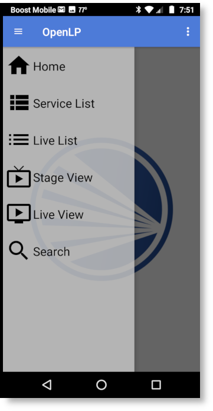

.. _android-remote:

Android Remote
==============

OpenLP gives you the ability to control your service from an Android based 
device. The following tutorial will describe how to install and 
use the application.

Installation
------------

Open the :guilabel:`Google Play Store` app and search for OpenLP. You should
find the `OpenLP - Remote 2.0`_ app. Now install the app.

.. image:: pics/droid_start.png

To use the Android application you must be on the same network as the OpenLP 
instance you are going to operate.  If your Android device has Celluar data, 
you may need to turn it off so that you can communicate with your OpenLP 
instance through your Wifi connection.  

You can now start the app and when you do, you will see the startup screen.

Preferences
-----------

|droid_menu_button| **Menu button**

After the installation is complete and you open the OpenLP Remote app you will need to
configure your Preferences. Open the preferences by touching the menu button in the top right
corner and tapping on :guilabel:`Preferences`. This will show the Preferences screen.

.. image:: pics/droid_right_menu.png

Display Text Size
^^^^^^^^^^^^^^^^^

.. image:: pics/droid_preferences1.png

**Select display text size:**
    This allows you to change the font size for the application display.

Auto center display
^^^^^^^^^^^^^^^^^^^

**Allow displays to auto center:**
    Check this box to allow the selected item to scroll to the centre of the
    list.

Set Custom Timeout
^^^^^^^^^^^^^^^^^^

In general the OpenLP Remote will work fine without having to change the custom timeout
settings. If you experience connection issues or are having trouble staying connected,
you can change these settings.

.. image:: pics/droid_preferences2.png

**Enable Custom Timeout:**
    Check this box to enable setting a custom timeout.

**Connection Timeout:**
    Once Custom Timeout has been enabled you can set a custom connection timeout
    here.

Server Details
^^^^^^^^^^^^^^

You will need to configure the server settings you will use with your phone.  
You can find these instructions and settings in the OpenLP desktop application 
under :ref:`remote_tab`.

**Note:** To use the OpenLP Remote you will need to be on the same network as the main
computer.

**Hostname or IP:**
    Enter the :guilabel:`Server on IP address` found in :ref:`remote_tab`. After
    entering the IP address in the box then select :guilabel:`OK`

**Port:**
    Enter the :guilabel:`Port number` found in :ref:`remote_tab` and enter it in
    the box. By default this is 4316. After entering the port number select
    :guilabel:`OK`.

**Username:**
    Here you can enter a username used for accessing OpenLP remotely. This
    must be the same as set in :ref:`user_auth`.

**Password:**
    Here you can enter a password used for accessing OpenLP remotely. This
    must be the same as set in :ref:`user_auth`.

Using the Android Remote
------------------------

|droid_left_menu_button| **Left Menu**

After you have completed the setup you are now ready to use the app. Touch the
menu button in the top left corner to see the list of views the app supports.

Service List
^^^^^^^^^^^^

Selecting :guilabel:`Service List` will take you to the Service Manager. 
Selecting an item in the service manager will immediately make it 
live on the projection screen and you will stay on the service screen on your 
device. You can use the arrows buttons shown on the bottom left and right to
move to the next slide inside the item. 

.. image:: pics/droid_service.png

Live List
^^^^^^^^^

Selecting :guilabel:`Live List` will display what ever is in Service Manager
at the time, or what is live at the moment. If there are items in the Service
Manager they will be shown on the left, and the live item will be shown on the
right. You can use the arrows buttons shown on the bottom left and right to move
to the next slide inside the item. 

When using the :guilabel:`Live List` it can be an advantage to use the device in
landscape mode.

.. image:: pics/droid_live_list_landscape.png

Stage View
^^^^^^^^^^

Selecting :guilabel:`Stage View` will display the stage view on your Android 
device. See the :ref:`stage_view` section in the manual for a detailed
description.

Live View
^^^^^^^^^^

Selecting :guilabel:`Live View` will provide an exact copy of what is on 
the main display. See the :ref:`main_view` section in the manual for a 
detailed description.

When using the :guilabel:`Live view` it can be an advantage to use the device in
landscape mode. 

Search
^^^^^^

Selecting :guilabel:`Search` will display the search window.  On the search 
window you are able to search the OpenLP instance library and add items to 
the service or display them to the live display.

Selecting the library item to the right of :guilabel:`Select Plugin` will 
open the library search menu.  Selecting any item on the menu will allow 
you to search that library item.

.. image:: pics/droid_search_menu.png

Selecting the blank line to the right of :guilabel:`Search Text` will allow you
to enter the text you want to find.  The search is the same search you would 
make on the instance of OpenLP :ref:`media-manager` and will find parts of the lyrics within a 
song if you type in part of the lyrics.  When you have typed in your search
criteria, select the search icon in the keyboard to activate the search.

The search results will be displayed. If no results are shown, please refine
your serch criteria by selecting the search text to make changes.  

When the search results contain what you are looking for, select the item in 
the search results.

After selecting an item from the search results you can choose to :guilabel:`Send Live`,
:guilabel:`Add to Service` or :guilabel:`Cancel`.

 

Alert
^^^^^

To send an alert to the live display, touch the alert button at the top right of the
screen.

|droid_alert_button| **Alert button**

You can send an alert to the live display by entering the text in the box and
clicking on :guilabel:`Process`. The alert will be displayed as you have it 
configured in :ref:`configure_alerts`.

.. image:: pics/droid_alert.png

.. _droid_blank:

Blank Display
^^^^^^^^^^^^^

To blank the display, touch the blank button at the top right of the screen.

|droid_blank_button| **Blank button**

Using the display blank type gives you the ability to blank your screen to the 
methods described below. You can find out more about this feature and how it 
operates on the main computer at :ref:`blank_control`.

.. image:: pics/droid_blank.png

**Live display:**
    Do not blank, or unblank the display.

**Display Black Only:**
    Choosing this option will blank your projector to black as if it were shut 
    off.

**Display Theme only:**
    Choosing this option will show your blank theme only, without lyrics or 
    verses. If you are blanking a song with an assigned theme it will blank to 
    that theme. If no theme is assigned or you are blanking a presentation or 
    image, it will blank to the global theme.

**Display Desktop background:**
    Choosing this option will show your desktop wallpaper or a program that you 
    have open on the extended monitor or projector. You can seamlessly switch 
    between the desktop wallpaper or a program and OpenLP by Blank to Desktop.

.. |droid_alert_button| image:: pics/droid_alert_button.png
.. |droid_blank_button| image:: pics/droid_blank_button.png

.. |droid_left_menu_button| image:: pics/droid_left_menu_button.png

.. _OpenLP - Remote 2.0: https://play.google.com/store/apps/details?id=org.openlp.android2
