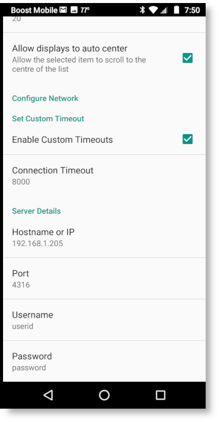

.. _android:

Android App
===========

Installation
------------

OpenLP gives you the ability to control your service from an Android based 
smartphone. The following tutorial will describe how to install and 
use the application. For this example we will be using a LG G2. Other Android
smartphones or tablet may vary slightly in appearance.

Open the :guilabel:`Google Play Store` app and search for OpenLP, and you will
find :guilabel:`OpenLP - Remote 2`. As an alternative use `this link
<https://play.google.com/store/apps/details?id=org.openlp.android2>` to go to
the apps page in Google Play Store. Now install the app.

.. image:: pics/droid_start.png

You can now start the app and when you do you will see the startup screen.

Android application settings
----------------------------

After the installation is complete and you open the OpenLP Android application 
you will need to configure your preferences and settings. 

Open the settings by opening the menu in the top right corner and choosing 
:guilabel:`Settings`. This will show the preferences.

Display Text Size
^^^^^^^^^^^^^^^^^

.. image:: pics/droid_preferences1.png

**Select display text size:**
    This allows you to change the the font size for the application display.

Set Custom Timeout
^^^^^^^^^^^^^^^^^^

In general the OpenLP Android application will work fine without having to 
change the custom timeout settings. If you experience connection issues or are 
having trouble staying connected, you can change these settings.

**Enable Custom Timeout:**
    Check this box to enable setting a custom timeout.

**Connection Timeout:**
    Once Custom Timeout has been enabled you can set a custom connection timeout
    here.

Server Details
^^^^^^^^^^^^^^

You will need to configure the server settings you will use with your phone.  
You can find these instructions and settings in the OpenLP desktop application 
under :ref:`remote_tab`.

**Note:** To use the Android application you will need to be on the same 
network as the main computer.

**Hostname or IP:**
    Enter the :guilabel:`Server on IP address` found in :ref:`remote_tab`. After
    entering the IP address in the box select :guilabel:`OK`

**Port:**
    Enter the :guilabel:`Port number` found in :ref:`remote_tab` and enter it in
    the box. By default this is 4316. After entering the port number select
    :guilabel:`OK`.

**Use HTTPS:**
    This specifies if HTTPS should be used. **Note:** To use HTTPS you must
    setup OpenLP to be secure, see :ref:`secure_server`.

**Username:**
    Here you can enter a username used for accessing OpenLP remotely. This
    must be the same as set in :ref:`user_auth`.

**Password:**
    Here you can enter a password used for accessing OpenLP remotely. This
    must be the same as set in :ref:`user_auth`.

Using OpenLP Android Application
--------------------------------

After you have completed the setup you are now ready to use the app. Touch the
menu button in the top left corner to see the list of views the app supports.

.. image:: pics/droid_left_menu.png

Service List
^^^^^^^^^^^^

Selecting :guilabel:`Service List` will take you to the Service Manager. 
Selecting an item with a short press in the service will immediately take it 
live on the projection screen and you will stay on the service screen on your 
device. Selecting an item with a long press in the service will immediately take 
it live on the projection screen and to the live display on your device. You can 
also move up and down through the service items using the :guilabel:`Previous` 
and :guilabel:`Next` buttons as shown below. Use your hardware back button to 
take you back to the main screen.

.. image:: pics/droid_service_list.png

Slide
^^^^^

If you selected a service item with multiple verses or images you can change 
verses or images by either selecting them with your finger or using the 
:guilabel:`Previous` and :guilabel:`Next` buttons. Use your hardware back button 
to take you back to the main screen.

.. image:: pics/droid_slide.png

Live
^^^^

Selecting the :guilabel:`Live` button will display what ever is live at the time 
from to your Android device. Use your hardware back button 
to take you back to the main screen.

Display
^^^^^^^

Selecting the :guilabel:`Display` button will give you the ability to blank and 
unblank your projection screen from your chosen method :ref:`above <droid_blank>`.

.. image:: pics/droid_blank_button.png

The title :guilabel:`Blank display to` means your display is live. Touching the 
:guilabel:`Blank display to` will blank the projection screen to the chosen 
method defined in Settings and the button will change to 
:guilabel:`Reset display from`. Touching it again will cycle back to 
:guilabel:`Blank display to` unblanking the screen for the live display.

Stage
^^^^^

Selecting the :guilabel:`Stage` button will display the stage view on your 
Android device. See the :ref:`stage_view` section in the manual for a detailed 
description. Use your hardware back button to take you back to the main screen.

.. image:: pics/droid_stage.png

Alert
^^^^^

You can send an alert to the projection screen by entering the text in the box 
and clicking on :guilabel:`Send`. The alert will be displayed as you have 
it configured in :ref:`configure_alerts`. Use your hardware back button to take 
you back to the main screen.

.. image:: pics/droid_alert.png

Search
------

Using the search function gives you the ability to search for a particular media, 
add it to the service or display it immediately.

To use search, press the hardware magnifying glass button on your phone or you 
can press the hardware menu button and then select :guilabel:`Search` and you 
will be taken to the search screen.

.. image:: pics/droid_search_all1.png

Enter the text you want to search for in the text box at the top. For this 
example we are using the search word "Jesus". You can click the magnifying glass 
next to the text box or press the return on your phone keyboard. You will be 
presented with a list of media in which your search word was found. 

**Note:** When searching the Bible you must enter the exact name, chapter, 
verse or verses. Searching songs will search titles and lyrics with the text 
used.

This screen shows the number of instances your searched text is found. 

.. image:: pics/droid_found1.png

As you can see in the example, there are 130 songs with the word "Jesus" in them. 
You can scroll through the list of songs until you find the one you want.

.. image:: pics/droid_found_select1.png

Click on :guilabel:`Add to Service` to add your media to the bottom of the 
:ref:`creating_service`. Click on :guilabel:`Send Live` to immediately display 
your media on the projection screen.

.. image:: pics/droid_found_add1.png

When you have completed your search you must press the back button on your phone 
to return to the main screen.
