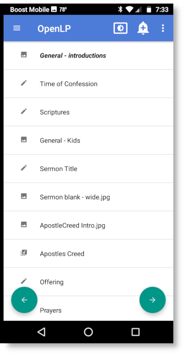

.. _android:

Android App
===========

Installation
------------

OpenLP gives you the ability to control your service from an Android based smart 
phone. The following tutorial will describe how to download, install and use the 
application. For this example we will be using the HTC Incredible. Other Android 
phones may vary slightly in appearance and installation.

Click the screen button on the phone to bring up the start menu for "All apps" 
and scroll to and select :guilabel:`Market`. 

.. image:: pics/droid_all_apps.png

Once selected you will be taken to the Market main screen. Click on the 
magnifying glass on the top right and type in :kbd:`openlp` and select it.

.. image:: pics/droid_find.png

Once selected this screen will appear and you will select OpenLP.

.. image:: pics/droid_free.png

Click on :guilabel:`Install`

.. image:: pics/droid_install.png

The next page shows the Permissions you will need to accept to continue the 
download. Click on :guilabel:`Accept & download`.

.. image:: pics/droid_accept.png

The downloading progress bar will appear verifying you are downloading the app.

.. image:: pics/droid_downloading.png

Once the install is complete you will see a window where you can :guilabel:`Open`
OpenLP for use. You will also find the OpenLP icon in your application menu.

.. image:: pics/droid_open.png

Android application settings
----------------------------

Server
^^^^^^

After the installation is complete and you open the OpenLP Android application 
you will need to enter the setup information. 

.. image:: pics/droid_configure.png

The first step is to configure the server settings you will use with your phone.  
You can find these instructions and settings in the OpenLP desktop application 
under :ref:`remote_tab`.

**Note:** To use the Android application you will need to be on the same 
network as the main computer.

Select the :guilabel:`Server` button and enter the :guilabel:`Serve on IP address`
found in :ref:`remote_tab`. After entering the IP address in the box select 
:guilabel:`OK`

.. image:: pics/droid_server.png

The next step is to enter the port number. Select :guilabel:`Port`. Use the 
:guilabel:`Port number` found in :ref:`remote_tab` and enter it in the box. 
After entering the port number select :guilabel:`OK`.

.. image:: pics/droid_port.png

Custom Timeout
^^^^^^^^^^^^^^

In general the OpenLP Android application will work fine without having to 
change the custom timeout settings. If you experience connection issues or are 
having trouble staying connected, you can change these settings. Select the box
next to :guilabel:`Enable Custom Timeouts`.

.. image:: pics/droid_connection.png

Connection Timeout
^^^^^^^^^^^^^^^^^^

If you are having trouble connecting please double check your settings first and 
be sure you did not type any extra characters or spaces. If your settings are 
correct and you are still having trouble, you can increase the 
:guilabel:`Connection Timeout` settings and try again.

.. image:: pics/droid_connection_timeout.png

Socket Timeout
^^^^^^^^^^^^^^

If you are having trouble maintaining a connection you can increase the timeout 
settings here.

.. image:: pics/droid_socket_timeout.png

When you are happy with your settings you can press the back button on your 
phone to check for connection. Make sure OpenLP is running on the main computer. 
If you were successful in your setup you will see the OpenLP application running.

If you need to change or adjust your settings you can always press your menu 
button on your phone while OpenLP is running and selecting :guilabel:`Settings` 
and it will take you back to the configuration screen.

.. image:: pics/droid_settings_return1.png

.. _droid_blank:

Display Blank Type
^^^^^^^^^^^^^^^^^^

Using the display blank type gives you the ability to blank your screen to the 
methods described below. You can find out more about this feature and how it 
operates on the main computer at :ref:`blank_control`.

**Screen:**
    Choosing this option will blank your projector to black as if it were shut 
    off.

**Theme:**
    Choosing this option will show your blank theme only, without lyrics or 
    verses. If you are blanking a song with an assigned theme it will blank to 
    that theme. If no theme is assigned or you are blanking a presentation or 
    image, it will blank to the global theme.

**Desktop:**
    Choosing this option will show your desktop wallpaper or a program that you 
    have open on the extended monitor or projector. You can seamlessly switch 
    between one program and OpenLP by Blank to Desktop.

Using OpenLP Android Application
--------------------------------

Service
^^^^^^^

After you have completed the setup you will be on the main page with the 
:guilabel:`Service` button highlighted on top and your service items showing 
below it. Selecting any item in the service will immediately take it live onto 
the projection screen. You can also move up and down through the service items 
using the :guilabel:`Previous` and :guilabel:`Next` buttons as shown below.

Slide
^^^^^

If you selected a service item with multiple verses or images you must select 
:guilabel:`Slide` at the top to change them. You can change verses or images by 
either selecting them with your finger or using the :guilabel:`Previous` and 
:guilabel:`Next` buttons. 

.. image:: pics/droid_slide.png

When you are finished with your verses you must click on :guilabel:`Service` to 
select the next item you want to display.

Misc
^^^^

Selecting the :guilabel:`Misc` button at the top will give you the ability to 
blank and unblank your projection screen from your chosen method 
:ref:`above <droid_blank>` or send an Alert message.

.. image:: pics/droid_misc.png

The title :guilabel:`Blank display to` means your display is live. Touching the 
:guilabel:`Blank display to` will blank the projection screen to the chosen 
method defined in Settings and the button will change to 
:guilabel:`Reset display from`. Touching it again will cycle back to 
:guilabel:`Blank display to` unblanking the screen for the live display.

Alert
^^^^^

You can send an alert to the projection screen by entering the text in the box 
and clicking on :guilabel:`Send`. The alert will be displayed as you have 
it configured in :ref:`configure_alerts`.

Search
------

Using the search function gives you the ability to search for a particular media, 
add it to the service or display it immediately.

To use search, press the hardware menu button or magnifying glass on your phone 
and then select :guilabel:`Search` and you will be taken to the search screen.

.. image:: pics/droid_search_all1.png

Enter the text you want to search for in the text box at the top. For this 
example we are using the search word "Jesus". You can click the magnifying glass 
next to the text box or press the return on your phone keyboard. You will be 
presented with a list of media in which your search word was found. 

**Note:** When searching the Bible you must enter the exact name, chapter, 
verse or verses. Searching songs will search titles and lyrics with the text 
used.

This screen shows the number of instances your searched text is found. 

.. image:: pics/droid_found1.png

As you can see in the example, there are 130 songs with the word "Jesus" in them. 
You can scroll through the list of songs until you find the one you want.

.. image:: pics/droid_found_select1.png

Click on :guilabel:`Add to Service` to add your media to the bottom of the 
:ref:`creating_service`. Click on :guilabel:`Send Live` to immediately display 
your media on the projection screen.

.. image:: pics/droid_found_add1.png

When you have completed your search you must press the back button on your phone 
to return to the main screen.
