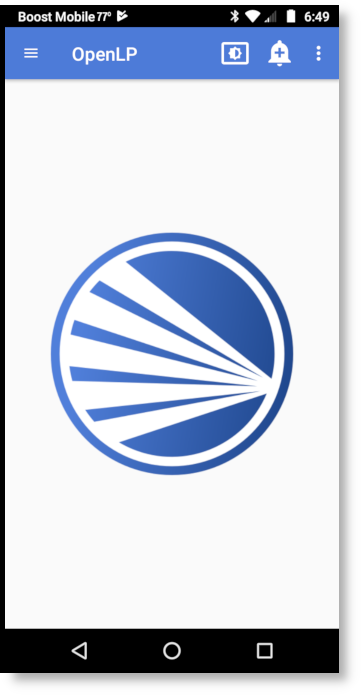
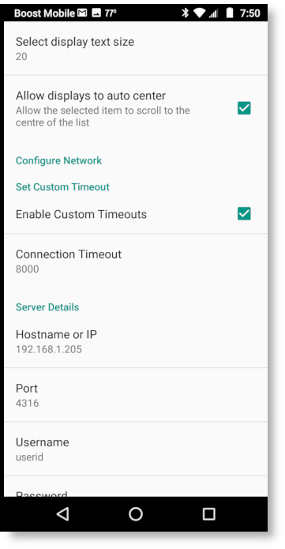
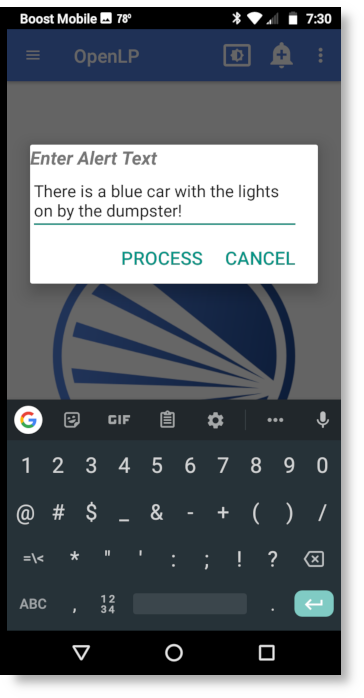
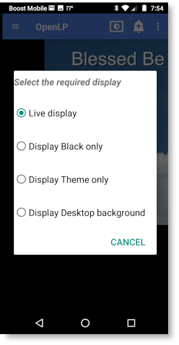

.. _android:

Android App
===========

Installation
------------

OpenLP gives you the ability to control your service from an Android based 
smartphone. The following tutorial will describe how to install and 
use the application. For this example we will be using a LG G2. Other Android
smartphones or tablet may vary slightly in appearance.

Open the :guilabel:`Google Play Store` app and search for OpenLP, and you will
find :guilabel:`OpenLP - Remote 2`. As an alternative use `this link
<https://play.google.com/store/apps/details?id=org.openlp.android2>`_ to go to
the apps page in Google Play Store. Now install the app.

You can now start the app and when you do you will see the startup screen.

Android application settings
----------------------------

After the installation is complete and you open the OpenLP Android application 
you will need to configure your preferences and settings. 

.. image:: pics/droid_right_menu.png

Open the settings by opening the menu in the top right corner and choosing 
:guilabel:`Settings`. This will show the preferences.

Display Text Size
^^^^^^^^^^^^^^^^^

**Select display text size:**
    This allows you to change the the font size for the application display.

Set Custom Timeout
^^^^^^^^^^^^^^^^^^

In general the OpenLP Android application will work fine without having to 
change the custom timeout settings. If you experience connection issues or are 
having trouble staying connected, you can change these settings.

.. image:: pics/droid_preferences2.png

**Enable Custom Timeout:**
    Check this box to enable setting a custom timeout.

**Connection Timeout:**
    Once Custom Timeout has been enabled you can set a custom connection timeout
    here.

Server Details
^^^^^^^^^^^^^^

You will need to configure the server settings you will use with your phone.  
You can find these instructions and settings in the OpenLP desktop application 
under :ref:`remote_tab`.

**Note:** To use the Android application you will need to be on the same 
network as the main computer.

**Hostname or IP:**
    Enter the :guilabel:`Server on IP address` found in :ref:`remote_tab`. After
    entering the IP address in the box select :guilabel:`OK`

**Port:**
    Enter the :guilabel:`Port number` found in :ref:`remote_tab` and enter it in
    the box. By default this is 4316. After entering the port number select
    :guilabel:`OK`.

**Use HTTPS:**
    This specifies if HTTPS should be used. **Note:** To use HTTPS you must
    setup OpenLP to be secure, see :ref:`secure_server`.

**Username:**
    Here you can enter a username used for accessing OpenLP remotely. This
    must be the same as set in :ref:`user_auth`.

**Password:**
    Here you can enter a password used for accessing OpenLP remotely. This
    must be the same as set in :ref:`user_auth`.

Using OpenLP Android Application
--------------------------------

After you have completed the setup you are now ready to use the app. Touch the
menu button in the top left corner to see the list of views the app supports.

.. image:: pics/droid_left_menu.png

Service List
^^^^^^^^^^^^

Selecting :guilabel:`Service List` will take you to the Service Manager. 
Selecting an item with a short press in the service will immediately take it 
live on the projection screen and you will stay on the service screen on your 
device. Selecting an item with a long press in the service will immediately take 
it live on the projection screen and to the live display on your device.

.. image:: pics/droid_service.png

Live List
^^^^^^^^^

Selecting :guilabel:`Live List` will display what ever is in Service Manager
at the time, or what is live at the moment. If there is items in the Service
Manager they will be shown on the left, and the live item will be shown on the
right.

.. image:: pics/droid_live_list_portrait.png

When using the :guilabel:`Live List` it can be an advantage to use the device in
landscape mode.

.. image:: pics/droid_live_list_landscape.png

Stage View
^^^^^^^^^^

Selecting :guilabel:`Stage View` will display the stage view on your Android 
evice. See the :ref:`stage_view` section in the manual for a detailed
description.

.. image:: pics/droid_stage_view.png

Live View
^^^^^^^^^^

Selecting :guilabel:`Live View` will display the live view on your Android
device. See the :ref:`main_view` section in the manual for a detailed 
description.

.. image:: pics/droid_live_view.png

Alert
^^^^^

To send an alert to the display, touch the alert button at the top right of the
screen.

|droid_alert_button| **Alert button**

You can send an alert to the display by entering the text in the box and
clicking on :guilabel:`Process`. The alert will be displayed as you have it 
configured in :ref:`configure_alerts`.

.. _droid_blank:

Blank Display
^^^^^^^^^^^^^

To blank the display, touch the blank button at the top right of the screen.

|droid_blank_button| **Blank button**

Using the display blank type gives you the ability to blank your screen to the 
methods described below. You can find out more about this feature and how it 
operates on the main computer at :ref:`blank_control`.

**Show Live:**
    Do not blank, or unblank the display.

**Display Blank:**
    Choosing this option will blank your projector to black as if it were shut 
    off.

**Display Theme:**
    Choosing this option will show your blank theme only, without lyrics or 
    verses. If you are blanking a song with an assigned theme it will blank to 
    that theme. If no theme is assigned or you are blanking a presentation or 
    image, it will blank to the global theme.

**Display Desktop:**
    Choosing this option will show your desktop wallpaper or a program that you 
    have open on the extended monitor or projector. You can seamlessly switch 
    between the desktop wallpaper or a program and OpenLP by Blank to Desktop.

.. |droid_alert_button| image:: pics/droid_alert_button.png

.. |droid_blank_button| image:: pics/droid_blank_button.png
