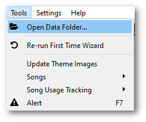
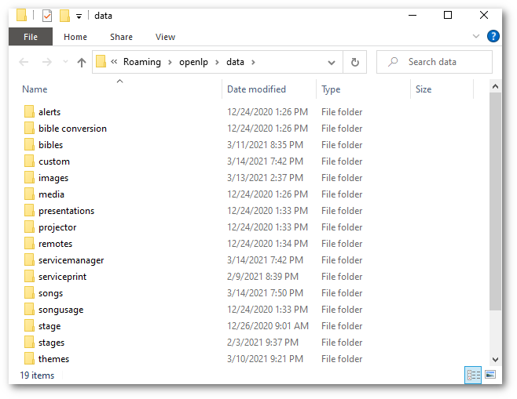
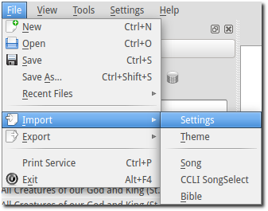

.. _backing_up:

=================
Backing up OpenLP
=================

Backing up data files
^^^^^^^^^^^^^^^^^^^^^

OpenLP gives you the ability to directly access your data files making your data 
easy to back up. Using the menu items at the top click on 
:menuselection:`Tools --> Open Data Folder...`.

You will be presented with the folder where all of the OpenLP data files are 
stored in their individual folders.

You can select an individual folder or all of the folders and copy your data to 
your choice of media or a flash drive. This is also an easy way to get all of 
your data onto another computer that is running OpenLP. 

You can restore your data folders and files by copying them back into your data 
folder :menuselection:`Tools --> Open Data Folder...`. You will overwrite all of 
your original data with the data you are copying back into the folder. 

**Warning:** Once you overwrite your data there is no way to retrieve your 
original data.

**Note:** If you copy your data files back into the OpenLP data folder you must 
shut down OpenLP and restart it to see the changes.

Export Settings
^^^^^^^^^^^^^^^

OpenLP stores all of the configuration settings in a configuration file for 
Linux and OS X or the Window's registry. Once you have OpenLP configured to your 
liking you should backup your settings. This is done from the menu item at the 
top by clicking on :menuselection:`File --> Export --> Settings`.

.. image:: pics/backup_export.png

You will then be presented with a window to choose what to name and where you 
want to save your configuration file. Click :guilabel:`Save`.

Import Settings
^^^^^^^^^^^^^^^

You can import OpenLP configuration settings from a previous backuped up 
configuration file or from an exported file from another computer. This is done 
from the menu item at the top. by clicking on 
:menuselection:`File --> Import --> Settings`.

Please read the complete warning and click :guilabel:`Yes` to continue or 
:guilabel:`No` to cancel.

.. image:: pics/backup_import_sure.png

You will then be presented with a window to find and restore your saved 
configuration file. Click on the configuration file and click :guilabel:`Open`.

.. image:: pics/backup_import_settings.png

Your configuration settings will be imported. Click on :guilabel:`Ok` to restart 
OpenLP.

.. image:: pics/backup_import_restart.png
