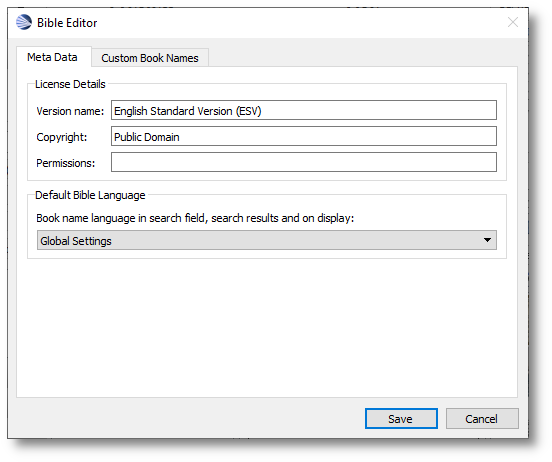
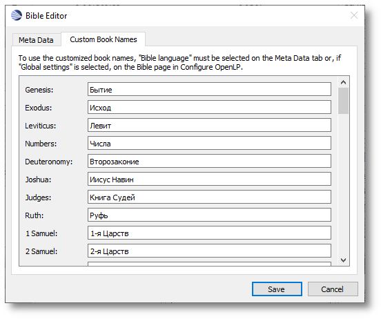
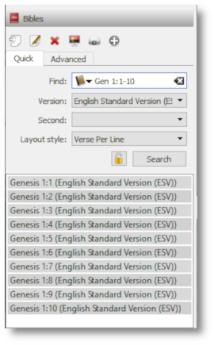
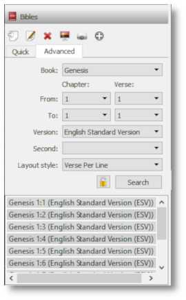

.. _bibles:

======
Bibles
======

This section describes the use of the various converters built into OpenLP for 
managing and importing Bibles from other formats.

.. _import_bibles:

Bible Import Wizard
===================

If you are using an earlier version of OpenLP or, come from another software
package, you may be able to convert your existing database to work in OpenLP
2.0. To access the Bible Importer :menuselection:`File --> Import --> Bible`.
You may also enter the Bible Importer by clicking the |importicon| Import Icon.

Click on the |importicon| Import Bibles icon to start the Bible import wizard.

You will see the Bible Importer window, click :guilabel:`Next`.

|bibleimportstart|

After clicking :guilabel:`Next` you can select from the various types of
software that OpenLP will convert Bibles from. Click on the file folder icon to
choose the file(s) of the Bible database you want to import. See the sections
below for more information on the different formats that OpenLP will import.
Click :guilabel:`Next` to continue.

|bibleimportdropdown| 

After selecting your file(s), you'll be asked to fill in the details of the
Bible you are importing. Remember to check what information you need to display
for your Bible's translation, as some of them have strict rules around the
copyright notice. Click :guilabel:`Next` to continue.

**Note:** You can use one blank space using the space bar in the copyright field 
to continue if you do not have or need copyright information.

|bibleimportdropdown|

After entering the license details, OpenLP will start to import your Bible.
It may take some time to import your Bible so please be patient.

|bibleimportfinished|

When the import has finished click :guilabel:`Finish` and you should be
ready to use your Bible in OpenLP.

.. _bible_import_osis:

Importing OSIS Bibles
^^^^^^^^^^^^^^^^^^^^^

Importing OSIS files is very simple. Select OSIS as your import source, select
your OSIS Bible file and continue the import process.

|bibleimportosis|

**About OSIS Formatted Bibles**

The OSIS XML standard was designed to provide a common format for distribution
of electronic Bibles. More information can be found out at the `Bible Technologies website
<http://www.bibletechnologies.net/>`_.

If you have any software installed that is part of the `Sword Project
<http://www.crosswire.org/sword/index.jsp>`_ it can be easily converted.

You can use the commands below convert Bibles from that software to OSIS format.

The following commands are used in all platforms and the commands are case
sensitive across all platforms. To convert a Bible using the command prompt in
Windows or a terminal in Linux or macOS you would type::

    mod2osis biblename > biblename.osis

For example: if I wanted to convert a King James Version Bible I would type
something similar to this::

    mod2osis KJV > kjv.osis

You may also wish to dictate a file location for the conversion to place the
osis file for example::

    mod2osis KJV > /home/user/bibles/kjv.osis

.. bibles_import_opensong:

Importing OpenSong Bibles
^^^^^^^^^^^^^^^^^^^^^^^^^

Converting from OpenSong you will need to locate your Bibles database. In the
later versions of OpenSong you are asked to define the location of this. The
songs will be located in a folder named :guilabel:`Bibles`. This folder should
contain files with all your Bibles in them without a file extension. (file.xmms).
When you have located this folder you will need to select the Bible from the
folder.

You may also import downloaded Bibles from `OpenSongs webpage (scroll down to
find bibles) <http://opensong.org/pages/downloads.html>`_. The process is the same,
except you will need to extract the Bible from a zip file. This is usually done
by right clicking on the downloaded file and select `Extract` or `Extract Here`.
Note that some of the bibles on OpenSongs webpage are actually in the Zefania
format, which OpenLP can also import, see :ref:`zefaniaimport`.

|bibleimportopensong|

After selecting the OpenSong Bibles you want to import, follow the rest of the
import process. When the import has finished you should be ready to use your
OpenSong Bibles.

.. bibles_import_web_download:

Importing Web Download Bibles
^^^^^^^^^^^^^^^^^^^^^^^^^^^^^

OpenLP provides a Web Download method to import Bibles when you do not have a
locally installed Bible available. The Web Download method registers the Bible
in OpenLP like the other Bibles only it downloads the verses as you need them.

.. warning::
    This import requires an internet connection when installing and when 
    searching for verses and is not meant to be used as your sole source for 
    Bibles, but rather as another option.

To use the web download feature select web download from the import wizard.

|biblewebdownload|

First click :guilabel:`Download bible list` to download a list of available
bibles.

|bibleweblist|

This will take a few moments depending on your internet connection and load on
the servers.

|bibleweblocation|

When the download is complete you can select from 3 different sources to 
download from: `Crosswalk <http://www.biblestudytools.com/>`_, `BibleServer
<http://www.bibleserver.com/>`_ and `BibleGateway
<https://www.biblegateway.com/>`_. From each source there are many Bible
translations available, so there is a good chance that you will find what you
need.

You can also select a proxy server if needed from the `Proxy Server` tab. Your
network administrator will know if this is necessary. In most cases this will
not be needed.

|biblewebproxy|

After selecting your download location and the Bible you wish to use, click
:guilabel:`Next` to continue the import process. When your import is completed
you should now be ready to use the web Bible.

.. _bibles_import_csv:

Importing CSV formatted Bibles
^^^^^^^^^^^^^^^^^^^^^^^^^^^^^^

If you have a Bible in .csv format OpenLP can import it. If you wish to create
a bible in the CSV format yourself the format is documented in the 
`OpenLP API documentation <http://api.openlp.io/api/openlp/plugins/bibles/lib/csvbible.html#module-openlp.plugins.bibles.lib.csvbible>`_.

CSV Bibles will consist of two files a `books` file and a `verse` file. 
Select CSV from the list of Bible types to import.

You are now ready to select your .csv files. You will need to select both your
books and verse file location.

|bibleimportcsv|

After you have selected the file locations you can continue with the import
process. Once it is complete you should be ready to use your imported CSV Bible.

.. _zefaniaimport:

Importing Zefania Bibles
^^^^^^^^^^^^^^^^^^^^^^^^

The Zefania project has many Bibles available from `their website
<http://sourceforge.net/projects/zefania-sharp/files/Bibles/>`_.
Find the Bible you would like to import and download the file. The downloaded
file is a zip-file from which the Bible must be extracted. This is usually done
by right clicking on the downloaded file and select `Extract` or `Extract Here`.

|bibleimportzefania|

You can now simply select the extracted file for import and click
:guilabel:`Next` to continue the import process. When your import is completed
you should now be ready to use the imported Zefania Bible.

.. _edit_bibles:

Edit Bible Data
===============

Some information about a Bible can be edited.  What can be edited is dependent on
the type of bible.

Select the Bible you want to edit then select the |bibleedit| Bible Edit icon 
to edit the Bible informtion.

On the :guilabel:`Meta Data` tab you can update the Bible Version name, 
Copyright information and the Permissions for the Bible.
    
You can also select the Book Name Language.  Choosing :guilabel:`Global Settings`, the 
defualt setting, will display the Book Names of the Bible in the Language 
set by the Operating System Language.  You can change this setting by using 
the dropdown to select a different option.
    
When you have made your changes you can select the :guilabel:`Save` button to
save your changes, select the :guilabel:`Cancel` button to discard your changes
or select the :guilabel:`Custom Book Names` tab to continue editing.

|bibleeditform|

Selecting the :guilabel:`Custom Book Names` tab will allow you to update the book
names that will be displayed.
    
.. warning::
    Please note that when using a Web Bible you can not change the book names.
    
When you have made your changes you can select the :guilabel:`Save` button to
save your changes, select the :guilabel:`Cancel` button to discard your changes
or select the :guilabel:`Meta Data` tab to continue editing.

|biblenameform|

.. _delete_bibles:

Delete a Bible
==============

You can remove a Bible from OpenLP.  

.. danger::
    The only recovery from deleting a Bible is to reimport the Bible using the 
    Wizard or copy the files from a Backup of the Data directory.

Select the Bible version on either the :guilabel:`Quick` or the :guilabel:`Advanced` tab
and click on the |deleteicon| Delete icon to delete a Bible.
You will be asked to confirm you want to delete the Bible.  Click
on :guilabel:`Yes` to delete the Bible or click :guilabel:`No` to cancel.

.. _preview_scripture:

Preview Bible Verses
====================

To Preview the selected verses in the left *Preview* panes, select the 
|biblepreview| Send to Preview icon.

.. _display_scripture:

Send Scriptures to Live Display
===============================

To Preview the selected verses in the right *Live* panes, select the 
|biblelive| Send to Live icon.
	

.. _add_scripture_to_service:

Add Scriptures to Service
=========================

Adding scriptures to a service can be done by selecting a group of verses
or by moving one verse at a time.

To add Bible verses you can click on a verse, hold and drag your selection
from the :ref:`library` over to the *Service Manager* 
or, after selecting the verse or group of verses you want to use, click the 
|bibleadd| Add to Service icon. This will add your scriptures at the bottom 
of the *Service*. 

.. _lock_results:

Locking Search Results
======================

Selecting the |biblelock| Lock icon locks and unlocks the search results.  
    
This feature can be used to combine multiple search results into one group of 
scriptures.  To use this feature, do a search for the first gorup of verses, 
then select the |biblelock| Lock icon and then search to your second group of 
verses.  The second group of verses will be added to the first group of 
verses.  You can continue to add more search results or select the |biblelock| Lock
icon again to unlock the results and return the search results to be replaced 
with each search.

.. _quick_search:

Quick Search
============

The quick search tab provides a simple search capability that can search
for scripture text or a scripture referance.  Use the dropdown in the :guilabel:`Find:`
data entry box to choose the type of search. 

Select your primary Bible by selecting it in the :guilabel:`Version` dropdown.

Select a second Bible to search using the :guilabel:`Second` dropdown or leave
it blank if you are not using a second Bible.

Select your desired layout style using the :guilabel:`Layout style` dropdown.

Enter your search text, Pressing the :kbd:`Enter` or selecting the :guilabel:`Search`
button activates the search.

When using the scripture referance search, the referance needs to be in one of a 
few formats.  You can see all the formats available by typing a book name and 
pressing the :kbd:`Enter`.  

A common format is "Bookname Chapter:verse - verse" (Gen 1:1-12) 

|biblequicksearch|

.. _advanced_search:

Advanced Search
===============

The advance search tab provides another search process that can search
for scripture text using dropdowns to set the search criteria.

To start your search, select your primary Bible by selecting it in the
:guilabel:`Version` dropdown. 

Select a second Bible to search using the :guilabel:`Second` dropdown or leave 
it blank if you are not using a second Bible.

Select your desired layout style using the :guilabel:`Layout style` dropdown.

Select the book of the Bible to search using the :guilabel:`Book` dropdown.

Select the starting Chapter of the book using :guilabel:`Chapter` dropdown to 
the right of *From:*

Select the starting Verse of the chapter using the :guilabel:`Verse` dropdown to 
the right of *From:*

Select the ending Chapter of the book using :guilabel:`Chapter` dropdown to 
the right of *To:*

Select the ending Verse of the chapter using the :guilabel:`Verse` dropdown to 
the right of *To:*

Selecting the :guilabel:`Search` button activates the search.

|bibleadvancesearch|

.. pictures used in this page

.. |DELETEICON| image:: pics/theme_delete.png
.. |BIBLELIVE| image:: pics/system_live.png
.. |BIBLEPREVIEW| image:: pics/general_preview.png

.. |BIBLEADD| image:: pics/buttons_add.png

.. |IMPORTICON| image:: pics/theme_import.png
.. |BIBLEIMPORTSTART| image:: pics/import_bible_start.png
.. |BIBLEIMPORTDROPDOWN| image:: pics/import_bible_dropdown.png
.. |BIBLEIMPORTFINISHED| image:: pics/import_bible_finished.png
.. |BIBLEIMPORTOSIS| image:: pics/import_bible_osis.png
.. |BIBLEIMPORTOPENSONG| image:: pics/import_bible_opensong.png
.. |BIBLEWEBDOWNLOAD| image:: pics/import_bible_web1.png
.. |BIBLEWEBLIST| image:: pics/import_bible_web2.png
.. |BIBLEWEBLOCATION| image:: pics/import_bible_web3.png
.. |BIBLEWEBPROXY| image:: pics/import_bible_web_proxy.png
.. |BIBLEIMPORTCSV| image:: pics/import_bible_csv.png
.. |BIBLEIMPORTZEFANIA| image:: pics/import_bible_zefania.png