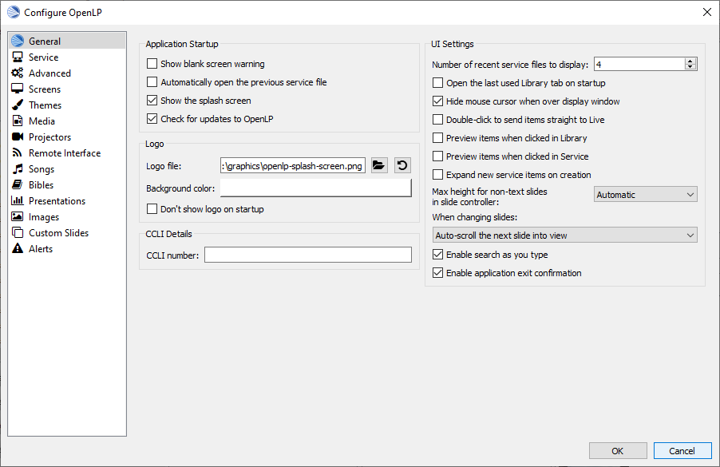
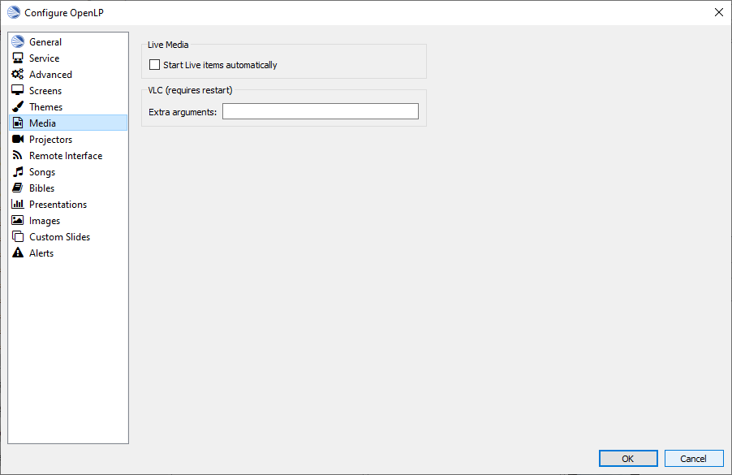

.. _configure:

==================
Configuring OpenLP
==================

OpenLP has many options you can configure to suit your needs. Most options are
self-explanatory and we will quickly review them.

To configure OpenLP, click on :menuselection:`Settings --> Configure OpenLP...`

The plugins you have activated will have configure options. If all the plugins
are activated there will be 10 items down the left side you can configure.

General
=======

Monitors
^^^^^^^^
To select the monitor you want to display OpenLP on, click the drop-down box 
and choose. 

Display if a single screen
^^^^^^^^^^^^^^^^^^^^^^^^^^ 

When this box is selected, you will be able to see your display on a separate 
window on the monitor you are using. Click the display and push the Esc key
on your keyboard to close the display window.
	
Application Startup
^^^^^^^^^^^^^^^^^^^

**Show blank screen warning:**
  When this box is selected, you will get a warning when opening OpenLP that the 
  output display has been blanked. You may have blanked it and shut down the 
  program and this will warn you it is still blanked.

**Automatically open the last service:**
  When this box is selected, OpenLP will remember the last service you were 
  working on when you closed the program.

**Show the splash screen:**
  The OpenLP logo is displayed while OpenLP loads when this checkbox is checked.
  This is useful to give some indication that the program is loading.

**Check for updates to OpenLP:**
  OpenLP will check to see if there is a newer version available on a regular 
  basis when this checkbox is checked. Please note that this requires Internet 
  access.

Application Settings
^^^^^^^^^^^^^^^^^^^^

**Prompt to save before starting a new service:**
  When this box is selected, OpenLP will prompt you to save the service you are
  working on before starting a new service.

**Unblank display when adding new live item:**
  When using the :guilabel:`blank to` button with this checkbox checked, on going 
  live with the next item, the screen will be automatically re-enabled. If this 
  checkbox is not checked you will need to click the :guilabel:`blank to` button 
  again to reverse the action.

**Automatically preview next item in service:**
  When this box is selected, the next item in the :ref:`creating_service` will 
  be displayed in the Preview pane.

**Enable slide wrap-around:**
  When this box is selected the lyrics, images or Bible verses will wrap-around. 
  When you reach the last slide of a song or verse and :kbd:`Down Arrow` you 
  will be back on the first slide. Likewise if you are on the first slide and 
  :kbd:`Up Arrow` you will wrap-around to the last slide of the song, images or 
  Bible verses. If this box is not checked it will not wrap-around to the 
  beginning or end of the song or verse.

**Timed slide interval:**
  This setting is the time delay in seconds if you want to continuously loop
  images, verses, or lyrics. This control timer is also accessible on the 
  :ref:`using_timer`

CCLI Details
^^^^^^^^^^^^

**CCLI number:**
  If you subscribe to CCLI, this box is for your License number. This number is
  also displayed in the Song Footer box.

Display Position
^^^^^^^^^^^^^^^^
This setting will default to your computer monitor. It will override the output 
display combo box.  If your projector display is different, select the Override 
display position and make the changes here to match your projector display. This 
option also comes in handy when you have the "Display if a single screen" box 
selected. You can make the display smaller so it does not cover your whole 
screen.

Background Audio
^^^^^^^^^^^^^^^^

**Start background audio paused:**
  If you have a :ref:`songs_linked` assigned to a song, with this box selected
  and when the song is displayed live, the audio will be paused until you start 
  it using :ref:`linked-audio`. If this box is not selected the audio will play 
  immediately when the song is displayed live.

Themes
======

.. image:: pics/configurethemes.png

Global Theme
^^^^^^^^^^^^
 
Choose the theme you would like to use as your default global theme from the
drop down box. The theme selected appears below. The global theme use is
determined by the Theme Level you have selected.
	
Theme Level
^^^^^^^^^^^

Choose from one of three options for the default use of your theme.

**Song Level:**
  With this level selected, your theme is associated with the song. The theme is
  controlled by adding or editing a song in the Song editor and  your song theme
  takes priority. If your song does not have a theme associated with it, OpenLP
  will use the theme set in the :ref:`creating_service`.

**Service Level:**
  With this level selected, your theme is controlled at the top of the 
  :ref:`creating_service`. Select your default service theme there. This setting 
  will override your Song theme. 

**Global Level:**
  With this level selected, all songs and verses will use the theme selected on
  the left in the Global Theme drop down.

Advanced
========

.. image:: pics/configureadvanced.png

.. _configure_ui:

UI Settings (user interface)
^^^^^^^^^^^^^^^^^^^^^^^^^^^^

**Number of recent files to display:**
  Set this number for OpenLP to remember your last files open. These will show 
  under :menuselection:`File --> Recent Files`.

**Remember active media manager tab on startup:**
  With this box selected OpenLP :ref:`media-manager` will open on the same tab 
  that it was closed on.

**Double-click to send items straight to live:**
  With this box selected, double-clicking on anything in the :ref:`media-manager` 
  will immediately send it live instead of to Preview.

**Preview items when clicked in Media Manager:**
  With this box selected, clicking any item in the :ref:`media-manager` will 
  immediately display it in the Preview pane.

**Expand new service items on creation:**
  With this box selected, everything you add to the :ref:`creating_service` will 
  be expanded so you can see all the verses, lyrics and presentations, line by 
  line. When you open OpenLP, everything will automatically be expanded in the 
  :ref:`creating_service`.

**Enable application exit confirmation:**
  With this box selected, on closing OpenLP you will be presented with a dialog
  box to confirm closing the program.

Default Images
^^^^^^^^^^^^^^

**Background color:**
  You can choose the background color that will be displayed when you start 
  OpenLP.

**Image file:**
  Select an image file to be displayed when OpenLP is started. Using an image 
  file will override a background color.

|buttons_open| **Browse for an image file to display**

|buttons_revert| **Revert to the default OpenLP logo**

Mouse Cursor
^^^^^^^^^^^^

**Hide mouse cursor when over display window:**
  With this box selected your mouse cursor will not be visible if you move it 
  from Display 1 onto Display 2. 

.. _config_songs:

Songs
=====

.. image:: pics/configuresongs.png

Songs Mode
^^^^^^^^^^

**Enable search as you type:**
  With this box selected, Media Manager/Songs will display the song you are
  searching for as you are typing. If this box is not selected, you need to type
  in your search box and then click on the Search button.

**Display verses on live tool bar:**
  With this box selected, a Go To drop down box is available on the live toolbar 
  to select any part of the verse type you want displayed live. 

**Update service from song edit:**
  With this box selected and you edit a song in the :ref:`media-manager`, the 
  results will also change the song if it is added to the :ref:`creating_service`. 
  If this box is not selected, your song edit changes will only be available in 
  the :ref:`creating_service` if you add it again.

**Add missing songs when opening service:**
  With this box selected, when you open an order of service created on another
  computer, or if one of the songs are no longer in your :ref:`media-manager`, 
  it will automatically enter the song in your Songs Media Manager. If this box 
  is not checked, the song is available in the service but will not be added to 
  the :ref:`media-manager`.

Bibles
======

.. image:: pics/configurebibles.png

Verse Display
^^^^^^^^^^^^^

**Only show new chapter numbers:**
  With this box selected, the live display of the verse will only show the
  chapter number and verse for the first verse, and just the verse numbers after
  that. If the chapter changes, the new chapter number will be displayed with the
  verse number for the first line, and only the verse number displayed thereafter.

**Display style:**
  This option will put brackets around the chapter and verse numbers. You may
  select No Brackets or your bracket style from the drop down menu.

**Layout style:**
  There are three options to determine how your Bible verses are displayed. 

* **Verse Per Slide:** will display one verse per slide.
* **Verse Per Line:** will start each verse on a new line until the slide is full.
* **Continuous:** will run all verses together separated by verse number and chapter if chapter is selected to show above.

**Note:** Changes do not affect verses already in the service.

**Display second Bible verses:**
  OpenLP has the ability to display the same verse in two different Bible
  versions for comparison. With this option selected, there will be a Second
  choice in the Bible Media Manager to use this option. Verses will display with 
  one verse per slide with the second Bible verse below.   

**Bible theme:**
  You may select your default Bible theme from this drop down box. This selected
  theme will only be used if your `Theme Level` is set at `Song Level`.

**Note:** Changes do not affect verses already in the service.

Presentations
=============

.. image:: pics/configurepresentations.png

Available Controllers
^^^^^^^^^^^^^^^^^^^^^

OpenLP has the ability to import OpenOffice Impress or Microsoft PowerPoint
presentations, and use Impress, PowerPoint, or PowerPoint Viewer to display
them and they are controlled from within OpenLP. Please remember that in order
to use this function, you must have Impress, PowerPoint or PowerPoint Viewer
installed on your computer because OpenLP uses these programs to open and run
the presentation. You may select your default controllers here in this tab. 

Advanced
^^^^^^^^

**Allow presentation application to be overridden:**
  With this option selected, you will see `Present using` area with a dropdown 
  box on the Presentations toolbar in :ref:`media-manager` which gives you the 
  option to select the presentation program you want to use.

Images
======

Provides border where an image is not the correct dimensions for the screen when 
it is resized.

.. image:: pics/configureimages.png

**Default Color:** 
  Click on the black button next to Default Color. You have the option of 
  choosing among the colors you see or entering your own.

.. _media_configure:

Media
=====

  
Available Media Players
^^^^^^^^^^^^^^^^^^^^^^^

Select the media players you want to be available for use.

Player Order
^^^^^^^^^^^^

Determines the preference order of the selected media players. The order is 
changed by selecting one of the available players and using the 
:guilabel:`Down` or :guilabel:`Up` button to change the position of the player.

Advanced
^^^^^^^^

**Allow media player to be overridden:**
  With this option selected, you will see `Use Player:` area with a dropdown box
  on the Media tool bar in the :ref:`media-manager` which gives you the option 
  to select the media player you want to use.
  
Custom
======

.. image:: pics/configurecustom.png

Custom Display
^^^^^^^^^^^^^^

**Display Footer:**
  With this option selected, your Custom slide Title will be displayed in the
  footer. 

**Note:** If you have an entry in the Credits box of your custom slide, title and
credits will always be displayed.

.. _configure_alerts:

Alerts
======

Font
^^^^

**Font name:**
  Choose your desired font from the drop down menu

**Font color:**
  Choose your font color here.

**Background color:**
  Choose the background color the font will be displayed on.

**Font size:**
  This will adjust the size of the font.

**Alert timeout:**
  This setting will determine how long your :ref:`alerts` will be displayed on 
  the screen, in seconds.

**Location:**
  Choose the location where you want the alert displayed on the
  screen, Top, Middle or Bottom.

**Preview:**
  Your choices will be displayed here.

.. _remote_tab:
  
Remote
======

OpenLP gives you the ability to control the :ref:`creating_service` or send an 
:ref:`alerts` from a remote computer through a web browser. This could be useful 
for a nursery or daycare to display an :ref:`alerts` message or, use it as an 
interface to control the whole service remotely by a visiting missionary or 
worship team leader. 

Stage view gives you the opportunity to set up a remote computer, netbook or 
smartphone to view the service being displayed in an easy to read font with a 
black background. Stage view is a text only viewer. 

The remote feature will work in any web browser that has network access whether 
it is another computer, a netbook or a smartphone. You can find more information 
about this feature here: :ref:`web_remote`.

**Note:** To use either of these features, your computers will need to be on the 
same network, wired or wireless. 

Server Settings
^^^^^^^^^^^^^^^

.. image:: pics/configureremotes.png

**Serve on IP address:**
  Put your projection computer's IP address here or use 0.0.0.0 which will 
  display your IP address links below. 

**Display stage time in 12h format:**
  This setting displays the time in stage view in 12h or 24h format.

**Port Number:**
  You can use the default port number or change it to another number. If you 
  do not understand this setting you should leave it as is.

**Remote URL:**
  Using the remote URL, you have the ability to control the live service from 
  another computer, netbook or smartphone that has a browser. 

**Note:** This URL and port number are also used to map the value for OpenLP's 
Android app.

**Stage view URL:**
  Using stage view gives you the ability, using a remote computer, netbook or 
  smartphone, to view the live service display in a basic black and white 
  format. This URL shows the address you will use in the remote browser for 
  stage view.

Finding your IP address
^^^^^^^^^^^^^^^^^^^^^^^

If the Remote or Stage view URL are not showing you can manually find these
settings. To find your projection computer's IP address use these steps below. 

**Windows:**
  
Open *Command Prompt* and type::
  
  C:\Documents and Settings\user>ipconfig
 
Press the :kbd:`Enter` key and the output of your command will display the
adapter IP address. The IP address will always have a format of xxx.xxx.xxx.xxx 
where x is one to three digits long.

**Linux:**

Open *Terminal* and type::

  linux@user:~$ifconfig 

Press the :kbd:`Enter` key. This will display a fair amount of technical 
information about your network cards. On most computers, the network card is 
named "eth0". The IP address for your network card is just after "inet addr:" in 
the section with your network card's name. The IP address will always have a 
format of xxx.xxx.xxx.xxx where x is one to three digits long.

**OS X 10.6 or 10.5**

From the Apple menu, select :menuselection:`System Preferences --> View --> Network`.
In the Network preference window, click a network port (e.g., Ethernet, AirPort, 
modem). If you are connected, you'll see its IP address under "Status:".

With these two settings written down, open a web browser in the remote computer
and enter the IP address followed by a colon and then the port number, ie: 
192.168.1.104:4316  then press enter. You should now have access to the OpenLP
Controller. If it does not come up, you either entered the wrong IP address, 
port number or one or both computers are not connected to the network.

.. These are all the image templates that are used in this page.

.. |BUTTONS_OPEN| image:: pics/buttons_open.png

.. |BUTTONS_REVERT| image:: pics/button_rerun.png