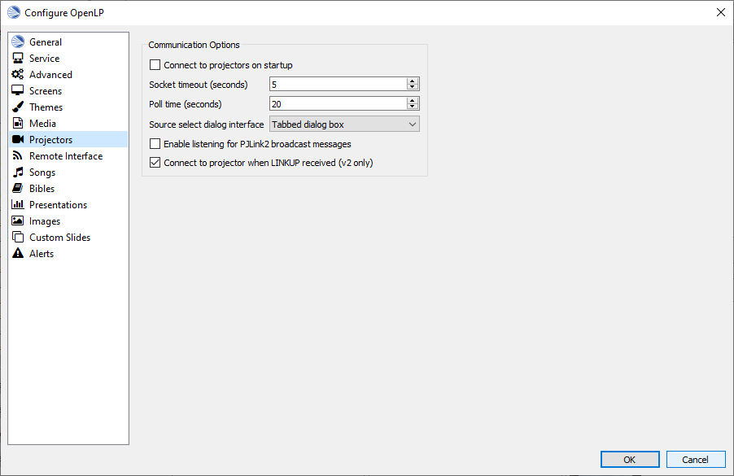
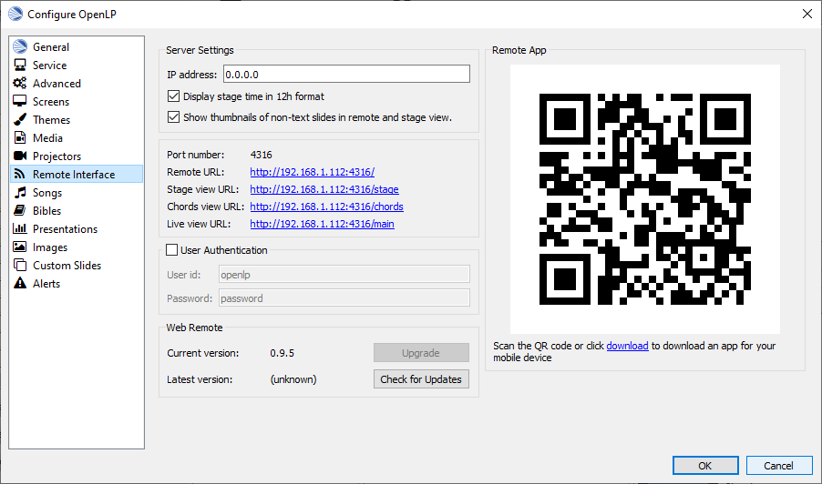
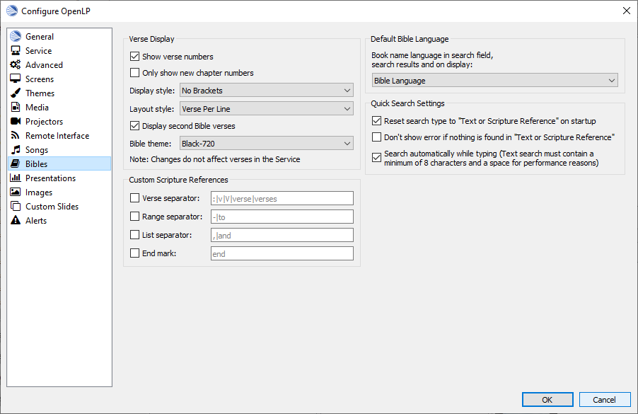
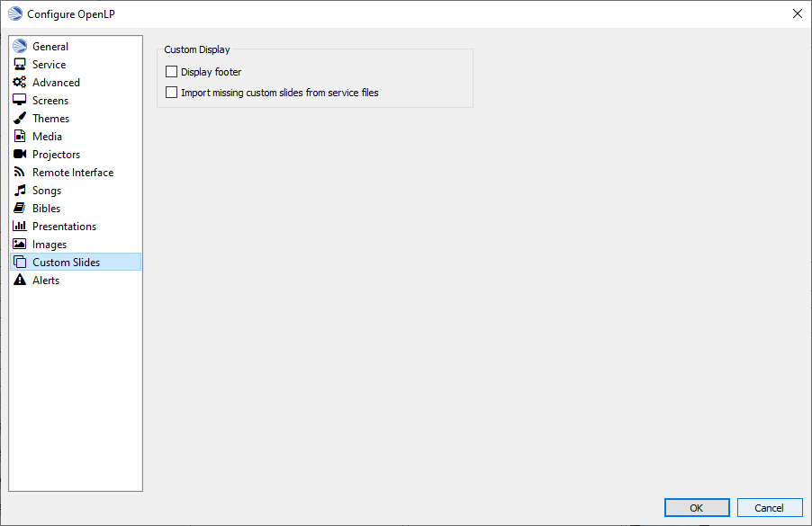

.. _configure:

==================
Configuring OpenLP
==================

OpenLP has many options you can configure to suit your needs. Most options are
self-explanatory and we will quickly review them.

To configure OpenLP, click on :menuselection:`Settings --> Configure OpenLP...`

The plugins you have activated will have configure options. If all the plugins
are activated there will be 14 items down the left side you can configure.

General
=======

.. image:: pics/configuregeneral.png

Application Startup
^^^^^^^^^^^^^^^^^^^

**Show blank screen warning**
  When this box is selected, you will get a warning when opening OpenLP that the 
  output display has been blanked. You may have blanked it and shut down the 
  program and this will warn you it is still blanked.

**Automatically open the previous service**
  When this box is selected, OpenLP will remember the last service you were 
  working on when you closed the program.

**Show the splash screen**
  The OpenLP logo is displayed while OpenLP loads when this checkbox is checked.
  This is useful to give some indication that the program is loading.

**Check for updates to OpenLP**
  OpenLP will check to see if there is a newer version available on a regular 
  basis when this checkbox is checked. Please note that this requires Internet 
  access.

Logo
^^^^

**Logo file:**
  Select an image file to be displayed when OpenLP is started. Using an image 
  file will override a background color.

|buttons_open| **Browse for an image file to display**

|buttons_revert| **Revert to the default OpenLP logo**

**Background color:**
  You can choose the background color that will be displayed when you start 
  OpenLP.

**Don't show logo on startup**
  With this box is checked the OpenLP log will not be displayed on startup.

CCLI Details
^^^^^^^^^^^^

**CCLI number:**
  If you subscribe to CCLI, this box is for your License number. This number is
  also displayed in the Song Footer box.

UI Settings (user interface)
^^^^^^^^^^^^^^^^^^^^^^^^^^^^

**Number of recent files to display**
  Set this number for OpenLP to remember your last files open. These will show 
  under :menuselection:`File --> Recent Files`.

**Open the last used Library tab on startup**
  With this box selected OpenLP :ref:`library` will open on the same tab 
  that it was closed on.

**Hide mouse cursor when over display window**
  With this box selected your mouse cursor will not be visible if you move it 
  from Display 1 onto Display 2. 

**Double-click to send items straight to live**
  With this box selected, double-clicking on anything in the :ref:`library` 
  will immediately send it live instead of to Preview.

**Preview items when clicked in Library**
  With this box selected, clicking any item in the :ref:`library` will 
  immediately display it in the Preview pane.

**Preview items when clicked in Service**
  With this box selected, clicking any item in the :ref:`creating_service` will 
  immediately display it in the Preview pane.
  
**Expand new service items on creation**
  With this box selected, everything you add to the :ref:`creating_service` will 
  be expanded so you can see all the verses, lyrics and presentations, line by 
  line. When you open OpenLP, everything will automatically be expanded in the 
  :ref:`creating_service`.

**Max height for non-text slides in slide controller**
  With this box selected, on closing OpenLP you will be presented with a dialog
  box to confirm closing the program.

**When changing slides**
  This dropdown controls how the Live and Preview controllers scroll the verses
  displayed as you progress through the item slides.

**Enable search as you type**
  With this box selected, as you type into text boxes suggestions will be shown.

**Enable application exit confirmation**
  With this box selected, you will be asked if you really want to close OpenLP.

.. _configservice:

Service
=======

Default service name
^^^^^^^^^^^^^^^^^^^^

The default service name gives you the ability to have a preset name, date and 
time when saving your service file.

**Enable default service name:**
  Checking this box will activate the use of the default service name.

**Date and Time:**
  You can choose the regular day of the week and time of the service or choose 
  :guilabel:`Now` from the dropdown for the immediate date and time to save your 
  service file.

**Name:**
  You can change "Service" to a default name of your choosing. The year, month 
  day, hour and minute will default to what you have set for 
  :guilabel:`Date and Time` above or if you chose :guilabel:`Now` the saved file 
  will have the time and date that you save it.

|buttons_revert| **Revert:**
  Clicking this button will erase your changes and revert to the default service name. 

**Example:**
  The example shows how the name, date and time will be displayed for the file 
  name when saving the file.

**Note:** If the date and time format does not suit your needs and you are 
technically inclined, there is more information at `Python.org`_.

Slide Controller
^^^^^^^^^^^^^^^^

**Unblank display when sending items to Live**
  When using the :guilabel:`blank to` button with this checkbox checked, on going 
  live with the next item, the screen will be automatically re-enabled. If this 
  checkbox is not checked you will need to click the :guilabel:`blank to` button 
  again to reverse the action.

**Unblank display when changing slide in live**

**Automatically preview next item in service:**
  When this box is selected, the next item in the :ref:`creating_service` will 
  be displayed in the Preview pane.

**Timed slide interval:**
  This setting is the time delay in seconds. This is used to continuously loop 
  a group of images, verses, or the lyrics in a song. This control timer is 
  also accessible on the :ref:`using_timer`

Service Item Wrapping
^^^^^^^^^^^^^^^^^^^^^

**End Slide:**
  Up and down arrow keys stop at the top and bottom slides of each Service item. 
  You will need to use the :kbd:`Right Arrow` key or the mouse to move to the 
  next Service Item.

**Wrap Slide:**
  Up and down arrow keys wrap around at the top and bottom slides of each 
  Service item, eg: When you reach the last slide of a song or verse and 
  :kbd:`Down Arrow` you will be back on the first slide. Likewise if you are on 
  the first slide and :kbd:`Up Arrow` you will wrap-around to the last slide of 
  the song, images or Bible verses.

**Next Slide:**
  Up and down arrow keys advance to the next or previous Service Item from the 
  top and bottom slides of each Service Item. As long as you have your songs and 
  verses in order, you can use the :kbd:`Down Arrow` to move through your 
  service from start to finish. Using this setting makes it possible to use a 
  presentation remote controller. 
  
.. _configtheme:
  
Advanced
========

.. image:: pics/configureadvanced.png

.. _configure_ui:

Data Location
^^^^^^^^^^^^^

If you wish to change the default location of where OpenLP stores its data, you
can enter a custom location here.

|buttons_open| **Browse for a custom data location**
  Clicking this button will open the open file dialog and allow you to select ability
  new location for the Data directory.

|buttons_revert| **Revert:**
  Clicking this button will erase your changes and revert to the default data
  location. 

Display Workarounds
^^^^^^^^^^^^^^^^^^^

**Ignore Aspect Ratio**
  Selecting this option will allow service items to be displayed as it was originally
  formated without regard for how the screen is formated.

**Bypass X11 Window Manager:**
  Linux and other X users may need to try toggling this flag if the main display 
  window is causing them problems. For example with this unset, KDE users may 
  find the main display window disappears if they switch windows. Ubuntu users 
  using the Unity interface may find the main screen is corrupted if set. GNOME 
  Shell users may find the window doesn't fill the whole screen if unset. As it 
  appears to affect different versions and distributions differently, this 
  setting has been added, rather than try and work it out programmatically.

**Use alternating row colors in lists:**
  Using alternating row colors in most cases makes it easier for the human eye
  to overview a list of items. Uncheck to disable.

**Disable display transparency**
  Selecting this option prevents the Live display from being transparent.

Proxy Server Settings
^^^^^^^^^^^^^^^^^^^^^

  You can select a proxy server if needed. Your network administrator will know
  if this is necessary. In most cases this will not be needed.

**No proxy**
  Select this option if you do not want to use a Proxy Server.

**Use system proxy**
  Select this option if you want to use your computers default Proxy Server.

**Manual proxy configuration**
  Select this option if you want to setup the Proxy Server manually.  The 
  remaining options are only active if you select the Manual proxy
  configuration.

**HTTP:**
  Enter the HTTP: address for your proxy server followed by the port to be
  used on your proxy server.  Please use the `120.002.168.064:4000` format.

**HTTPS:**
  Enter the HTTP: address for your proxy server followed by the port to be
  used on your proxy server.  Please use the `120.002.168.064:4000` format.

**Username:**
  Please enter your username if a username is required by you proxy server.
  Leave this blank if your proxy server does not require user authenication.

**Password:**
  Please enter your password if a username and password is required by you 
  proxy server.  Leave this blank if your proxy server does not require 
  user authenication.

Screens
=======

To choose which monitor you want OpenLP's Live display on, select the
appropriate monitor.  If only one screen is displayed your system has
determined you only have one display it can output to.  If you are 
unsure about what display to use for you Live display select the 
:guilabel:`Identify Screens` button.

Use this screen as display
^^^^^^^^^^^^^^^^^^^^^^^^^^
  This box needs to be checked for one display.

**Full Screen**
  Select this option if you want to use the full screen area.

**Custom geometry**
  This setting overrides the exact position on your screen where the display
  output appears. If you have a custom projector setup, click the
  :guilabel:`Override display position` checkbox, and manually set the position
  of the display output using the :guilabel:`X`, :guilabel:`Y`, :guilabel:`Width`
  and :guilabel:`Height` values.

  This setting often comes in useful when you only have a single display, and you
  want to be able to make the display smaller so that it does not cover your
  entire screen.

Generic Screen Settings
^^^^^^^^^^^^^^^^^^^^^^^ 

**Display if a Single Screen**
  Checking this checkbox will show the display output in a separate window when
  you only have a single monitor. To close the display window, click on it and
  press the :kbd:`Esc` key.

Themes
======

.. image:: pics/configurethemes.png

Global Theme
^^^^^^^^^^^^
 
Choose the theme you would like to use as your default global theme from the
drop down box. The theme selected appears below unless the theme is a movie
theme. The global theme use is determined by the Theme Level you have selected.

Theme Level
^^^^^^^^^^^

Choose from one of three options for the default use of your theme.

**Song Level:**
  With this level selected, your theme is associated with the song. The theme is
  controlled by adding or editing a song in the Song editor and  your song theme
  takes priority. If your song does not have a theme associated with it, OpenLP
  will use the theme set in the :ref:`creating_service`.

**Service Level:**
  With this level selected, your theme is controlled at the top of the 
  :ref:`creating_service`. Select your default service theme there. This setting 
  will override your Song theme. 

**Global Level:**
  With this level selected, all songs and verses will use the theme selected on
  the left in the Global Theme drop down.

Universal Settings
^^^^^^^^^^^^^^^^^^

**Transition between service items**
  Checking this option will force the theme to use it's transition between items
  in the service (so when you change from a song to a Bible verse you'll get a transition)

**Reload live theme when changed**
  Check this option if you want the theme reloaded when you edit it while it is
  currently being used in the current live item.

.. _media_configure:

Media
=====

.. image:: pics/configuremedia.png

Live Media
^^^^^^^^^^

**Start Live items automatically:**
  With this option selected songs and videos will start to play automatically when
  sent live.

VLC (requires restart)
^^^^^^^^^^^^^^^^^^^^^^

**Extra arguments:**
  If needed you can add command line arguments to be used with VLC.

.. _configure_projectors:

Projectors
==========

Communication Options
^^^^^^^^^^^^^^^^^^^^^

The following options available are:

**Connect to projectors on startup:**
  Check if you want to attempt to connect to all projectors when OpenLP starts.

**Socket timeout (seconds):**
  Time in seconds to wait for the projector connection. Available options are 2
  to 10 seconds.

**Poll timeout (seconds):**
  How often to poll the projector for status information. Available options are
  2 to 60 seconds. For quicker response on the status icons, set to a lower
  value. If you have network congestion, you may need to use a higher value.

**Source select dialog interface:**
  Select whether you want all video source options on one dialog page or to use
  tabs to consolidate the inputs based on video group.

**Enable listening for PJLink2 broadcast messages***
  Select this option to Enable listening on UDP ports for PJLink2 broadcasts.

**Convert to projector when LINKUP received**
  Select this option so a projector can be enabled when the LINKUP signal is
  received from the projector.

.. _remote_tab:
  
Remote Interface
================

OpenLP gives you the ability to control the :ref:`creating_service` or send an 
:ref:`alerts` from a remote computer through a web browser. This could be useful 
for a nursery or daycare to display an :ref:`alerts` message or, use it as an 
interface to control the whole service remotely by a visiting missionary or 
worship team leader. 

Stage view gives you the opportunity to set up a remote computer, netbook or 
smartphone to view the service being displayed in an easy to read font with a 
black background. Stage view is a text only viewer. 

The remote feature will work in any web browser that has network access whether 
it is another computer, a netbook or a smartphone. You can find more information 
about this feature here: :ref:`web_remote`.

**Note:** To use either of these features, your computers will need to be on the 
same network, wired or wireless. 

.. _non_secure:

Server Settings - Non Secure
^^^^^^^^^^^^^^^^^^^^^^^^^^^^

**IP address:**
  Put your projection computer's IP address here or use 0.0.0.0 which will 
  display your IP address links below.

**Display stage time in 12h format:**
  This setting displays the time in stage view in 12h or 24h format.

**Show Thumbnails of non-text slides in remote and stage views.**
  Check this option if you want to see thumbnails of non-text slides on the Stage
  and Remote Views.

**Port Number:**
  You can use the default port number or change it to another number. If you 
  do not understand this setting you should leave it as is.

**Remote URL:**
  Using the remote URL, you have the ability to control the live service from 
  another computer, netbook or smartphone that has a browser. 

**Note:** This URL and port number are also used to map the value for OpenLP's 
Android app.

**Stage view URL:**
  Using stage view gives you the ability, using a remote computer, netbook or 
  smartphone, to view the live service display in a basic black and white 
  format. This URL shows the address you will use in the remote browser for 
  stage view.

**Chord view URL:**
  Using the chord view adds chords to the Stage view lyrics.  This can be 
  helpful when the stage view is used for the musicians that play the cords.

**Live view URL:**
  Using the live view, you can display the Live output on multiple devices.

.. _user_auth:

User Authentication 
^^^^^^^^^^^^^^^^^^^
This option allows the additional security for update functions via the web or
android interfaces. Once the userid and password have been accepted then
updates will be possible for duration of the web session. This option can be
changed without the need to restart OpenLP.

.. _web_remote_version:

Web Remote
^^^^^^^^^^

**Current version:**
  The current version of the remote interface is displayed here. If the
  current version is different from the latest version, press the :guilabel:`Upgrade`
  button.

**Latest Version**
  The latest version of the remote interface is displayed here after you
  press the :guilabel:`check for Updates` button.
  
Remote App
^^^^^^^^^^

You can quickly find and download the OpenLP Android or iOS remote apps using your 
barcode scanner or by clicking on the :guilabel:`download` link. See the sections on
the :ref:`android-remote` and :ref:`ios-remote` for more details on how to install
and use them.

Finding your IP address
^^^^^^^^^^^^^^^^^^^^^^^

If the Remote or Stage view URL are not showing you can manually find these
settings. To find your projection computer's IP address use these steps below. 

**Windows:**
  
Open *Command Prompt* and type::
  
  C:\Documents and Settings\user>ipconfig
 
Press the :kbd:`Enter` key and the output of your command will display the
adapter IP address. The IP address will always have a format of xxx.xxx.xxx.xxx 
where x is one to three digits long.

**Linux:**

Open *Terminal* and type::

  linux@user:~$ifconfig

Some Linux systems will require the full path::

  linux@user:~$/sbin/ifconfig 

Press the :kbd:`Enter` key. This will display a fair amount of technical 
information about your network cards. On most computers, the network card is 
named "eth0". The IP address for your network card is just after "inet addr:" in 
the section with your network card's name. The IP address will always have a 
format of xxx.xxx.xxx.xxx where x is one to three digits long.

**OS X 10.6 or 10.5**

From the Apple menu, select :menuselection:`System Preferences --> View --> Network`.
In the Network preference window, click a network port (e.g., Ethernet, AirPort, 
modem). If you are connected, you'll see its IP address under "Status:".

With these two settings written down, open a web browser in the remote computer
and enter the IP address followed by a colon and then the port number, ie: 
192.168.1.104:4316  then press enter. You should now have access to the OpenLP
Controller. If it does not come up, you either entered the wrong IP address, 
port number or one or both computers are not connected to the network.

.. _config_songs:

Songs
=====

.. image:: pics/configuresongs.png

Song related settings
^^^^^^^^^^^^^^^^^^^^^

**Enable `Go to verse` button in Live panel**
  With this box selected, a :guilabel:`Go To` drop down box is available on
  the live toolbar to select any part of the song.  You can also type you 
  the part of the song you want displayed on live display. 

**Update service from song edit:**
  With this box selected and you edit a song in the :ref:`library`, the 
  results will also change the song if it is added to the :ref:`creating_service`. 
  If this box is not selected, your song edit changes will only be available in 
  the :ref:`creating_service` if you add it again.

**Import missing songs from service files:**
  With this box selected, when you open a service file created on another
  computer, or if one of the songs are no longer in your :ref:`library`, 
  it will automatically enter the song in your Songs Media Manager. If this box 
  is not checked, the song is available in the service but will not be added to 
  the :ref:`library`.

**Add Songbooks as first slide**
  With this box selected the songbook name for songs (if available) will be
  shown as an introduction slide for the song.  This option is implemented as
  songs are added to the Service.  If you already have a song in the service, you
  will need to remove the song and re-add the song to the service for the songbook
  name slide to be added to the song.

Chords
^^^^^^
  Enabling this option allows songs with chords to show the chords on the Stage 
  views.  Any text in the song that is between "[" and "]" will be regarded as
  chords.

**Ignore chords when importing songs**
  This option will allow the song importer to ignore cords in the imported song.

**Chord notation to use:**
  Select the English, German or Neo-Latin notation to match your location or need.

SongSelect Login
^^^^^^^^^^^^^^^^
  You must have a valid SongSelect account to use this option.  Type in your
  username and password to enable automatic login when importing SongSelect songs.

Footer
^^^^^^
  This is a list of the Placeholders that can be used in the Footer Template.

Footer Template
^^^^^^^^^^^^^^^
  You can cutomize the Footer information for a song.  To make changes click into
  the text box and type your changes.  If you need to reset the template, press
  the :guilabel:`Reset Template` button.

  
Bibles
======

Verse Display
^^^^^^^^^^^^^

**Show verse numbers:**
  With this box selected verse numbers are always shown, deselect to hide verse
  numbers.

**Only show new chapter numbers:**
  With this box selected, the live display of the verse will only show the
  chapter number and verse for the first verse, and just the verse numbers after
  that. If the chapter changes, the new chapter number will be displayed with the
  verse number for the first line, and only the verse number displayed thereafter.

**Display style:**
  This option will put brackets around the chapter and verse numbers. You may
  select No Brackets or your bracket style from the drop down menu.

**Layout style:**
  There are three options to determine how your Bible verses are displayed. 

    * Verse Per Slide:
      Will display one verse per slide.
    * Verse Per Line:
      Will start each verse on a new line until the slide is full.
    * Continuous:
      Will run all verses together, separated by verse number and chapter, if 
      chapter is selected to show above. This will only add the next verse if it 
      wholly fits on the slide. If it does not fit, it will begin a new slide.

**Note:** Changes do not affect verses already in the service.

**Display second Bible verses:**
  OpenLP has the ability to display the same verse in two different Bible
  versions for comparison. With this option selected, there will be a Second
  choice in the Bible Media Manager to use this option. Verses will display with 
  one verse per slide with the second Bible verse below.   

**Bible theme:**
  You may select your default Bible theme from this drop down box. This selected
  theme will only be used if your *Theme Level* is set at *Song Level*.

**Note:** Changes do not affect verses already in the service.

Custom Scripture References
^^^^^^^^^^^^^^^^^^^^^^^^^^^

Here you can change the default separators used in the scripture references.
The default values are shown in gray when the custom separators has not be 
enabled and nothing has been entered. Note that the default separators can
change if the language of OpenLP is changed.

**Verse Separators:** Enable to enter a custom verse separator.

**Range Separators:** Enable to enter a custom range separator.

**List Separators:** Enable to enter a custom list separator.

**End Mark:** Enable to enter a custom end marker.

Default Bible Language
^^^^^^^^^^^^^^^^^^^^^^

Choose the language of the bible books. The options are:

**Bible Language:**
  The language of the books will be determined by the language of the bible.

**Application Language:**
  The language of the books will be determined by the language set for OpenLP.

**English:**
  The language of the books will be set to English.

Quick Search Settings
^^^^^^^^^^^^^^^^^^^^^

**Reset search type to `Text or Scripture Reference` on Startup**
  Select this option if you want the bible search type to be Text or 
  scripture Reference when OpenLP is started.

**Don't show error if nothing is found in `Text or Scripture Reference`**
  Select this option to remove the error message when there are no
  results for your text or scripture reference search.

**Seach automatically while typing**
  Select this option if you want a display of possible results to appear
  as you type in your search criteria.  The list will appear after 8
  charactors are entered or a space is entered.

.. _presentation_configure:

Presentations
=============

Available Controllers
^^^^^^^^^^^^^^^^^^^^^

OpenLP has the ability to import OpenOffice Impress or Microsoft PowerPoint
presentations, and use Impress, PowerPoint, or PowerPoint Viewer to display and
control them from within OpenLP. Please remember that in order to use this
feature you will need to have one of the above-mentioned applications installed,
due to the fact that OpenLP uses these application to open and run the
presentation.

Support of PDF is bundled with OpenLP on macOS and Windows. On Linux you will
need to install :file:`mupdf` (recommended) or :file:`ghostscript`.

Advanced
^^^^^^^^

**Allow presentation application to be overridden:**
  With this option selected, you will see *Present using* area with a dropdown 
  box on the Presentations toolbar in the Library :ref:`library-presentations` which gives you the 
  option to select the presentation program you want to use.

PowerPoint options
^^^^^^^^^^^^^^^^^^

These options are only available if PowerPoint has been detected.

**Clicking on a selected slide in the slidecontroller advances to next effect:**
  When this is enabled it is possible to go to the next effect of a slide by
  clicking the slide in the slidecontroller. The default behavior is to restart
  the slide.

**Let PowerPoint control the size and position of the presentation window (workaround for Windows 8 scaling issue):**
  Windows 8 and 10 can on computers with multiple monitors use scaling to make
  windows look the same size on different monitors. Unfortunately this can
  cause issues with how OpenLP places and resizes the PowerPoint presentation
  window. Check this box to enable the workaround which let PowerPoint control
  the presentation window. When you enable this you must setup PowerPoint to
  present to the correct monitor.

Images
======

Provides border where an image is not the correct dimensions for the screen when 
it is resized.

.. image:: pics/configureimages.png

Image Background
^^^^^^^^^^^^^^^^

**Use Blank Theme**
  Select this option to place the image on a blank background.  If the
  image is smaller than the screen, the area around the imabe will be
  black.

**Custom Theme**
  Select this option and use the dropdown box to use one of the current
  themes as a background for the imate.

Custom Slides
=============

.. _configure_custom:

Custom Display
^^^^^^^^^^^^^^

**Display Footer:**
  With this option selected, your Custom slide Title will be displayed in the
  footer. 

**Note:** If you have an entry in the Credits box of your custom slide, title and
credits will always be displayed.

**Import missing custom slides from service files:**
  With this box selected, when you open a service file created on another
  computer, or if one of the custom slides are no longer in your
  :ref:`library`, it will automatically enter the custom slide in your 
  Custom Slide Media Manager. If this box is not checked, the custom slide is
  available in the service but will not be added to the :ref:`library`.

.. _configure_alerts:

Alerts
======

.. image:: pics/configurealerts.png

Font Settings
^^^^^^^^^^^^^

**Font name:**
  Choose your desired font from the drop down menu

**Font color:**
  Choose your font color here.

**Background color:**
  Choose the background color the font will be displayed on.

**Font size:**
  This will adjust the size of the font.

Background Settings
^^^^^^^^^^^^^^^^^^^
  
**Background Color**
  Select the color box and you can select the background color for the alert.

Enable Scrolling
^^^^^^^^^^^^^^^^
  Select this option and the alert text will scroll across the screen.
  
**Repeat(no. of times)**
  If Enable Scrolling has been selected this sets the number of times
  the alert will scroll across the screen.
  
Other Settings
^^^^^^^^^^^^^^

**Alert timeout:**
  This setting will determine how long your :ref:`alerts` will be displayed on 
  the screen, in seconds.

**Vertical Align:**
  Choose the location where you want the alert displayed on the
  screen, Top, Middle or Bottom.

Preview
^^^^^^^
  Your choices will be displayed here.

.. These are all the image templates that are used in this page.

.. |BUTTONS_OPEN| image:: pics/buttons_open.png

.. _Python.org: http://docs.python.org/library/datetime.html#strftime-strptime-behavior
.. _VLC: http://www.videolan.org/vlc/

