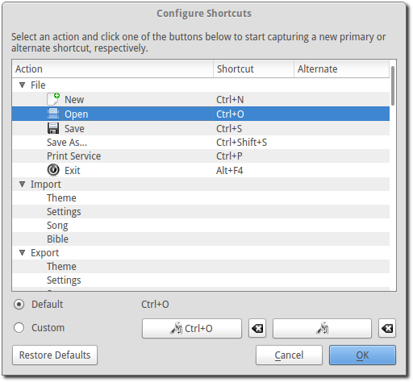

.. _shortcuts:

===================
Customize Shortcuts
===================

OpenLP gives you the ability to use keyboard shortcuts either by changing the 
default primary ones already assigned or by adding an alternate shortcut that 
will work alongside the primary shortcut.

To Configure Shortcuts go to :menuselection:`Settings --> Configure Shortcuts`

The image below shows a partial list of shortcuts you can customize.

Across the top of the list are Action, Shortcut and Alternate. 

**Action:**
  This is the name of the of the shortcut you can change. It could be part of 
  the menu selection or a toolbar item.

**Shortcut:**
  This is the keyboard shortcut assigned to the action beside it.

**Alternate:**
  This is the alternate shortcut you can assign to the action. Each Action can 
  have two different shortcuts assigned to it. 

Changing a Shortcut
-------------------

|configshortcut| **Capture shortcut:**
  To change a shortcut click on an Action in the list that you would like to 
  modify. Click on the left |configshortcut| to add or modify the default 
  shortcut   and the right |configshortcut| to modify or add an alternate 
  shortcut. After you   click on one of the boxes you can type in the key or 
  combination of keys you want to use for your shortcut. 

|clearshortcut| **Restore the default shortcut of this action:**
  If you are not happy with your shortcut selection you can restore it to its 
  default value by clicking the |clearshortcut| icon next to the shortcut. This
  will set the shortcut to its original state. 

If there is a shortcut you want to remove from an action and not assign another
one you can click on |configshortcut| twice. This will remove the shortcut. 

All Actions that you click on will show either Default or Custom.

If you change or add any shortcut the option button for Custom will be selected. 
Clicking the Default option button will restore the original shortcut. You can 
also click |clearshortcut| to change it back to default. 

If you don't like any of your changes or find that you want to return the 
shortcuts back to their original settings, click :guilabel:`Restore Defaults`.

When you are done making your changes click :guilabel:`OK`. If you don't want to 
save any of your changes click :guilabel:`Cancel`

.. The following section defines the inline pics

.. |clearshortcut| image:: pics/configure_shortcuts_clear.png

.. |configshortcut| image:: pics/configure_shortcuts_config.png
