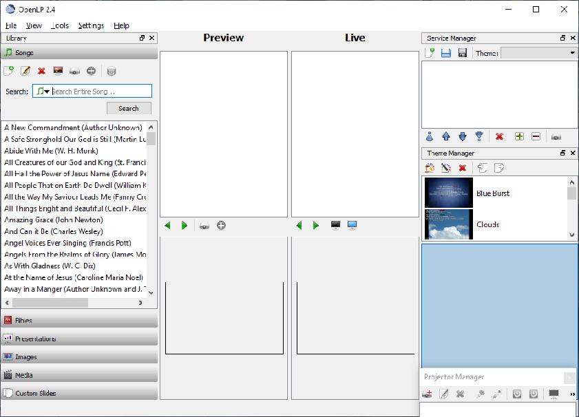
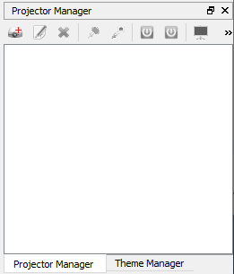
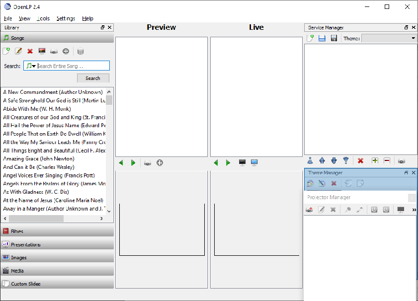

.. _configure_ui_2:

==================================
Configuring the Main Window
==================================

The main window is configurable.  By default there are 
three screen layouts and each can be configured as you desire.
To change to one of the screen layouts, use the :ref:`menu_items_view` menu.

Hiding the window items
==============================

The first way to configure the main window is to Hide
items that are not used.  

If you are not using the Projector Manager, having it open 
all the time uses up part of the window that could be
used for other items.  To hide the Projector Manager, or any 
other item, left click on the 'X' in the right corner of 
the item.  You can also use the :ref:`menu_items_view` menu to hide or show 
any of the main window items.

Re-Sizing the window items
=================================

If you use the item part of the time, you can re-size the item 
in the same manner you re-size any window on the desktop
by placing your pointer over the edge of the item and pulling
the edge in or out to re-size the item .

Change the Location of an item in the window
===================================================

There are four zones the items can be located in addition to 
keeping the item as a seperate window. 

1. Left Side of the window
2. Right Side of the window
3. Top of the window
4. Bottom of the window

To move an item, move the mouse over the item title bar and press 
and hold the left mouse button while draging the item to a new 
location.  When the item is in a location that the item can be
located at, the area will turn blue to indicate the item can be placed 
at that location.  Releasing the left mouse button will place the 
item at that location.

Tab Locating an item
====================

By default the items in the main window are located above, 
below or to the side of other items in the window.  Most of the 
items can also be located in a Tab arrangement.  This arrangement 
allows the item to be full sized, and to be viewed by selecting
a Tab at the bottom of another item in the window.

To create a Tab located item, move the mouse over the item title 
bar then press and hold the left mouse button while draging the 
item to a new location on top of another item in the window.  When 
the item is in a location that the item can be placed at, the area 
will turn blue to indicate the item can be located at that location.  
Releasing the left mouse button will create the Tab location with 
the item you moved and the item or items displayed in blue.

Locking and Un-Locking the panels
=================================

To prevent the panels from changing accidently you can lock the
panels.  After you have made your changes to the panels, lock the 
panels using the :ref:`menu_items_view` menu Lock Panels menu item. 
By selecting the Lock Panels menu item a second time you can 
unlock the panels.  
