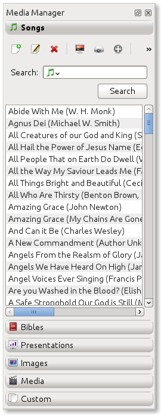
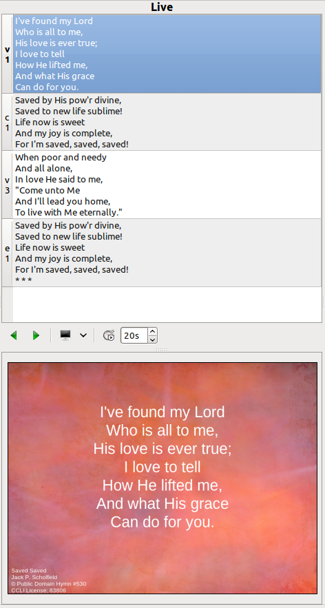

==================
Creating a service
==================

Now that you have OpenLP set up the way you want, it is time to put it to use.

Everything you need to display will be in the left panel called *Media Manager*
under their respective categories. Using the Media Manager you will load new 
Media, Songs, Images, Bibles, or create a Custom slide as discussed earlier in
:ref:`mediamanager`. 

On the right side of your screen at the top is the Service Manager. 

.. image:: pics/service_manager.png

Anything you want to display should be in the Service Manager and preferably in 
the order you want to display it. To add your media you can click on an item in 
the *Media Manager* hold and drag your selection from the Media Manager over to 
the *Service Manager* or, after clicking the media or verse you want to use, 
click the + sign icon above. This will add your media to the service side at the 
bottom. Once it is in the Service Manager you can click on your item and drag 
and drop it in the order you want or, click the item and use the arrow icons 
below to move it up or down in the order you want. Note: You always have the 
option to send any media live direct from the Media Manager. Please see 
:ref:`mediamanager` for more details.

.. image:: pics/service_arrows.png

Displaying an Item
------------------

When you have all of your items needed for the service in your Service Manager
there are a few ways to get them to display on the screen. You can double-click
the item, click it once with the mouse and push the :kbd:`Enter` key on your 
keyboard, right click the item and left click *Show Live* or click it once with 
the mouse and click on the projector at the bottom of the Service Manager. 

Any of these methods will display your item on 
the screen. When your item is displayed, it will appear in the Live windows just 
to the left of the Service Manager. 

To Preview an item in the left *Preview* panes, right click the item and left 
click *Show Preview*.

Changing a Service theme
------------------------

When you get your Service file set up and you are previewing a slide or sending 
it Live and you notice you don't have the correct theme for it, you can right 
click the item and mouseover :guilabel:`Change Item Theme` and select the theme
you want to use.

Moving through a Service
------------------------

Once you have your first item displayed live you can move through the service in 
a couple of ways. You can double-click on each item you need displayed, or click 
it once and press enter. If your songs, verses, etc. are in the order you will 
be displaying them, you can use the :kbd:`Right Arrow` key on your keyboard to 
move down through your service. Pressing the :kbd:`Left Arrow` key will move up 
through the service. Every time you press the :kbd:`Left Arrow` or 
:kbd:`Right Arrow` key the next item in your Service will be displayed. 

Moving through a Song or Bible verses
-------------------------------------

When you display a song or Bible verse with multiple verses you will need to 
move through them. When a song or verse is being displayed you will see the 
lyrics in the top Live window and how it actually appears on your display 
in the bottom Live window. To change slides you can use your mouse to click on 
each slide in the top Live window, use the Left Arrow and Right Arrow icons 
under the top Live window.

service_live_arrows.png

You can also use the :kbd:`Down Arrow` key to move down through 
the song or verses. Using the :kbd:`Up Arrow` key will move you from bottom to 
top. :kbd:`Page Up` and :kbd:`Page Down` keys will do the same thing. 

Adding a group of Images
------------------------

At some point you may have a group of images to display together. It may be 
pictures from a youth group adventure, bulletin announcements, or some other 
reason. Once you add your images to the Media Manager hold the :kbd:`Ctrl` key 
on your keyboard and click each image you want to add as a group. As you click 
the images they will remain highlighted. When you are done with your selections 
you can either click the + icon above the images or, click on one of the 
highlighted images, hold the mouse button and drag them over to the Service 
Manager side and place them where you need them. 

.. image:: pics/service_images.png

Sorting a group of Images
-------------------------

If you do not like the order the images are in, 
right click Images. 

.. image:: pics/service_reorder.png

Left click Reorder Item. 

.. image:: pics/service_reorder_service_item.png

From this box you will be able to rearrange the order of your images by clicking 
on one and using the :guilabel:`Up` and :guilabel:`Down` arrows to move it to 
where you want it. If there is an image you do not want in your order, click on 
it and then click the :guilabel:`Delete` button. When you are done arranging 
your images click :guilabel:`Save`. 

If you need to add another image from the Media Manager to your group of images, 
left click the image you want to add and hold the mouse button and drag it over 
your group of Images and release the mouse button. You will be given two options, 
:guilabel:`Add New Item` and :guilabel:`Add to Selected Item`. 

.. image:: pics/service_add.png

If you click :guilabel:`Add New Item` your image will be separate from your 
group of images as another item at the bottom of the Service. If you click 
:guilabel:`Add to Selected Item` your image will be added to your group of 
images.

Adding a service Note
---------------------

You have the option to leave yourself or the next tech a service note. This is 
done by right clicking on an item in your service and left clicking *Notes*.

.. image:: pics/service_item_notes.png

You can type your note in the box and click :guilabel:`Save`. If you change your
mind you can click :guilabel:`Cancel`. Your note will appear as a yellow note on
your item.

.. image:: pics/service_note.png

If you need to change your Note or delete it, open it again, delete your text 
and click :guilabel:`Save`

Using the Continuous Loop Timer
-------------------------------

Once you have a group of images you can easily cycle through them by using the 
*Live Controller Bar* timer in between the Live panes.

.. image:: pics/service_timer.png

Adjust the time delay for the seconds in between each image by adjusting the 
timer. This timer counter is in seconds. Immediately to the left of the timer is 
the button to start the images looping. Click it once to start the continuous 
loop and once to stop it. You can also use the keyboard shortcut :kbd:`L` to 
start and stop the continuous loop. The timer will also cycle through Bible 
verses and song lyrics. 

Using the "Blank to" Control
----------------------------

On the *Live Controller Bar* in between the Live windows are three options to 
Blank your screen. Clicking on the down arrow next to the blank button will show 
you your three options.

.. image:: pics/service_blank.png

**Blank Screen** 
    Choosing this option will blank your projector to black as if it were shut off. 
    The shortcut for this option is :kbd:`.` (fullstop/period on your keyboard).

**Blank to Theme** 
    Choosing this option will show your blank theme only, without lyrics or verses. 
    If you are blanking a song with an assigned theme it will blank to that theme. 
    If no theme is assigned or you are blanking a presentation or image, it will 
    blank to the global theme. The shortcut for this option is :kbd:`T`. 

**Blank to Desktop** 
    Choosing this option will show your desktop wallpaper or a program that you have 
    open on the extended monitor or projector. You can seamlessly switch between one 
    program and OpenLP by Blank to Desktop. The shortcut for this option is :kbd:`D`.
  
You can change or add to the keyboard shortcuts here 
:menuselection:`Settings --> Configure Shortcuts`.

New, Open and Saving the service
---------------------------------

.. image:: pics/service_save.png

These three icons at the top of the *Service Manager* will do the following:
The first icon will create a New Service. The second icon will Open an already
created service file. The third icon will Save the service you created, added to
or rearranged.

Now that you created your service, tested it and are ready for your worship 
service, you will want to save your service file. OpenLP will remind you to do 
this when you close the program or you can click the save button at the top of 
your service file. Choose the location you want to save your file and click 
:guilabel:`Ok`.
