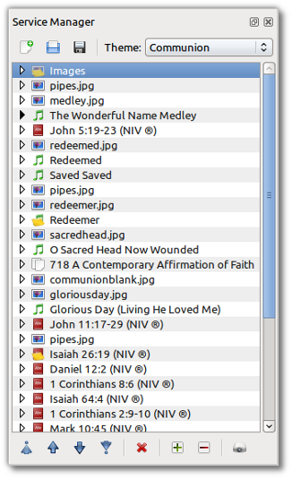
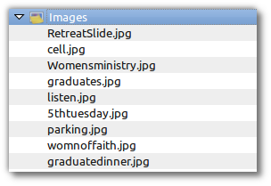
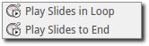

.. _creating_service:

===============
Service Manager
===============

Creating a Service
==================

Now that you have OpenLP set up the way you want, it is time to put it to use.

Everything you need to display will be in the left panel called the
:ref:`g-media-manager`, under their respective categories. Using the
:ref:`g-media-manager` you can add new media, songs, images, Bibles or create a
custom slide as discussed earlier in the :ref:`media-manager` section.

.. image:: pics/mediamanager_songs.png

On the right side of your screen at the top is the Service Manager.

Anything you want to display should be in the Service Manager and preferably in
the order you want to display it. To add your media you can click on an item in
the :ref:`media-manager` hold and drag your selection from the :ref:`media-manager` 
over to the *Service Manager* or, after clicking the media or verse you want to 
use, click the |add_plus|. This will add your media to the service side at the 
bottom. Once it is in the Service Manager you can click on your item and drag 
and drop it in the order you want or, click the item and use the icons shown 
below to move it up or down in the order you want. 

|service_top| Move item to the top of the service.

|service_up| Move item up one position in the service.

|service_down| Move item down one position in the service.

|service_bottom| Move item to the end of the service.

To view your Bible or song verses one by one, use the icons below. This is a 
convenient way to move around through the verses if they are skipped or repeated. 
Double-click on the verse you want to display live.

|service_expand| Expand all the service items.

|service_collapse| Collapse all the service items.

|live| Send the selected item to Live.

**Note:** You always have the option to send any media live direct from the 
:ref:`media-manager`. Please see the :ref:`media-manager` section for more 
details.

Displaying an Item
------------------

When you have all of your items needed for the service in your Service Manager
there are a few ways to get them to display on the screen. You can double-click
the item, click it once with the mouse and push the :kbd:`Enter` key on your
keyboard, right click the item and left click *Show Live* or click it once with
the mouse and click on the projector |live| at the bottom of the Service Manager.

Any of these methods will display your item on
the screen. When your item is displayed, it will appear in the Live windows just
to the left of the Service Manager.

.. image:: pics/slidecontroller.png

To Preview an item in the left *Preview* panes, right click the item and left
click *Show Preview*.

Changing a Service Theme
------------------------

When you get your Service file set up and you are previewing a slide or sending
it Live and you notice you don't have the correct theme for it, you can right
click the item and mouseover :guilabel:`Change Item Theme` and select the theme
you want to use.

An easy way to check which theme you are using is to move your mouse cursor over
an item in your service and you will see a popup with the theme being used.

Moving Through a Service
------------------------

Once you have your first item displayed live you can move through the service in
a couple of ways. You can double-click on each item you need displayed, or click
it once and press enter. If your songs, verses, etc. are in the order you will
be displaying them, you can use the :kbd:`Right Arrow` key on your keyboard to
move down through your service. Pressing the :kbd:`Left Arrow` key will move up
through the service. Every time you press the :kbd:`Left Arrow` or
:kbd:`Right Arrow` key the next item in your Service will be displayed.

Moving Through a Song, Bible Verses or Images
---------------------------------------------

When you display a song or Bible verse with multiple verses you will need to
move through them. When a song or verse is being displayed you will see the
lyrics in the top Live window and how it actually appears on your display
in the bottom Live window. 

To change slides you can use your mouse to click on each slide in the top Live 
window, use the Left Arrow and Right Arrow icons under the top Live window.

|slide_next| Move to next.

|slide_previous| Move to previous.

You can use the :kbd:`Down Arrow` key to move down through
the song or verses. Using the :kbd:`Up Arrow` key will move you from bottom to
top. :kbd:`Page Up` and :kbd:`Page Down` keys will do the same thing.

There is shortcut support for the Live Controller in OpenLP. This allows you to 
navigate through, and jump between, your slides in the Live Controller using only 
your keyboard. This works for any type of slides, e.g. songs, Bible verses and 
images.

How does it work?
If you want to jump to verse 3 using the keyboard you press :kbd:`v' and within 
a time frame of 350ms you press :kbd:`3`. Keep in mind to be quick and you will 
be successful.

The available keyboard shortcuts are:
Verse: v
Chorus: c
Bridge: b
Pre-Chorus: p
Intro: i
Ending: e
Other: o
and the numbers from 0-9

.. _adding_images:

Adding a Group of Images
------------------------

At some point you may have a group of images to display together. It may be
pictures from a youth group adventure, bulletin announcements, or some other
reason. Once you add your images to the :ref:`media-manager` hold the :kbd:`Ctrl` 
key on your keyboard and click each image you want to add as a group. As you 
click the images they will remain highlighted. When you are done with your 
selections you can either click the + icon above the images or, click on one of 
the highlighted images, hold the mouse button and drag them over to the Service
Manager side and place them where you need them.

Sorting a Group of Images
-------------------------

If you do not like the order the images are in,
right click Images.

Left click Reorder Item.

.. image:: pics/service_reorder_service_item.png

From this box you will be able to rearrange the order of your images by clicking
on one and using the :guilabel:`Up` and :guilabel:`Down` arrows to move it to
where you want it. If there is an image you do not want in your order, click on
it and then click the :guilabel:`Delete` button. When you are done arranging
your images click :guilabel:`Save`.

If you need to add another image from the :ref:`media-manager` to your group of 
images, left click the image you want to add and hold the mouse button and drag 
it over your group of Images and release the mouse button. You will be given 
two options, :guilabel:`Add New Item` and :guilabel:`Add to Selected Item`.

If you click :guilabel:`Add New Item` your image will be separate from your
group of images as another item at the bottom of the Service. If you click
:guilabel:`Add to Selected Item` your image will be added to your group of
images.

Adding a Service Note
---------------------

You have the ability to leave yourself or the next projector person a service 
note. This is done by right clicking on an item in your service manager and left 
clicking *Notes*.

.. image:: pics/service_item_notes.png

You can type your note in the box and click :guilabel:`Save`. If you change your
mind you can click :guilabel:`Cancel`. Your note will appear as a yellow note on
your item.

To view your note move your mouse cursor over the item in your service and you 
will see a popup with the information you typed in your note.

If you need to change your Note or delete it, open it again, delete your text
and click :guilabel:`Save`

Using the Service Timer
-------------------------------

The Service Timer is available for any media item with multiple slides.
This includes Bible verses, Songs, or a group of images. The Service Timer is 
accessed in the *Live Controller Bar* between the Live panes.

The time delay increment is in seconds. Use the up or down arrow on the right of 
the timer to change the number of seconds or type in the number of seconds you 
want to use. This number determines how many seconds will lapse before your 
media item will automatically change to the next slide. 

Immediately to the left of the second counter is a down arrow. Clicking on this 
arrow will give you two options for the use of the timer.

**Play Slides in Loop:**
    Selecting this option will continuously loop your slides from beginning to 
    end, and back to the beginning again. The slide loop will continue until you 
    click the timer start and stop button again or move to the next service item.

**Play Slides to End:**
    Selecting this option will display your slides through once and stop at the 
    end.

|service_timer| **Timer start and stop:**
    Click this button to start or stop the timer function. You can also use the 
    keyboard shortcut :kbd:`L` to start and stop the continuous loop.

Using the "Blank to" Control
----------------------------

On the *Live Controller Bar* in between the Live windows are three options to
Blank your screen. Clicking on the down arrow next to the blank button will show
you your three options.

.. image:: pics/service_blank.png

|slide_blank| **Blank Screen:**
    Choosing this option will blank your projector to black as if it were shut off.
    The shortcut for this option is :kbd:`.` (fullstop/period on your keyboard).

|slide_theme| **Blank to Theme:**
    Choosing this option will show your blank theme only, without lyrics or verses.
    If you are blanking a song with an assigned theme it will blank to that theme.
    If no theme is assigned or you are blanking a presentation or image, it will
    blank to the global theme. The shortcut for this option is :kbd:`T`.

|slide_desktop| **Show Desktop:**
    Choosing this option will show your desktop wallpaper or a program that you have
    open on the extended monitor or projector. You can seamlessly switch between one
    program and OpenLP by Blank to Desktop. The shortcut for this option is :kbd:`D`.

You can change or add to the keyboard shortcuts here
:menuselection:`Settings --> Configure Shortcuts`.

.. _linked-audio:

Linked Audio Control
--------------------

|audio_pause| You can stop or start the audio playing on your :ref:`songs_linked`
by using this button. This button becomes available when you have linked an 
audio file to a song and it is in use.

.. _new_service:

New, Open and Saving the Service
--------------------------------

Three icons at the top of the *Service Manager* will do the following:

|service_new| **Create a new service:**
    This first icon will create a New Service. 

|service_open| **Load an existing service:**
    This second icon will Open an already created service file. 

**Note:** You can open a saved service by dragging it into the service manager. 
The service will be opened and the existing service replaced. You will first 
be prompted to save your previous service if changes were made. 

|service_save| **Save this service:**
    This icon will Save the service you created, added to, or rearranged.

Now that you created your service, tested it and are ready for your worship
service, you will want to save your service file. OpenLP will remind you to do
this when you close the program or you can click the save button at the top of
your service file. Choose the location you want to save your file and click
:guilabel:`Ok`.

.. These are all the image templates that are used in this page.

.. |SERVICE_TIMER| image:: pics/service_timer_start.png
.. |ADD_PLUS| image:: pics/general_add.png

.. |SERVICE_UP| image:: pics/service_up.png
.. |SERVICE_BOTTOM| image:: pics/service_bottom.png
.. |SERVICE_DOWN| image:: pics/service_down.png

.. |SLIDE_PREVIOUS| image:: pics/slide_previous.png

.. |SLIDE_THEME| image:: pics/general_preview.png
.. |SLIDE_DESKTOP| image:: pics/preferences-desktop-display.png

.. |SERVICE_COLLAPSE| image:: pics/service_collapse_all.png
.. |SERVICE_NEW| image:: pics/service_new.png
.. |SERVICE_OPEN| image:: pics/service_open.png
.. |SERVICE_SAVE| image:: pics/service_save.png
.. |AUDIO_PAUSE| image:: pics/media_playback_pause.png