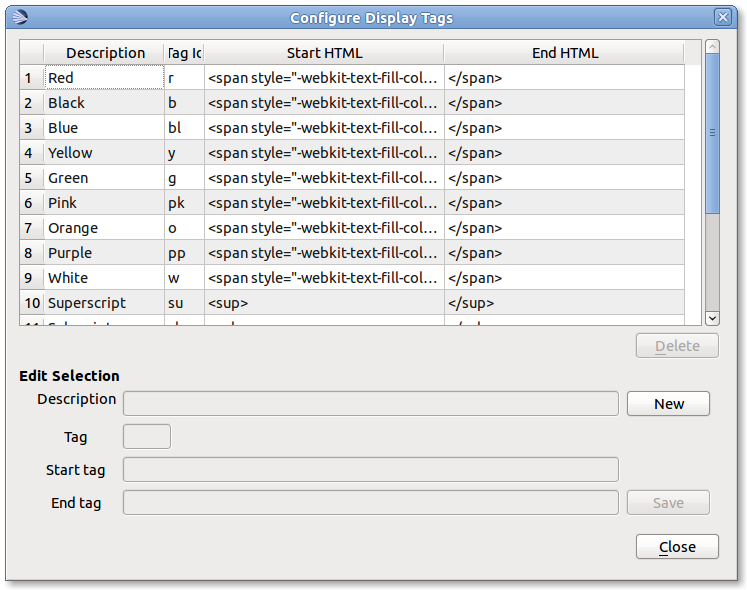

.. _display-tags:

============
Display Tags
============

OpenLP has the ability to add additional formatting to text in songs and custom
slides through the use of :ref:`g-display-tags`. :ref:`g-display-tags` provide 
a shortcut to use HTML and CSS to format text. 

:ref:`g-display-tags` consist of two parts, a starting and an ending tag, each
tag consists of brace, tag identifier, brace. 

Using a Display Tag
-------------------

To use :ref:`g-display-tags` surround the text with a starting tag {} followed
by the text to be formatted. End the text to be formatted with an ending tag
{/}.

Example of Use
--------------

To make a section of text bold you would do the following in a custom slide or
song::

  Amazing grace how {st}sweet{/st} the sound.
  
This will yield the text as:

  Amazing grace how **sweet** the sound.
  
Included Display Tags
---------------------

The following tags are included with OpenLP

* **{r}** red text
* **{b}** black text
* **{bl}** blue text
* **{y}** yellow text
* **{g}** green text
* **{pk}** pink text
* **{o}** orange text
* **{pp}** purple text
* **{w}** white text
* **{sb}** subscript text
* **{p}** paragraph
* **{st}** bold
* **{it}** italics

Configuring Display Tags
------------------------

To add new :ref:`g-display-tags` go to :menuselection:`Settings -> Configure 
Display Tags`

Click the :guilabel:`New` button to add new :ref:`g-display-tags`. Enter the 
description of the display tag followed by the tag. The tag must be unique.
Tags do not need to put the in braces {} here, only when using the tag.
Finally, enter in the HTML or CSS for the tag and click :guilabel:`Save` to
complete adding new :ref:`g-display-tags`.

To delete :ref:`g-display-tags` that you have entered click on the display tag
from the list and click :guilabel:`Delete`.

**Note** if a tag is deleted that is in use in a song or custom slide the slide
will display the tags {} without any formatting.  The deleted tags will need to
be manually deleted from the songs or custom slides.
