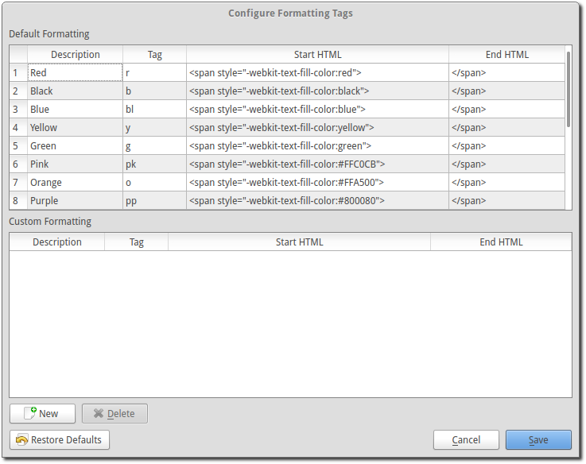

.. _formatting-tags:

===============
Formatting Tags
===============

OpenLP has the ability to add additional formatting to text in songs and custom
slides through the use of :ref:`g-formatting-tags`. :ref:`g-formatting-tags` 
provide a shortcut to use HTML and CSS to format text. 

:ref:`g-formatting-tags` consist of two parts, a starting and an ending tag, 
each tag consisting of a brace, tag identifier, brace. 

**Note:** HTML or CSS cannnot be directly entered into OpenLP. They must be
defined through the use of :ref:`g-formatting-tags`

Using a Formatting Tag
======================

:ref:`g-formatting-tags` can be inserted by typing the tag into the text that 
is being edited or by using the mouse to select and insert the tags.
:ref:`g-formatting-tags` can not span across page breaks. If a tag begins with
text on one side of a page break it cannot stretch across the break. Instead, 
two sets of tags will need to be used, one set on each side of the break.

Adding Formatting Tags Using Text
---------------------------------

To use :ref:`g-formatting-tags` surround the text with a starting tag {} followed
by the text to be formatted. End the text to be formatted with an ending tag
{/}.

Example of Use
^^^^^^^^^^^^^^

To make a section of text bold you would do the following in a custom slide or
song::

  Amazing grace how {st}sweet{/st} the sound.
  
This will yield the text as:

  Amazing grace how **sweet** the sound.
  
Adding a Formatting Tag Using The Mouse
---------------------------------------

:ref:`g-formatting-tags` can be inserted by selecting the text you wish to
format. Right click on the text and select :menuselection:`Formatting Tags` 
followed by selecting the desired formatting.

Example of Use
^^^^^^^^^^^^^^

Select the song or custom slide to edit. Next, highlight the text that you want
to be formatted.

.. image:: /pics/select_text.png

Right click on the selected text and select :menuselection:`Formatting Tags` 
followed by selecting the desired formatting for the selected text.

.. image:: /pics/select_formatting.png

The formatting tags should now be inserted.

.. image:: /pics/tags_inserted.png

Included Formatting Tags
------------------------

The following tags are included with OpenLP

* **{r}** red text
* **{b}** black text
* **{bl}** blue text
* **{y}** yellow text
* **{g}** green text
* **{pk}** pink text
* **{o}** orange text
* **{pp}** purple text
* **{w}** white text
* **{su)** superscript text
* **{sb}** subscript text
* **{p}** paragraph
* **{st}** bold
* **{it}** italics
* **{u}** underline
* **{br}** break

Configuring Formatting Tags
===========================

To add new :ref:`g-formatting-tags` go to :menuselection:`Settings --> Configure 
Formatting Tags`

Click the :guilabel:`New` button to add new :ref:`g-formatting-tags`. Enter the 
description of the :ref:`g-formatting-tags` followed by the tag. The tag must be
unique. You do not need to put the in braces {} here, only when using the tag.
Finally, enter in the HTML or CSS for the tag and click :guilabel:`Save` to
complete adding new :ref:`g-formatting-tags`.

To delete :ref:`g-formatting-tags` that you have entered click on the
:ref:`g-formatting-tags` from the list and click :guilabel:`Delete`.

**Note:** if a tag is deleted that is in use in a song or custom slide the slide
will display the tags {} without any formatting.  The deleted tags will need to
be manually deleted from the songs or custom slides.

Additional Useful Tags to Add
=============================

The :ref:`g-formatting-tags` included when you installed OpenLP provide many of the commonly used 
formating Tags.  The following are :ref:`g-formatting-tags` that are used by some of the 
user community and may be of use to you.

The alignment Tags can be used to override the Theme formating.  A common use
is to Center the Title of a song when the Theme is left justified.

The Font size up and down Tags can be used to make the Theme Font size larger
or smaller for the text between the tags.  Both Tags can be combined to provide 
multiple size changes.

The Font size 20pt Tag sets the font size to a specific size.  The size
'20pt' is not an exact copy of what you would get in a word processor, but will
be comperable in size.

The Font name Tags, Arial and Times New Roman, will change the font used for the 
text enclosed by the Tags.  The Font name Tags can be combined with Color or 
Formating Tags to create easily destiguishable differences on the screen.  One use
could be for responsive readings.

The Paragraph with hanging text is used to indent the lines of Text after the
first line of text in a paragraph.

The Column Left and Column Right Tags can be used to create two columns of text,
each left justified.

.. table::
   :widths: grid
   
   +----------------+-----+-----------------------------------------------------------------------------------------------------------------------------+----------------+
   | Description    | Tag | Start HTML                                                                                                                  | End HTML       |
   +================+=====+=============================================================================================================================+================+
   | Align Left     | al  | ``
``                                                                                                      | ``
``     |
   +----------------+-----+-----------------------------------------------------------------------------------------------------------------------------+----------------+
   | Align Center   | ac  | ``
``                                                                                                    | ``
``     |
   +----------------+-----+-----------------------------------------------------------------------------------------------------------------------------+----------------+
   | Align Right    | ar  | ``
``                                                                                                     | ``
``     |
   +----------------+-----+-----------------------------------------------------------------------------------------------------------------------------+----------------+
   | Font size ˄    | fu  | ``<big>``                                                                                                                   | ``</big>``     |
   +----------------+-----+-----------------------------------------------------------------------------------------------------------------------------+----------------+
   | Font size ˅    | fd  | ``<small>``                                                                                                                 | ``</small>``   |
   +----------------+-----+-----------------------------------------------------------------------------------------------------------------------------+----------------+
   | Font size 20pt | f20 | ````                                                                                          | ````    +
   +----------------+-----+-----------------------------------------------------------------------------------------------------------------------------+----------------+
   | Arial          |arial| ````                                                                                       | ````    |
   +----------------+-----+-----------------------------------------------------------------------------------------------------------------------------+----------------+
   | Times New      |times| ````                                                                             | ````    |
   | Roman          |     |                                                                                                                             |                |
   +----------------+-----+-----------------------------------------------------------------------------------------------------------------------------+----------------+
   | Paragraph with | phg | ``
`` | ``
``     |
   | hanging test   |     |                                                                                                                             |                |
   +----------------+-----+-----------------------------------------------------------------------------------------------------------------------------+----------------+
   | Column left    | cl  | ``
``                                                                          | ``
``     |
   +----------------+-----+-----------------------------------------------------------------------------------------------------------------------------+----------------+
   | Column right   | cr  | ``
``                                                                         | ``
``     |
   +----------------+-----+-----------------------------------------------------------------------------------------------------------------------------+----------------+
