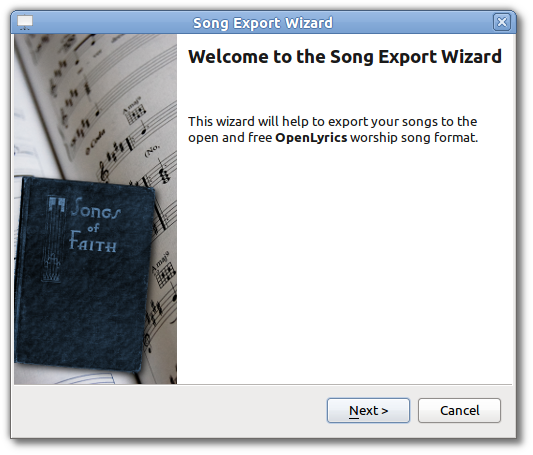
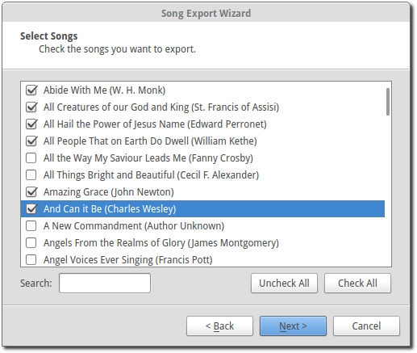
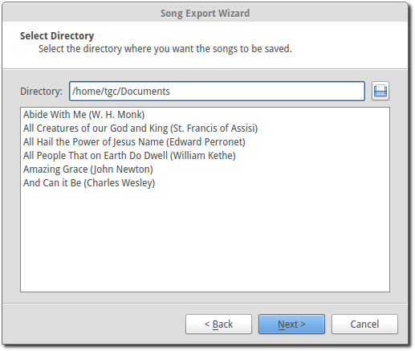
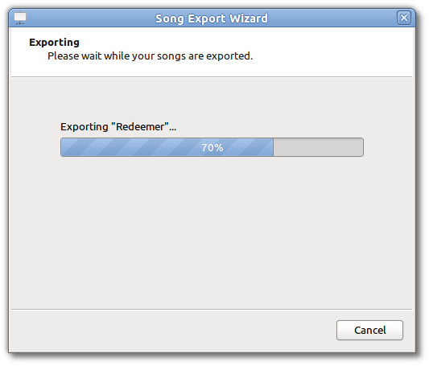
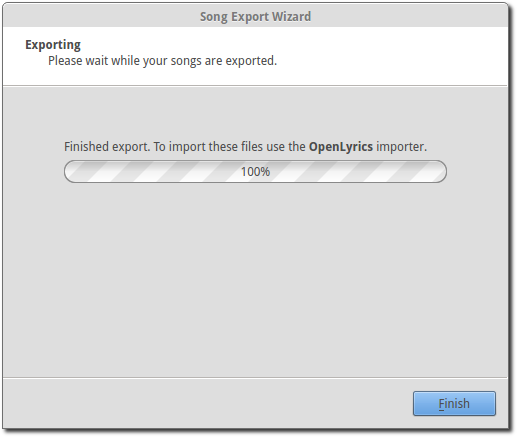

.. _export_songs:

Exporting Songs
===============

OpenLP has the ability to export your songs in the OpenLyrics worship song 
format. This is convenient for transferring your songs to another computer or 
for backup purposes.

Song export is accessible through :menuselection:`File --> Export --> Song` and
once clicked the following dialog box will appear.

Click :guilabel:`Next` to continue or :guilabel:`Cancel` if you change your mind.

You can select the songs you want to export by clicking on each song you want to 
export. 

**Search:** Searches for a song title or keyword in a title. 

**Uncheck All:** If you are not sure of your selections click :guilabel:`Uncheck All` 
and start over.

**Check All:** Click :guilabel:`Check All` selects all of the songs for export. 

When you are finished with your selection click :guilabel:`Next`.

**Select Directory** Select the directory where you want the songs to be saved. 
The list of songs to be exported are shown below. 

**Note** Exporting songs will create a file for each song, If you export one 
hundred songs, you will have have one hundred individual files.

Shows the progress of exporting the songs.

Click :guilabel:`Finish` to complete the export process.

