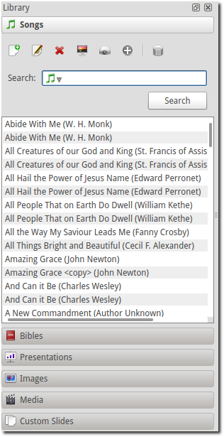
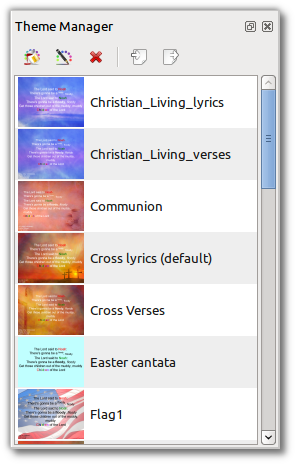

.. _glossary:

========
Glossary
========

The developers of OpenLP have strived to make it a straightforward and easy to
use application. However, it is good to be familiar with a few terms that will
be used throughout this documentation, and when seeking support.

.. _g-ftwizard:

First Time Wizard
-----------------

The :ref:`wizard` gives you the ability to perform a basic setup before OpenLP 
starts for the first time.

.. _g-formatting-tags:

Formatting Tags
---------------

:ref:`formatting-tags` give you the ability to add additional text formatting to text in
songs and custom slides.

.. _g-main-window:

Main Window
-----------

The Main Window is what you will see when you first open OpenLP. It contains all
the tools and plugins that make OpenLP function.

.. image:: pics/mainwindow.png

.. _g-media-manager:

Media Manager
-------------

The Media Manager contains a number of tabs which the plugins supply to OpenLP.
Each tab in the Media Manager is called a :ref:`g-media-item`. You can send
songs, Bibles, etc from the :ref:`g-media-item` to the
:ref:`g-preview-slide-controller` or :ref:`g-live-slide-controller`.

.. _g-media-item:

Media Item
----------

A media item is a tab in the :ref:`g-media-manager`. The media item contains
any items from the various plugins which can be displayed on the display screen.

.. g-platform:

Platform
--------

When the word "platform" is used, it is usually referring to your operating
system, Windows, Linux, (Mac) OS X or FreeBSD/PC-BSD.

.. _g-preview-pane:

Preview Pane
------------

The preview pane is a section to preview your media items before you go live
with them.

.. _g-service-file:

Service File
------------

A service file is the file that is created when you save your service in OpenLP.
The service file consist of **Service Items**

.. _g-service-item:

Service Item
------------

Service items are the **media items** that are in the **service manager**

.. _g-service-manager:

Service Manager
---------------

The service manager contains the media items in your service file. This is the
area where your media items go live. You can also save, open, and edit
services files from here.

.. _g-slide-controller:

Slide Controller
----------------

The Slide Controller controls which slide from a **Service Item** is currently
being displayed, and moving between the various slides.

.. image:: pics/slidecontroller.png

.. _g-preview-slide-controller:

Preview Slide Controller
------------------------

The preview :ref:`g-slide-controller` shows you a simple preview of your item.
It does not send any output to the display screen.

.. _g-live-slide-controller:

Live Slide Controller
---------------------

The live :ref:`g-slide-controller` controls the live output to the display
screen.

.. _g-theme-manager:

Theme Manager
-------------

The theme manager is where themes are created and edited. Themes are the text
styles and backgrounds that you use to personalize your services.

