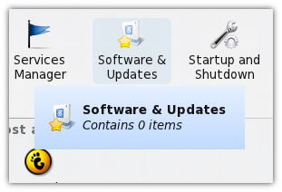
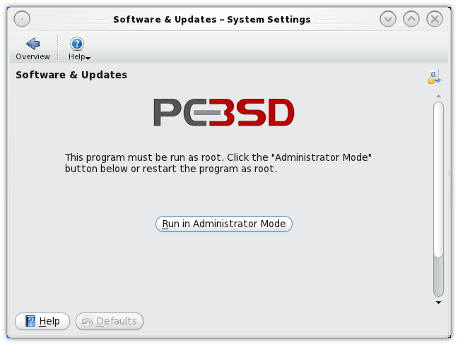
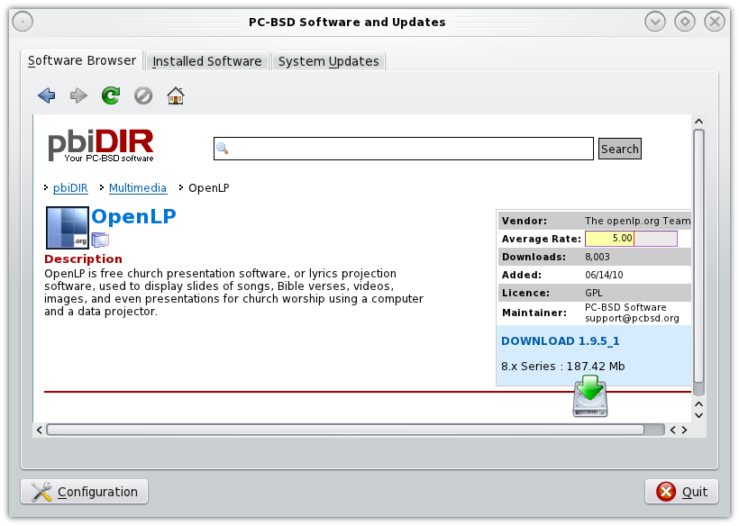
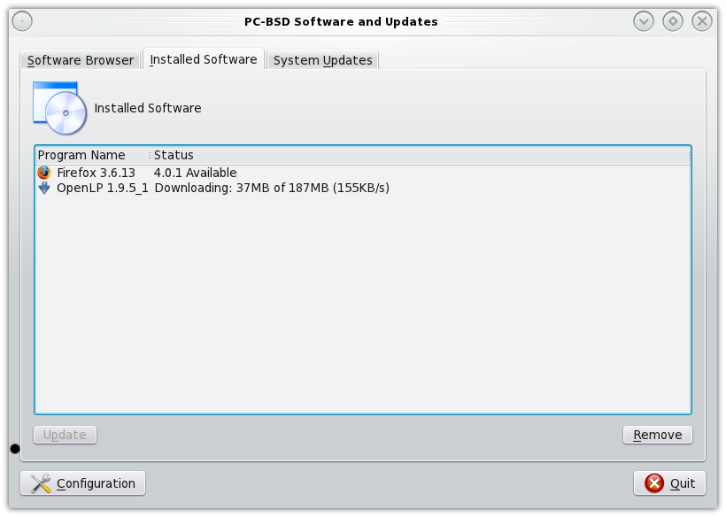

Installing OpenLP on BSD
========================

PC-BSD
^^^^^^

You will need to have root privileges to install OpenLP. You will be asked for 
the root password several times during installation.

From the KickOff Menu select :guilabel:`System Settings`. From the System
Settings select :guilabel:`Software & Updates`

When prompted click on the :guilabel:`Run in Administrator Mode` button and
enter your root password when asked.

Type *openlp* into the search box then click :guilabel:`Search`. When OpenLP is
located click on :guilabel:`Download`

Confirm you want to download OpenLP. You should now be able to see the progress
of the OpenLP download and installation.

When the installation has completed OpenLP will be available from the KickOff menu.

