Installing OpenLP on Linux
==========================

Setting up OpenLP varies by distribution. We have included documentation on
popular distributions or distributions that have OpenLP available from their
package managers. It should be possible to get OpenLP running on 
nearly any Linux distribution.

Ubuntu
^^^^^^

Installation of OpenLP on Ubuntu can either be done through the Software Center
or the command line. Command line instructions will be included at the end of
this section on Ubuntu and its variants.

Open up the software center by clicking on the :guilabel:`Software Center` icon
in the Launcher if you are using the Unity desktop, or if you are using an 
older version of Ubuntu, or the Classic Desktop go to :menuselection:`Applications`
and select the Software Center from the bottom of the menu. You will need to 
be the administrator of the system to install OpenLP and will be asked for the
administrator password several times through this process.

First you will need to add the OpenLP Personal Package Archive (PPA) to
your system. Go to :menuselection:`Edit --> Software Sources`

.. image:: pics/1softwaresources.png

Click on the :menuselection:`Other Software` tab then click on the 
:guilabel:`Add...` button to add the new software source.

.. image:: pics/2othersoftware.png

Add the APT line::

  ppa:openlp-core/release
  
Click :guilabel:`Add Source`
  
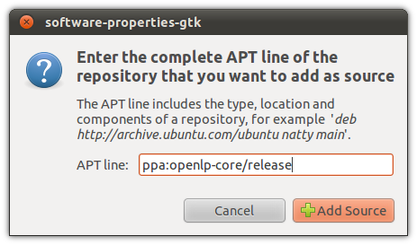

You now need to restart the Software Center to refresh the package list. When
you have the Software Center running simply search for OpenLP and click 
:guilabel:`Install`.

.. image:: pics/4searchopenlp.png

You will see the install progress as OpenLP and the dependencies required for
it to run are downloaded.

.. image:: pics/5installprogressubuntu.png

After installation you should see that OpenLP is installed.

.. image:: pics/6installcompleteubuntu.png

You can now run OpenLP by either searching for it in the *Dash*, or clicking on
the category *Media Apps* in Unity. If you are running the Classic Desktop you 
will have OpenLP available by clicking 
:menuselection:`Applications --> Sound and Video --> OpenLP`

Kubuntu
^^^^^^^

From the KickOff Menu click :guilabel:`System Settings` Then click on 
:guilabel:`Software Management`.

.. image:: pics/kubuntusystemsettings.png

Click on settings in the left hand column.

Click on the :guilabel:`Edit Origins` button.

.. image:: pics/kubuntuaddremovesettings.png

Click on the :guilabel:`Other Software` tab.

.. image:: pics/kubuntusoftwaresources.png

Click the :guilabel:`Add` button.

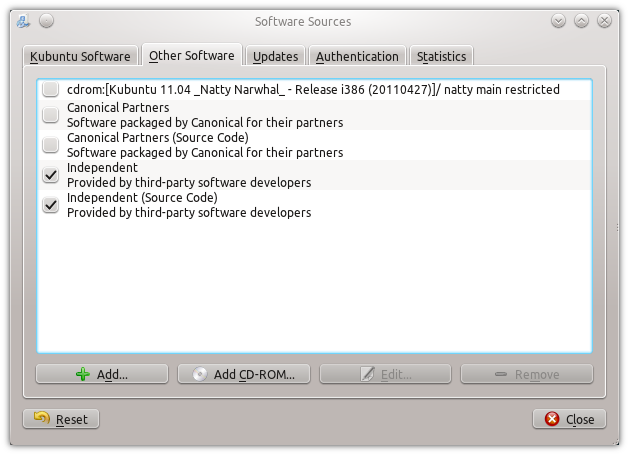

Type the following in the text box::

  ppa:openlp-core/release

.. image:: pics/kubuntuaddapt.png

After clicking :guilabel:`OK` you should now see new entries for OpenLP

.. image:: pics/kubuntusoftwareopenlpadded.png

Click :guilabel:`Close` when given the option to reload the software 
information click the :guilabel:`Reload` button.

.. image:: pics/kubuntureloadsources.png

Click on :guilabel:`Get and Remove Software` in the left column. Type openlp in
the search box. Next, click on :guilabel:`Find by name`. Once OpenLP is located
click on the search result and click on :guilabel:`Install`. Click the
:guilabel:`Apply` button to install OpenLP 

.. image:: pics/kubuntuopenlpsearch.png

You should now see the progress of the download.
 
.. image:: pics/kubuntudownloadprogress.png

Once completed you may have the option to start OpenLP from the window pictured
below. If this feature is not enabled, you can start OpenLP from the KickOff
menu.

.. image:: pics/kubuntuopenlplaunch.png

Ubuntu Command Line Install
^^^^^^^^^^^^^^^^^^^^^^^^^^^

The following install procedure should work across all Ubuntu variants. You
will need to add the Personal Package Archive (PPA) to Ubuntu's software 
sources. From a terminal type::

  user@ubuntu:~$ sudo add-apt-repository ppa:openlp-core/release
  
Now you need to refresh the package list::

  user@ubuntu:~$ sudo apt-get update
  
Install OpenLP::

  user@ubuntu:~$ sudo apt-get install openlp

OpenLP should now be available in your desktop's menu system, but if you wish 
to run OpenLP from the command line type::

  user@ubuntu:~$ openlp

Fedora (GNOME)
^^^^^^^^^^^^^^

**Note** When installing OpenLP you will need to have administrator privileges.
You will be asked for the administrator password to install.

Installing with Fedora you will use the default Add/Remove Programs available
from :menuselection:`System --> Administration --> Add/Remove Programs` in 
Fedora 14 and below or in :menuselection:`Applications --> System Tools --> 
Add/Remove Programs`

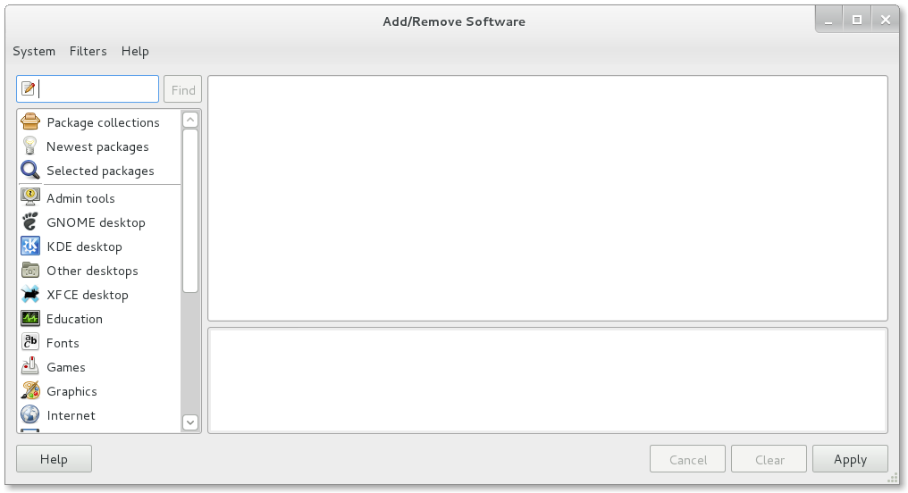

Search for OpenLP in the search box

.. image:: pics/2fedoraaddremove.png

Check the check box for OpenLP then click :guilabel:`Apply`

.. image:: pics/3fedoraaddremove.png

Click :guilabel:`Continue` to confirm installing any additional software.

.. image:: pics/4fedoraadditionalconfirm.png

You should now see the packages downloading in the lower left corner.

.. image:: pics/5fedoraaddremove.png

Click :guilabel:`Run` to run OpenLP now, or :guilabel:`Close` to run OpenLP
later.

.. image:: pics/6fedoracomplete.png

OpenLP will be available in :menuselection:`Applications --> Sound & Video --> OpenLP`

Fedora (KDE)
^^^^^^^^^^^^

**Note** when installing OpenLP you will need to have administrator privileges.
You will be asked for the administrator password to install.

From the KickOff open *Software Management*. Type OpenLP into the search
box. Then click :guilabel:`Find by name` or press :kbd:`Enter`.

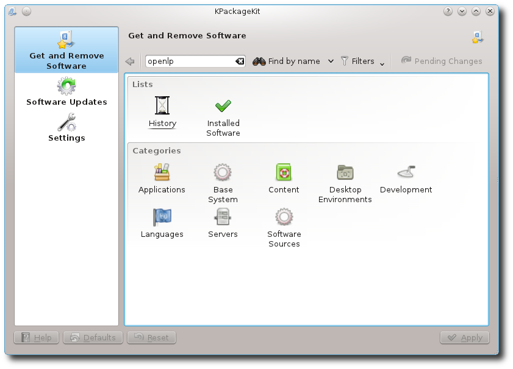

Select OpenLP from the search results. Next, click :guilabel:`Apply`

.. image:: pics/2fedoragetremove.png

Now give permission to install other software dependencies that are needed by
clicking :guilabel:`Continue`

Once completed you can run OpenLP by clicking on its logo in the completed 
install notification, or from the KickOff menu.

.. image:: pics/4fedoracompleted.png

Fedora Command Line Install
^^^^^^^^^^^^^^^^^^^^^^^^^^^

To install OpenLP from the command line type::

  user@fedora:~$ sudo yum install openlp

OpenLP should now be available in your desktop's menu system, but if you wish 
to run OpenLP from the command line type::

  user@fedora:~$ openlp

Linux Mint
^^^^^^^^^^

The following instructions are for a standard Linux Mint install. These 
instructions will not work with Linux Mint Debian Edition. If your are running
Linux Mint without the standard desktop please see the :ref:`mint-command`
install instructions.

The administrator password will be required several times during the 
installation. To install OpenLP open the Software Manager from the Mint Menu.

.. image:: pics/mint1.png

The OpenLP personal package archive (PPA) will need to be added. Click on 
:menuselection:`Edit --> Software Sources`

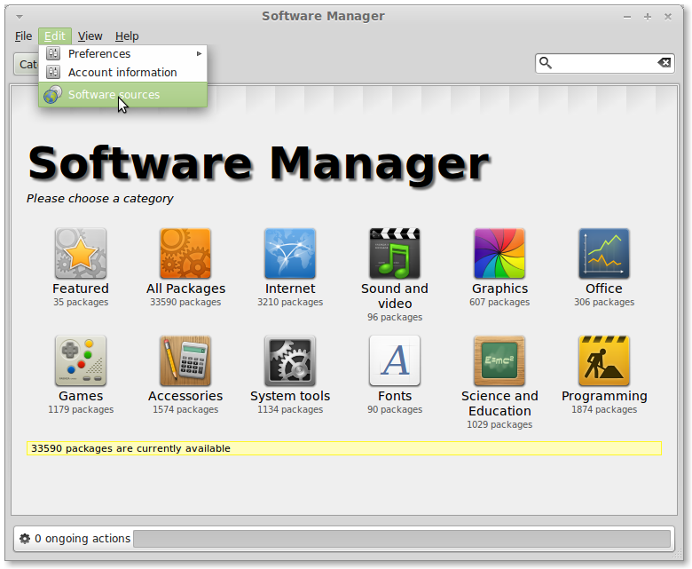

Click on the :guilabel:`Other Software` tab.

.. image:: pics/mint3.png

Click on the :guilabel:`Add...` button to add the new software source.

.. image:: pics/mint4.png

Add the APT line::

  ppa:openlp-core/release
  
Click :guilabel:`Add Source`.

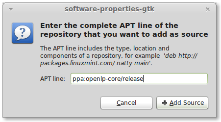

Click :guilabel:`Reload` to reload your software sources.

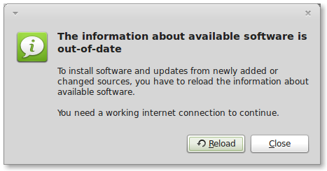

Type OpenLP into the search box to locate the OpenLP package.

.. image:: pics/mint7.png

Click on OpenLP from the results then click :guilabel:`Install`.

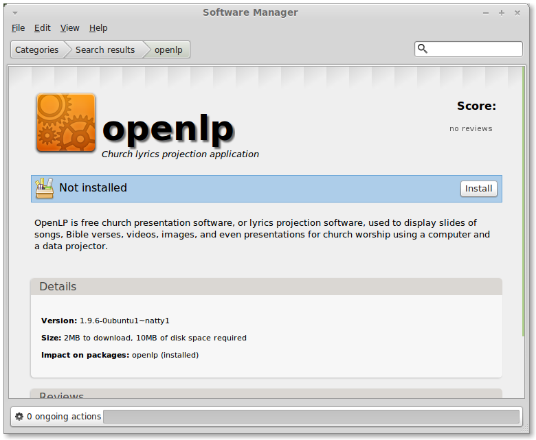

After OpenLP is installed you can close the Software Manager and start OpenLP
from the *Sound and Video* section of the Mint Menu.

.. _mint-command:

Linux Mint Command Line Install
^^^^^^^^^^^^^^^^^^^^^^^^^^^^^^^

You will need to add the Personal Package Archive (PPA) to Linux Mint's
software sources. From a terminal type::

  user@mint:~$ sudo add-apt-repository ppa:openlp-core/release
  
Now you need to refresh the package list::

  user@mint:~$ sudo apt-get update
  
Install OpenLP::

  user@mint:~$ sudo apt-get install openlp

OpenLP should now be available in your desktop's menu system, but if you wish 
to run OpenLP from the command line type::

  user@mint:~$ openlp

openSUSE
^^^^^^^^

**Note:** OpenLP is only currently supported in openSUSE 12.1

OpenLP is available using 1-Click Install on the openSUSE Build Service
website. Go to the `openSUSE Build Service site <http://software.opensuse.org>`_
and type :kbd:`openlp` into the search box.

.. image:: pics/suse1.png

Then click :guilabel:`1-Click Install`

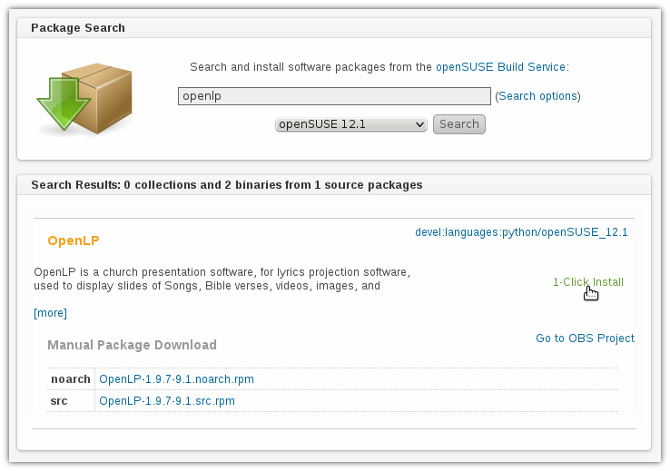

Select open with YaST then click :guilabel:`OK`

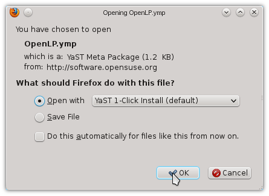

Additional repositories may need to be enabled. This will be performed
automatically. Accept the default options by clicking :guilabel:`Next`

.. image:: pics/suse5.png

Confirm you want to install OpenLP and click :guilabel:`Next`

.. image:: pics/suse6.png

Before the installation takes place confirm adding the repositories and
installing the software again. Click :guilabel:`Next` to continue.

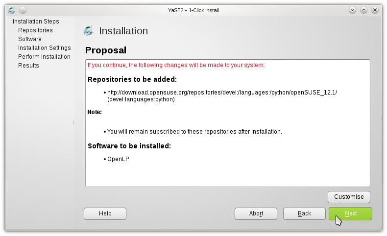

Since this is a third party application the software key will have to be 
accepted. Click :guilabel:`Trust` to accept the software key.

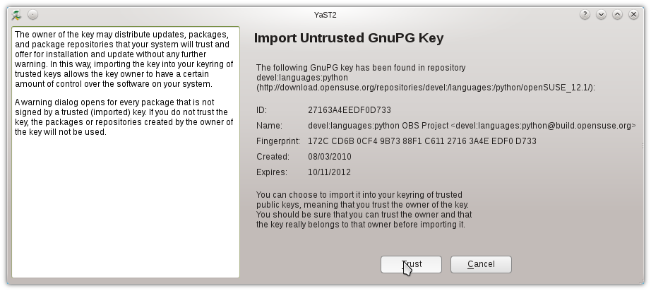

OpenLP will now be installed. When the install process is completed click
:guilabel:`Finish`.

.. image:: pics/suse9.png

OpenLP will now be available for use.

Arch Linux
^^^^^^^^^^

OpenLP is availabe on Arch Linux through the Arch User Repository, or AUR. Info
on the AUR can be found `at the Arch wiki <https://wiki.archlinux.org/index.php/Arch_User_Repository>`_.

There are a variety of tools and methods to install from the AUR. For this
example we will demonstrate using Yaourt. For more info on Yaourt please see 
the `Yaourt documentation <https://wiki.archlinux.org/index.php/Yaourt>`_.  

From a terminal type::

  user@arch:~$ yaourt -S openlp

OpenLP should now be available in your desktop's menu system, but if you wish
to run OpenLP from the command line type::

  user@arch:~$ openlp
