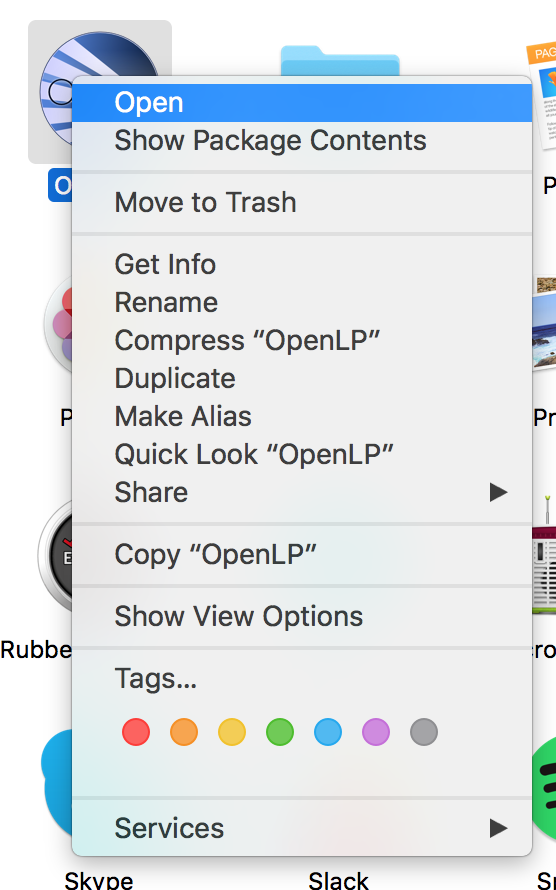
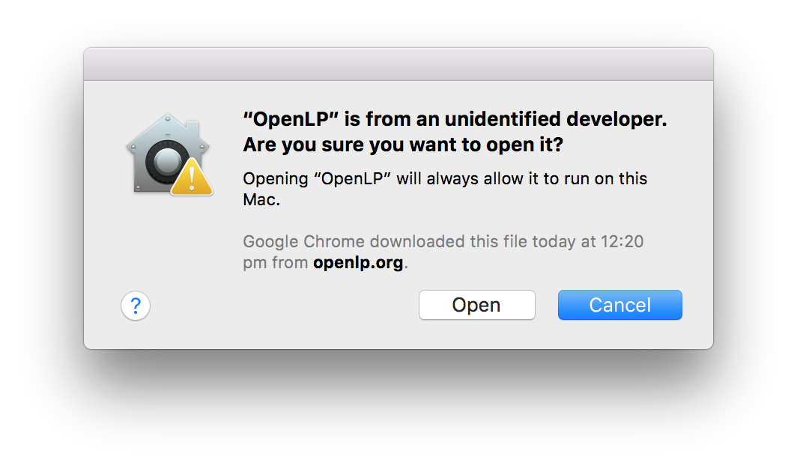
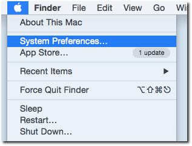
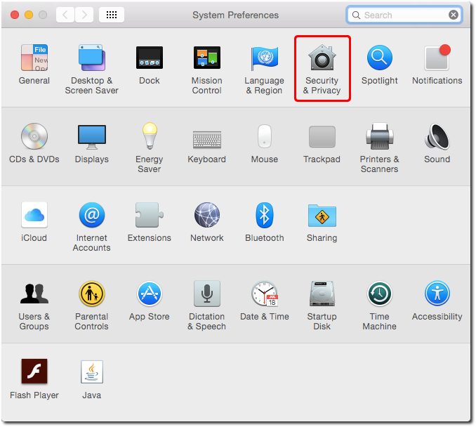
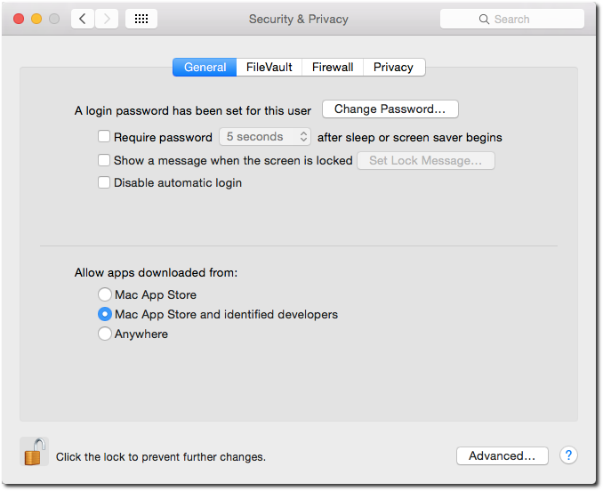

Installing OpenLP on macOS
==========================

If you have not already downloaded the correct file from the `OpenLP website`_, download it now. Then double click on
the .dmg file. This will open a window with two icons: An OpenLP icon and an Applications Folder icon. To install
OpenLP, simply drag the OpenLP icon over to the Applications folder icon and you will be ready to use OpenLP. OpenLP
will be available in your Applications folder.

.. image:: pics/install-macos-01-dnd-install.png

With the release of Mac OS X 10.7.5, applications that are not signed by a developer registered with Apple will not run
by default. In order to run OpenLP the first time after installation, you will need to "teach" your computer to trust
the OpenLP application.

First, go to the :guilabel:`Applications` folder and right-click on OpenLP (two-finger click on touch pads, or
:kbd:`Control+click` if you don't have a right mouse button). This will bring up a context menu as shown. Select "Open"
from that menu.

Your computer may then verify the application, which will take a few seconds.

.. image:: pics/install-macos-03-verifying.png

You will see a prompt asking whether you are sure you want to open "OpenLP", noting that it is from an unidentified
developer. It will look very similar to the pictured dialog.

To run OpenLP you simply need to click "Open". In future, you can simply run OpenLP just like any other application
(double-click in Applications, or keep it in the Dock for easy access) without going through these steps.

You may need to repeat similar steps when you upgrade OpenLP (once per upgrade).

If the steps above don't work, you may need to set your GateKeeper settings (under :guilabel:`Security && Privacy`) to
"Mac App Store and identified developers", as seen below.

.. _OpenLP website: https://openlp.org/
