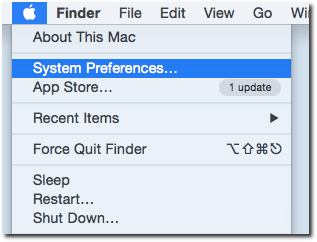
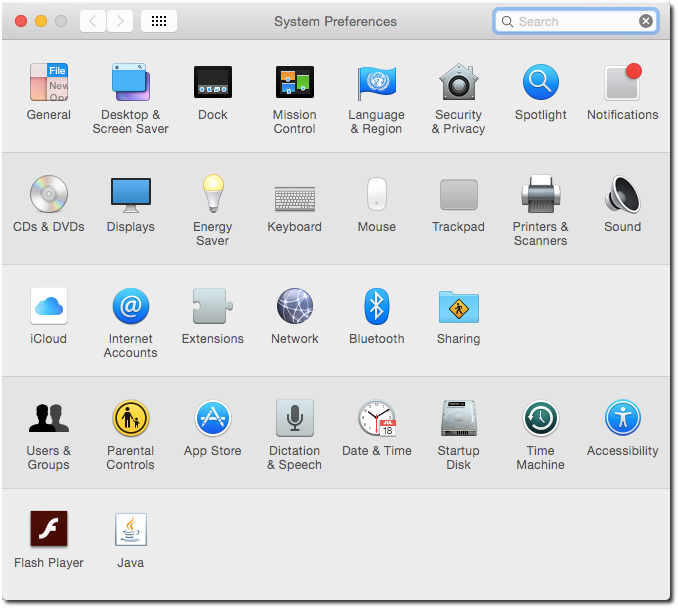

Installing OpenLP on Mac OS X
=============================

If you have not already downloaded the correct file from the `OpenLP website`_,
download it now. Then double click on the .dmg file. This will open a window with two
icons: An OpenLP icon and an Applications Folder icon. To install OpenLP, simply drag
the OpenLP icon over to the Applications folder icon and you will be ready to use
OpenLP. OpenLP will be available in your Applications folder.

.. image:: pics/mac-os-x-dnd-install.png

With the release of Mac OS X 10.8 applications not downloaded throught the Mac
App Store will not run by default. A setting must be changed in the Security &
Privacy Settings to run OpenLP.

Click the Apple icon and open System Preferences

Open the Security & Privacy settings

Change the setting from Mac App Store to Anywhere. If the settings are grayed
out click on the lock in the lower lefthand corner of the settings window to  
enable editing.

.. _OpenLP website: https://openlp.org/
