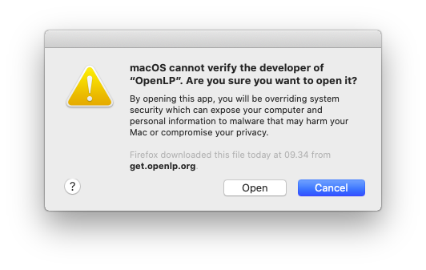

Installing OpenLP on macOS
==========================

If you have not already downloaded the correct file from the `OpenLP website`_, download it now. Then double click on
the .dmg file. This will open a window with two icons: An OpenLP icon and an Applications Folder icon. 

To install OpenLP, simply drag the OpenLP icon over to the Applications folder icon. A window will show the installation
progress.

Since OpenLP is an Open Source project we do not have the finacial means to buy an official Apple Developer certificate,
which means that macOS will refuse to open OpenLP because it has not been signed by an official Apple Developer
certificate. We do assure you that if you downloaded OpenLP from the `OpenLP website`_, it is safe to install and run.
To start OpenLP open the :guilabel:`Applications` folder, find the OpenLP icon an click it. The first time you start
OpenLP a window will open showing the verification progress.

The verification will fail and show this warning:

Click :guilabel:`OK` to close the window. You will now have to tell macOS to trust OpenLP despite this.
Open the Apple menu and choose :guilabel:`System Preferences...`. Now click :guilabel:`Security & Privacy` as marked
below.

In the default :guilabel:`General` tab you should now see a window similar to the one below. Click the
:guilabel:`Open Anyway` button to open OpenLP.

macOS will now try to open OpenLP again. Again a window will open showing the verification progress.

.. image::  pics/install-macos-07-verifying-again.png

A window will now open with a warning that OpenLP is unsafe. Click :guilabel:`Open` to open OpenLP.

The first time OpenLP runs you will be prompted about granting some extra rights to OpenLP. OpenLP uses these rights to
control PowerPoint and Keynote presentation programs. Click :guilabel:`OK` to allow this.

The first time you start a PowerPoint or Keynote presentation from OpenLP you will also be asked to grant rights to
those applications as can be seen below. Again click :guilabel:`OK` to allow this.

.. image::  pics/install-macos-12-allow-keynote-access.png

.. _OpenLP website: https://openlp.org/
