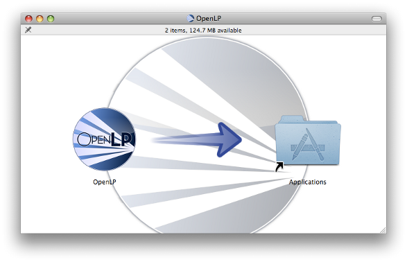

Installing OpenLP on Microsoft Windows
======================================

Installing OpenLP is identical over all supported versions of Windows. After
downloading the file from the `download page <http://www.openlp.org/en/download.html>`_ 
open the file by double clicking when the download is complete. After opening 
the downloaded file agree to open the unverified file if you are prompted.
On Windows 8 you might have to click :guilabel:`More info` before you can
verify by clicking :guilabel:`Run anyway`.

Next select your language and click :guilabel:`OK`

After reading the welcome message click :guilabel:`Next` to continue the
installation.

.. image:: pics/win10-welcome.png

Agree to the license agreement. Click :guilabel:`Next` to continue.

.. image:: pics/win10-license.png

Select the install location for OpenLP. Choosing the default location is
generally the best choice. Click :guilabel:`Next` to continue.

Select a start menu folder for OpenLP to be visible in. The default location
here is generally the best choice. Click :guilabel:`Next` to continue.

Select if you want to create a desktop or Quick Launch icon. Click :guilabel:`Next`
to continue.

.. image:: pics/win10-additionaltask.png

Review your previous choices. If you need to make any changes click the
:guilabel:`Back button` to get to the previous choices, or click :guilabel:`Install`

.. image:: pics/win10-readytoinstall.png

The progress bar will update you on how far along the installation has gone.

.. image:: pics/win10-progress.png

When the install is complete you will have the option to launch OpenLP.

.. image:: pics/win10-launch.png

After making your selection click :guilabel:`Finish`

Installing OpenLP on Mac OS X
=============================

Version 10.8 (Mountain Lion) and Newer
--------------------------------------

With the release of version 10.8 applications not downloaded throught the Mac
App Store will not run by default. A setting must be changed in the Security &
Privacy Settings to run OpenLP.

Click the Apple icon and open System Preferences

Open the Security & Privacy settings

Change the setting from Mac App Store to Anywhere. If the settings are grayed
out click on the lock in the lower lefthand corner of the settings window to  
enable editing.

I you have not already downloaded the correct file from the OpenLP
`download page <http://www.openlp.org/en/download.html>`_, download it now.
Then double click on the .dmg file. Drag the OpenLP icon over to the Applications
folder and you will be ready to use OpenLP. OpenLP will be available in your
Applications folder.

