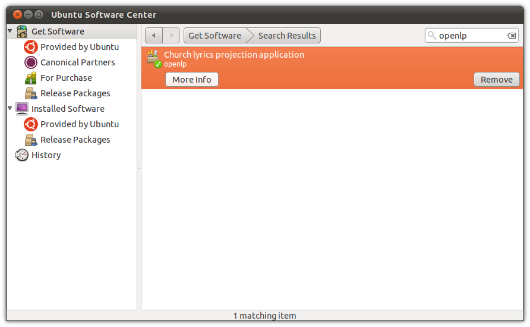

Installing OpenLP
=================

Microsoft Windows
-----------------

Installing OpenLP is identical over all supported versions of Windows. After
downloading the file from the `download page <http://www.openlp.org/en/download.html>`_ 
open the file by double clicking when the download is complete. After opening 
the downloaded file agree to open the unverified file if you are prompted.

Next select your language and click :guilabel:`OK`

.. image:: pics/selectlanguage.png

After reading the welcome message click :guilabel:`Next` to continue the
installation.

.. image:: pics/welcome.png

Agree to the license agreement. Click :guilabel:`Next` to continue.

.. image:: pics/license.png

Select the install location for OpenLP. Choosing the default location is
generally the best choice. Click :guilabel:`Next` to continue.

.. image:: pics/installlocation.png

Select a start menu folder for OpenLP to be visible in. The default location
here is generally the best choice. Click :guilabel:`Next` to continue.

.. image:: pics/startmenufolder.png

Select if you want to create a desktop or Quick Launch icon. Click :guilabel:`Next`
to continue.

.. image:: pics/additionaltask.png

Review your previous choices. If you need to make any changes click the
:guilabel:`Back button` to get to the previous choices, or click :guilabel:`Install`

.. image:: pics/readytoinstall.png

The progress bar will update you on how far along the installation has gone.

.. image:: pics/progress.png

When the install is complete you will have the option to launch OpenLP. After
making your selection click :guilabel:`Finish`

Mac OS X
--------

Installing OpenLP on OS X is very simple. After downloading the correct file
from the OpenLP `download page <http://www.openlp.org/en/download.html>`_ 
double click on the .dmg file. Drag the OpenLP icon over to the Applications
folder and you will be ready to use OpenLP. OpenLP will be available in your
Applications folder.

.. image:: pics/osxinstall.png

Linux
-----

Setting up OpenLP varies by distribution, we have included documentation on
popular distributions or distributions that have OpenLP available from their
package managers. It should be possible to get OpenLP running on 
nearly any linux distribution.

Ubuntu
^^^^^^

Installation of OpenLP on Ubuntu can either be done through the Software Center
or the command line. Command line instructions will be included at the end of
this section on Ubuntu and its variants.

Open up the software center by clicking on the :guilabel:`Software Center` icon
in the Launcher if you are using the Unity desktop, or if you are using an 
older version of Ubuntu, or the Classic Desktop go to :menuselection:`Applications`
and select the Software Center from the bottom of the menu. You will need to 
be the administrator of the system to isntall OpenLP and will be asked for the
administrator password several times through this process.

We will first need to add the OpenLP Personal Package Archive (PPA) to your
system. Go to :menuselection:`Edit --> Software Sources`

.. image:: pics/1softwaresources.png

Click on the :menuselection:`Other Software` tab then click on the 
:guilabel:`Add...` button to add the new software source.

.. image:: pics/2othersoftware.png

Add the APT line::

  ppa:openlp-core/release
  
Click :guilabel:`Add Source`
  
.. image:: pics/3aptline.png

You will now need to restart the Software Center to refresh the package list.
when you have it back to running simple search for OpenLP and click 
:guilabel:`Install`.

You will now see the install progress as OpenLP and the depenencies required
for it to run are downloaded.

.. image:: pics/5installprogressubuntu.png

After installation you should see that OpenLP is installed.

You can now run OpenLP by either searching for it in the `Dash`, or clicking on
the category `Media Apps` in Unity. If you are running the Classic Desktop you 
will have OpenLP avaialable by clicking 
:menuselection:`Applications --> Sound and Video --> OpenLP`

Ubuntu Command Line Install
^^^^^^^^^^^^^^^^^^^^^^^^^^^

The following install procedure should work across all Ubuntu variants. We will
first need to add the Personal Package Archive (PPA) to Ubuntu's software 
soruces. From a terminal type::

  user@ubuntu:~$ sudo add-apt-repository ppa:openlp-core/release
  
Now we need to refresh the package list::

  user@ubuntu:~$ sudo apt-get update
  
Install OpenLP::

  user@ubuntu:~$ sudo apt-get install openlp

OpenLP should now be avaialable in your desktops menu system, but if you wish 
to run OpenLP from the command line type::

  user@ubuntu:~$ openlp

Fedora (GNOME)
^^^^^^^^^^^^^^

Installing with Fedora we will use the default Add/Remove Programs available
from :menuselection:`System --> Administration --> Add/Remove Programs` in 
Fedora 14 and below or in :menuselection:`Applications --> System Tools --> 
Add/Remove Programs`

.. image:: pics/1fedoraaddremove.png

Search for OpenLP in the search box

.. image:: pics/2fedoraaddremove.png

Check the check box for OpenLP then click :guilabel:`Apply`

.. image:: pics/3fedoraaddremove.png

Click :guilabel:`Continue` to confirm isntalling any additional software.

.. image:: pics/4fedoraadditionalconfirm.png

You should now see the packages downloading in the lower left corner.

Click :guilabel:`Run` to run OpenLP now, or :guilabel:`Close` to run OpenLP
later.

.. image:: pics/6fedoracomplete.png

OpenLP will be available in :menuselection:`Applications --> Sound & Video --> OpenLP`

Fedora (KDE)
^^^^^^^^^^^^

