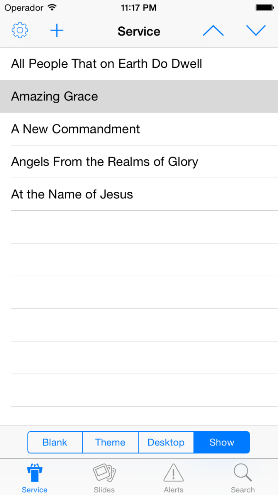
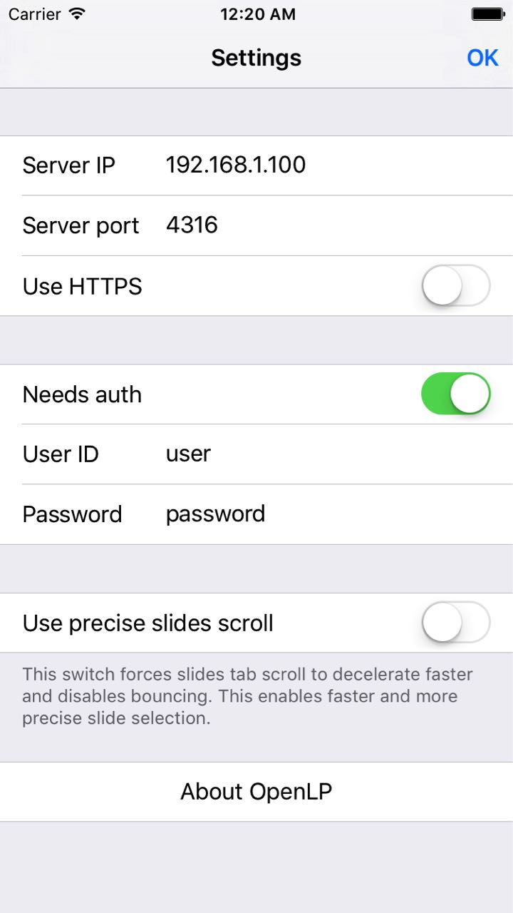
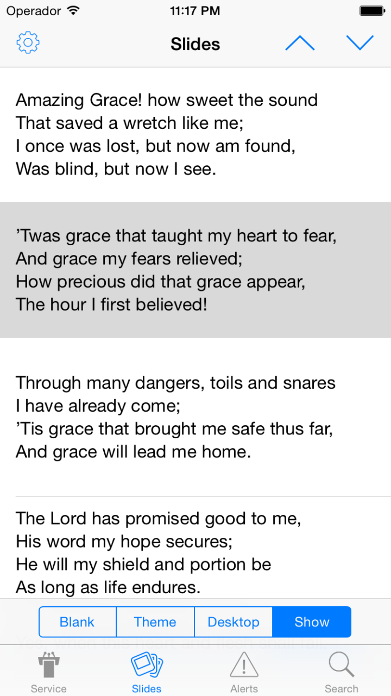
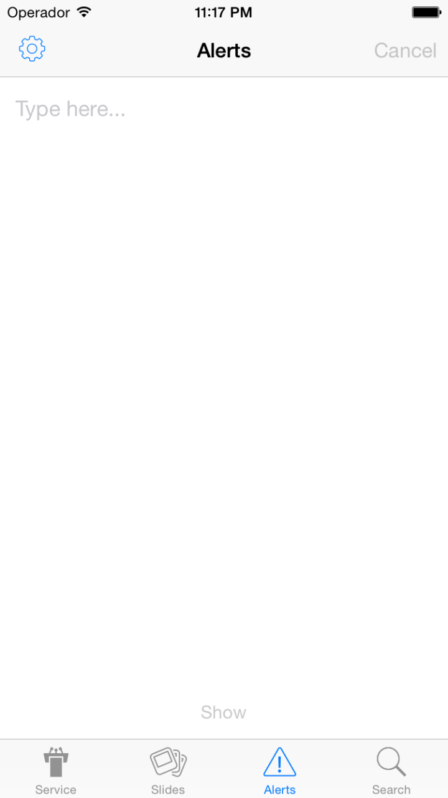
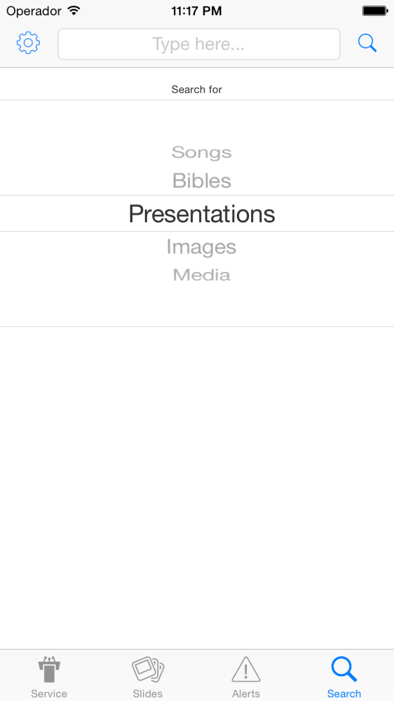
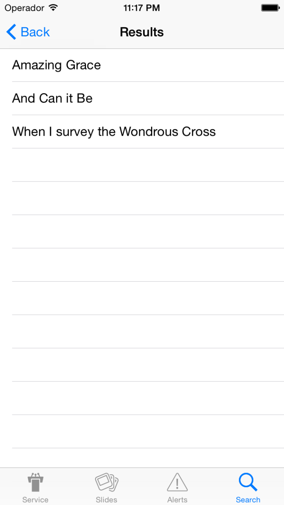

.. _ios-remote:

iOS Remote
==========

OpenLP gives you the ability to control your service from an iOS-based device. The
following tutorial will describe how to install and use the application.

Installation
------------

Open the *Apple App Store* and search for ``OpenLP``. You should find the
`OpenLP Remote`_ app. Install this app.

When you start the app, you will initially see the launch screen, followed by the
service screen once the app has loaded.

Settings
--------

After the installation is complete and you open the OpenLP Remote app you will need to
configure your settings. Open the settings by touching the settings icon in the top
left corner.

Server Details
^^^^^^^^^^^^^^

You will need to configure the server settings you will use with your device. You can
find these instructions and settings in the OpenLP desktop application under
:ref:`remote_tab`.

**Note:** To use the OpenLP Remote you will need to be on the same network as the main
computer.

**Server IP:**
    Enter the :guilabel:`Server on IP address` found in :ref:`remote_tab`.

**Server port:**
    Enter the :guilabel:`Port number` found in :ref:`remote_tab` and enter it in the box. By default this is ``4316``.

Authentication
^^^^^^^^^^^^^^

**Needs auth:**
    Tap this switch to enable authentication. Authentication needs to be set up in
    :ref:`user_auth`.

**User ID:**
    Here you can enter a username used for accessing OpenLP remotely. This
    must be the same as set in :ref:`user_auth`.

**Password:**
    Here you can enter a password used for accessing OpenLP remotely. This
    must be the same as set in :ref:`user_auth`.

Scrolling
^^^^^^^^^

**Use precise slide scrolling:**
    By default, iOS's scrolling effects can make scrolling up and down the slides
    difficult. When tapping this switch you can turn iOS's scrolling effects on and off,
    which may result in more precise scrolling.

Using the iOS Remote
--------------------

After you have completed the setup you are now ready to use the app. At the bottom of
the app you can see the *Service*, *Slides*, *Alert* and *Search* tabs.

Service
^^^^^^^

Selecting :guilabel:`Service` will take you to the Service tab. Selecting an item with
a in the service manager will immediately take it live on the projection screen and you
will be taken to the *Slides* screen on your device. You can use the arrows buttons
shown on the bottom left and right to move to the next slide inside the item. 

Along the bottom of the Service tab you can see buttons that say, *Blank*, *Theme*,
*Desktop* and *Show*. These buttons will blank the display, set it to the current theme,
show the main computer's desktop, or show the currently live item, respectively.

Slides
^^^^^^

Selecting :guilabel:`Slides` will take you to the Slides tab. This displays what ever is
live at the moment. You can use the arrow buttons shown on the top right to move to the
next slide inside the item. 

Along the bottom of the Slides tab you can also see the *Blank*, *Theme*, *Desktop* and
*Show* buttons.

Alerts
^^^^^^

To send an alert to the display, touch the *Alerts* tab at the bottom of the screen.
Type in your alert text in the text box and press the *show* button at the bottom to
show your alert in OpenLP. The alert will be displayed as you have it configured in
:ref:`configure_alerts`.

Search
^^^^^^

If you want to search for an item that is not currently in your service, press on the
*Search* tab at the bottom of the screen. Type your search term in the search box at the top of the screen, and then select which type of item you want to search for.

Once OpenLP has finished searching for you, the results of your search will be visible
in the search screen. Touch a search result to add it to your service.

.. _OpenLP Remote: https://itunes.apple.com/us/app/openlp-remote/id1096218725?mt=8
