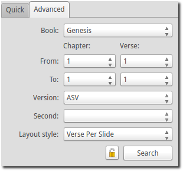
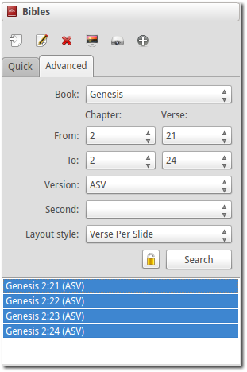
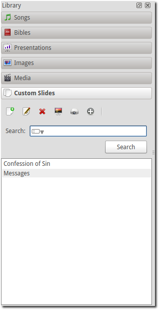
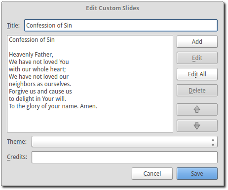

.. _media-manager:

=============
Media Manager
=============

Once you get your system set up for OpenLP you will be ready to add content to
your :ref:`g-service-manager`. This will all happen through the
:ref:`g-media-manager`. The :ref:`g-media-manager` contains all the Bibles,
Songs, Presentations, Media, and Custom Slides that you will project through
OpenLP.

If you don't see the "Songs", "Bibles" and other media items in the
:ref:`g-media-manager`, then refer to :ref:`t-no-media-items` in the
troubleshooting guide.

Songs
-----

Clicking on *Songs* in the :ref:`g-media-manager` will display the songs media
item. The songs media item shows a list of all the songs you have added to the
songs database.

.. image:: pics/mediamanager_songs.png

Toolbar
^^^^^^^

|buttons_new| **Add song**
    Open the song edit dialog to add a new song.

|buttons_edit| **Edit song**
    Open the song edit dialog to make changes to the selected song.

|buttons_delete| **Delete song**
    Remove the selected song(s) from the song list.

|buttons_preview| **Preview song**
    Send the selected song to the :ref:`g-preview-slide-controller`.

|buttons_live| **Send song live**
    Send the selected song to the :ref:`g-live-slide-controller` to be shown on
    the display screen.

|buttons_add| **Add song to service**
    Add the selected song(s) to the :ref:`g-service-manager`. Songs can also be
    added to the :ref:`g-service-manager` by means of drag and drop from the
    :ref:`g-media-manager`.

|buttons_db| **Maintain authors, topics and books**
    Open the song maintenance dialog to add, edit or delete authors, topics or
    song books.

**Note:** Right clicking on a song in the list will bring up some of the same
options.

Search
^^^^^^

.. image:: pics/mediamanager_songs_search.png

Clicking on the icon in the search box displays a list of search options. The
following options are available:

|search_song| **Entire Song**
    Search the title, lyrics and comments fields.

|search_title| **Titles**
    Search the title field only.

|search_text| **Lyrics**
    Search the lyrics field only.

|search_author| **Authors**
    Search the associated authors.

|search_theme| **Themes**
    Search the assigned themes.

Click the :guilabel:`Search` button to perform a search and display the results
in the song list.

Bibles
------

Clicking on Bibles in the :ref:`g-media-manager` will display the Bibles media
item. The Bibles media item gives you the ability to search for Bible verses and
add them to the :ref:`g-service-manager`.

.. image:: pics/mediamanager_bibles.png

Toolbar
^^^^^^^

|buttons_import| **Import Bible**
    Import Bibles from a number of formats. This is discussed in detail on the
    :ref:`bibles-import` page.

|buttons_preview| **Preview verses**
    Send the selected verses to the :ref:`g-preview-slide-controller`.

|buttons_live| **Send verses live**
    Send the selected verses to the :ref:`g-live-slide-controller` to be shown
    on the display screen.

|buttons_add| **Add verses to service**
    Add the selected verses to the :ref:`g-service-manager`. Verses can also be
    added to the :ref:`g-service-manager` by means of drag and drop from the
    :ref:`g-media-manager`.

Quick Search Tab
^^^^^^^^^^^^^^^^

.. image:: pics/mediamanager_bibles_quick.png

The following options are available on the quick search tab:

**Find**
    Clicking the icon in the Find box displays a list of search options. The
    following options are available:

    |search_reference| **Scripture Reference**
        Search for a specific verse using a scripture reference format. The following formats are supported:

        * Book Chapter
        * Book Chapter-Chapter
        * Book Chapter:Verse-Verse
        * Book Chapter:Verse-End (this will display verses to the end of the chapter)
        * Book Chapter:Verse-Verse, Verse-Verse
        * Book Chapter:Verse-Verse, Chapter:Verse-Verse
        * Book Chapter:Verse-Chapter:Verse

    |search_text| **Text Search**
        Search by a keyword or words. Use more words to narrow down the list
        of results.

**Version**
    Once a Bible has been imported, it will be displayed in the drop down box.
    Select a version from the list of the Bibles.
    
**Second**
    If :guilabel:`Display second Bible verses` has been selected in the Bibles
    configuration, this option will be available. This is used to display
    another version of the Bible for comparison. Both versions will be
    displayed. If there is not enough space on one slide, the Second verses
    will be displayed on the next slide.
    
**Layout Style**
    The following options are available to set how Bible verses are displayed:

    **Verse Per Slide**
        Display one verse per slide.

    **Verse Per Line**
        Start each verse on a new line until the slide is full.

    **Continuous**
        Verses flow together, separated by verse number and chapter
        if chapter is selected to show above.

    This setting is also accessible in :menuselection:`Setttings --> Configure OpenLP`
    on the *Bibles* tab.

    **Note:** Changes to layout style do not affect verses already in the
    :ref:`g-service-manager`.

|buttons_clear_results| |buttons_keep_results| **Keep/Clear Results**
    Normally, when a search is run, the previous verses are cleared. To retain
    the previous set of verses, toggle this button.

Click the :guilabel:`Search` button to perform a search and display the results
in the verse list.

Advanced Tab
^^^^^^^^^^^^

The Advanced tab is convenient for selecting Bible verses by book, chapter and
verse from a set of drop down boxes.

**Book**
    Click on the drop down box and select a book from the list.

**Chapter/Verse**
    Select the *From* chapter and verse, and the *To* chapter and verse.

*Version*, *Second* and *Layout Style* are the same as in the *Quick* search
tab.

Click the :guilabel:`Search` button to perform a search and display the results
in the verse list.

Presentations
-------------

.. image:: pics/mediamanager_presentations.png

Using the buttons you can:

.. image:: pics/mediamanager_presentations_buttons.png

|buttons_open| Load a new presentation
    This brings up a dialog box to find your presentation and load it into
    OpenLP.

|buttons_delete| Delete the selected presentation
    This removes your presentation from the list.

    *Please note*: this will not delete the presentation from your computer,
    only from the OpenLP list.

|buttons_preview| Preview the selected presentation
    Sends your selected presentation to the preview window.

*Send the selected Presentation live:*
  This option will immediately display your selected Presentation live.

*Add the selected Presentation to the service:*
  This will enter your Presentation into the Service Manager. You can also click
  and drag your Presentation over to the Service Manager.

Right clicking on a Presentation file will bring up some of the same options.

Images
------

.. image:: pics/mediamanager_images.png

Using the buttons you can:

.. image:: pics/mediamanager_images_buttons.png

*Load a new Image:*
  This brings up a dialog box to find your Image and list it in OpenLP.

*Delete the selected Image:*
  This removes your Image from the list. Please note: this will not delete the
  Image from your computer, just the OpenLP list.

*Preview the selected Image:*
  Sends your selected Image to the Preview window.

*Send the selected Image live:*
  This option will immediately display your selected Image live.

*Add the selected Image to the service:*
  This will enter your Image into the Service Manager. You can also click and
  drag your Image over to the Service Manager.

*Replace Live Background:*
  With an Image selected, clicking this button will immediately replace the live
  background being displayed with your selection. The Image will replace the theme
  background until the theme changes or the "Remove Background" button is pressed.

Right clicking on an Image file will bring up some of the same options.

Media
-----
Media is an audio or video file. Generally if you can play or view your media
on your computer without OpenLP, you can also play it in OpenLP.

.. image:: pics/mediamanager_media.png

Using the buttons you can:

*Load a new Media:*
  This brings up a dialog box to find your Media and list it in OpenLP.

*Delete the selected Media:*
  This removes your Media from the list. Please note: this will not delete the
  Media from your computer, just the OpenLP list.

*Preview the selected Media:*
  Sends your selected Media to the Preview window.

*Send the selected Media live:*
  This option will immediately display your selected Media live.

*Add the selected Media to the service:*
  This will enter your Media into the Service Manager. You can also click and
  drag your Media over to the Service Manager.

*Replace Live Background:*
  With a Media file selected, clicking this button will immediately replace the
  live background being displayed with your selection.

Right clicking on a Media file will bring up some of the same options.

Custom Slides
-------------
Custom Slides gives you the option of creating your own slide. This is useful
for displaying readings, liturgy or any text that may not be found in songs or
Bibles.

Using the buttons you can:

.. image:: pics/mediamanager_custom_buttons.png

|buttons_new| *Add a new custom slide*
    Brings up the dialog box to add a new custom slide.

|buttons_edit| *Edit the selected custom slide:*
    Brings up the dialog box to make changes to the custom slide.

|buttons_delete| *Delete the selected custom slide*
    Removes the custom slide from your list.

|buttons_preview| *Preview the selected custom slide*
    Sends your custom slide to the :ref:`g-preview-slide-controller` to
    see what it will look like when live.

|buttons_live| *Send the selected custom slide live*
    Immediately display your custom slide live, sending it to the
    :ref:`g-live-slide-controller`.

|buttons_add| *Add the selected custom slide to the service*
    This will add your custom slide to the :ref:`g-service-manager`. You can
    also drag your custom slide over to the :ref:`g-service-manager`.

*Note:*
    Right clicking on a custom slide will bring up some of the same options.

When you Add a new custom slide a dialog box will appear.

*Title:*
  Name of your custom slide.

*Add:*
  After clicking on Add you will enter your text you want to display in this box.
  To create multiple slides, click the Split Slide button. When you have finished
  adding your text, click on the Save button.

*Theme:*
  Select the theme you want to use for your Custom slide from this drop down box.

*Credits:*
  Anything typed in this box will be displayed in the footer information on the
  display. When you are finished, click the :guilabel:`Save` button.

To Edit your slide, click on :guilabel:`Edit` to edit part of it or
:guilabel:`Edit All` if you need to make multiple changes. Use the Up and Down
arrows to change the arrangement of your custom slide.

.. These are all the image templates that are used in this page.

.. |BUTTONS_NEW| image:: pics/buttons_new.png

.. |BUTTONS_EDIT| image:: pics/buttons_edit.png

.. |BUTTONS_DELETE| image:: pics/buttons_delete.png

.. |BUTTONS_PREVIEW| image:: pics/buttons_preview.png

.. |BUTTONS_LIVE| image:: pics/buttons_live.png

.. |BUTTONS_ADD| image:: pics/buttons_add.png

.. |BUTTONS_DB| image:: pics/buttons_db.png

.. |BUTTONS_IMPORT| image:: pics/buttons_import.png

.. |BUTTONS_OPEN| image:: pics/buttons_open.png

.. |BUTTONS_CLEAR_RESULTS| image:: pics/buttons_clear_results.png

.. |SEARCH_SONG| image:: pics/search_song.png

.. |SEARCH_AUTHOR| image:: pics/search_author.png

.. |SEARCH_THEME| image:: pics/search_theme.png

.. |SEARCH_REFERENCE| image:: pics/search_reference.png

.. |SEARCH_TEXT| image:: pics/search_text.png

