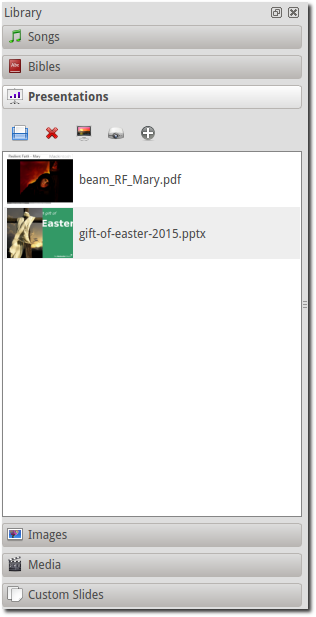

.. _mediamanager:

=============
Media Manager
=============

Once you get your system set up for OpenLP you will be ready to add content to
your Service Manager. This will all happen through the :ref:`media-manager`. The
:ref:`media-manager` contains all the Bibles, Songs, Presentations, Media, and 
Slides that you will project through OpenLP.

Enabling the Plugins
--------------------

You may need to enable the default plugins that are built in to OpenLP. As you 
can see below this is what the *Media Manager* looks like with all the plugins 
enabled.

.. image:: pics/mediamanager_songs.png

To enable the plugins navigate to :menuselection:`Settings --> Plugins` or
press :kbd:`Alt+F7`. You will want to click on the plugin to the left that you
would like to enable and select *Active* from the drop down box to the right.

You are now ready to add content for your service.

Adding Media Content
--------------------

This section will describe how to add the different types of media OpenLP is 
capable of displaying.

Songs
^^^^^
Clicking on songs in the :ref:`media-manager` will display all of the songs you have 
added by title and author(s).

.. image:: pics/mediamanager_songs.png

Using the buttons in the toolbar you can: 

|buttons_new| Add a song
    Brings up the dialog box to add a new song.

|buttons_edit| Edit the selected song
    Brings up the dialog box to make changes to the song.

|buttons_delete| Delete the selected song
    Removes the song from your song list.

|buttons_preview| Preview the selected song
    Lets you see what your song will look like displayed live.

|buttons_live| Send the selected song live
    This option will immediately display your song live.

|buttons_add| Add the selected song to the service
    This will enter your song in the :ref:`service-manager`. You may also drag your
    song over to the :ref:`service-manager`.

|buttons_db| Maintain the list of authors, topics and books
    Brings up a dialog box to edit authors, topics or song books.
  over to the Service Manager.

*Note*: Right clicking on a song file will bring up some of the same options.

*Search:*
  Clicking on the icon in the Search box will display a list of options for you 
  to search your song database.

.. image:: pics/mediamanager_songs_search.png

You have these options to search.

* *Entire Song:* This option will search Titles, Lyrics and Comments.
* *Titles:* This option will search Titles only.
* *Lyrics:* This option will search Lyrics only. 
* *Authors:* This option will search Authors only.
* *Themes:* This option will search for the assigned theme to the song.

Use the :guilabel:`Search` button to display your results in the box below.

Bibles
^^^^^^
Clicking on Bibles in the :ref:`media-manager` will display your options for searching 
and adding chapters and verses to the :ref:`service-manager`.

Using the buttons you can:

|buttons_import| Import a Bible
    This is discussed in detail on the :ref:`bible-importer` page in the manual. 

|buttons_preview| Preview the selected Bible
    Sends your selected verses to the Preview window.

|buttons_live| Send the selected Bible live
    This option will immediately display your selected verses live.

|buttons_add| Add the selected Bible to the service
    This will enter your verses into the :ref:`service-manager`. You may also
    drag and drop your verses over to the :ref:`service-manager`.

**Quick** tab

.. image:: pics/mediamanager_bibles_quick.png

*Version*
    Once you have imported a Bible, it will be displayed in the **version**
    drop down box. Select the version of the Bible you want to use here.
*Second*
    If you have "Display second Bible verses" selected in Configure OpenLP,
    Bibles tab, this choice will be visible. This option is for displaying
    another version of the Bible for comparison. Both versions will be
    displayed. If there is not enough space on one slide, the Second verses
    will be displayed on the next slide.
*Search*
    Use the **Search** button to display your results in the box below.
  
*Find*
    You will type your search query in this box for the following two searches.
Clicking the icon in the Find box will give you the choice of searching by 
Scripture Reference or Text Search.

    *Scripture Reference*
        You may search for a specific verse using this format below. 

        * Book Chapter 
        * Book Chapter-Chapter
        * Book Chapter:Verse-Verse
        * Book Chapter:Verse-End (this will display verses to the end of the chapter)
        * Book Chapter:Verse-Verse, Verse-Verse
        * Book Chapter:Verse-Verse, Chapter:Verse-Verse
        * Book Chapter:Verse-Chapter:Verse

    *Text Search*
        You may also search by a keyword or words. The more words you use for
        the search, the more you will narrow down your results.

*Results*
    Clear and Keep.

If you have “Display second Bible verses” selected in 
:menuselection:`Configure OpenLP --> Bibles` tab, this choice will be visible. 
This option is for displaying another version of the Bible for comparison. Both 
versions will be displayed. If there is not enough space on one slide, the 
Second version will be displayed on the next slide.

Click the :guilabel:`Search` button to display your results in the box below.

**Layout style**

There are three options to determine how your Bible verses are displayed. 

* *Verse Per Slide* will display one verse per slide.
* *Verse Per Line* will start each verse on a new line until the slide is full.
* *Continuous* will run all verses together separated by verse number and chapter if chapter is selected to show above. This setting is also accessible through :menuselection:`Configure OpenLP --> Bibles` tab.

*Note: Changes to Layout Style do not affect verses already in the Service Manager.*

Each search you make will display your verses in the box below.

.. image:: pics/mediamanager_bibles_results.png

Toggle lock to keep or clear the previous results.

.. image:: pics/mediamanager_bibles_lock.png 
.. image:: pics/mediamanager_bibles_unlock.png

If you would like to display verses that are out of sequence you can click on 
the lock icon and continue your search for the next verse or verses. All 
searches will be shown and kept below. If you click the lock icon again, each 
new search clears the previous search from the list below.

**Advanced** tab

.. image:: pics/mediamanager_bibles_advanced.png

The Advanced tab is convenient for selecting book, chapter and verse by name and 
number.

*Book:*
  Click on the drop down box and select the book you want to display. 

*Chapter: Verse:*
  Select your chapter From and To and Verse From and To.

Version and Second are the same as in Quick tab above. Click on each box and 
select the version you wish to display and Second version if you wish to display 
an alternative version for comparison.

**Layout style**

There are three options to determine how your Bible verses are displayed. 

* *Verse Per Slide* will display one verse per slide.
* *Verse Per Line* will start each verse on a new line until the slide is full.
* *Continuous* will run all verses together separated by verse number and chapter if chapter is selected to show above. This setting is also accessible through :menuselection:`Configure OpenLP --> Bibles` tab.

*Note: Changes to Layout Style do not affect verses already in the Service Manager.*

Click the :guilabel:`Search` button to display your results in the box below.

Each search you make will display your verses in the box below.

Presentations
^^^^^^^^^^^^^

Using the buttons you can:

|button_open| Load a new presentation
    This brings up a dialog box to find your presentation and load it into
    OpenLP.

|button_delete| Delete the selected presentation
    This removes your presentation from the list.
    
    *Please note*: this will not delete the presentation from your computer,
    only from the OpenLP list.

|button_preview| Preview the selected presentation
    Sends your selected presentation to the preview window.

*Send the selected Presentation live:*
  This option will immediately display your selected Presentation live.

*Add the selected Presentation to the service:*
  This will enter your Presentation into the Service Manager. You can also click 
  and drag your Presentation over to the Service Manager. 

Right clicking on a Presentation file will bring up some of the same options.

Images
^^^^^^

.. image:: pics/mediamanager_images.png

Using the buttons you can:

*Load a new Image:*
  This brings up a dialog box to find your Image and list it in OpenLP.

*Delete the selected Image:*
  This removes your Image from the list. Please note: this will not delete the 
  Image from your computer, just the OpenLP list.

*Preview the selected Image:*
  Sends your selected Image to the Preview window. 

*Send the selected Image live:*
  This option will immediately display your selected Image live.

*Add the selected Image to the service:*
  This will enter your Image into the Service Manager. You can also click and 
  drag your Image over to the Service Manager. 

*Replace Live Background:*
  With an Image selected, clicking this button will immediately replace the live 
  background being displayed with your selection. The Image will replace the theme 
  background until the theme changes or the "Remove Background" button is pressed.

Right clicking on an Image file will bring up some of the same options.

Media
^^^^^
Media is an audio or video file. Generally if you can play or view your media 
on your computer without OpenLP, you can also play it in OpenLP.

Using the buttons you can:

.. image:: pics/mediamanager_media_buttons.png

*Load a new Media:*
  This brings up a dialog box to find your Media and list it in OpenLP.

*Delete the selected Media:*
  This removes your Media from the list. Please note: this will not delete the 
  Media from your computer, just the OpenLP list.

*Preview the selected Media:*
  Sends your selected Media to the Preview window. 

*Send the selected Media live:*
  This option will immediately display your selected Media live.

*Add the selected Media to the service:*
  This will enter your Media into the Service Manager. You can also click and 
  drag your Media over to the Service Manager. 

*Replace Live Background:*
  With a Media file selected, clicking this button will immediately replace the 
  live background being displayed with your selection.

Right clicking on a Media file will bring up some of the same options.

Custom Slides
^^^^^^^^^^^^^
Custom Slides gives you the option of creating your own slide. This is useful 
for displaying readings, liturgy or any text that may not be found in Songs or 
Bibles.

.. image:: pics/mediamanager_custom.png

Using the buttons you can:

*Add a new custom slide:*
  Brings up the dialog box to add a new Custom slide display. 

*Edit the selected custom slide:* 
  Brings up the dialog box to make changes to the custom slide.

*Delete the selected custom slide:*
  Removes the custom slide from your list.

*Preview the selected custom slide:*
  Lets you see what your Custom will look like displayed live.

*Send the selected custom slide live:*
  This option will immediately display your custom slide live.

*Add the selected custom slide to the service:*
  This will enter your custom slide in the Service Manager. You can also drag 
  your custom slide over to the Service Manager.

Right clicking on a custom slide file will bring up some of the same options.

When you Add a new custom slide a dialog box will appear. 

.. image:: pics/mediamanager_custom_edit.png

*Title:*
  Name of your custom slide.

*Add:*
  After clicking on Add you will enter your text you want to display in this box. 
  To create multiple slides, click the Split Slide button. When you have finished 
  adding your text, click on the Save button.

*Theme:*
  Select the theme you want to use for your Custom slide from this drop down box.

*Credits:*
  Anything typed in this box will be displayed in the footer information on the 
  display. When you are finished, click the :guilabel:`Save` button.

To Edit your slide, click on :guilabel:`Edit` to edit part of it or 
:guilabel:`Edit All` if you need to make multiple changes. Use the Up and Down 
arrows to change the arrangement of your custom slide.

.. These are all the image templates that are used in this page.

.. |BUTTONS_NEW| image:: pics/buttons_new.png

.. |BUTTONS_EDIT| image:: pics/buttons_edit.png

.. |BUTTONS_DELETE| image:: pics/buttons_delete.png

.. |BUTTONS_PREVIEW| image:: pics/buttons_preview.png

.. |BUTTONS_LIVE| image:: pics/buttons_live.png

.. |BUTTONS_ADD| image:: pics/buttons_add.png

.. |BUTTONS_DB| image:: pics/buttons_db.png

.. |BUTTONS_OPEN| image:: pics/buttons_open.png

