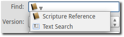

.. _media-manager:

Media Manager
=============

Once you get your system set up for OpenLP you will be ready to add content to
your :ref:`g-service-manager`. This will all happen through the
:ref:`g-media-manager`. The :ref:`g-media-manager` contains all the Bibles,
Songs, Presentations, Media, and Custom Slides that you will project through
OpenLP.

If you don't see the "Songs", "Bibles" and other media items in the
:ref:`g-media-manager`, then refer to :ref:`t-no-media-items` in the
troubleshooting guide.

Songs
-----

Clicking on *Songs* in the :ref:`g-media-manager` will display the songs media
item. The songs media item shows a list of all the songs in the songs database.

.. image:: pics/mediamanager_songs.png

Toolbar
^^^^^^^

|buttons_new| **Add song:**
    Open the song edit dialog to add a new song.

|buttons_edit| **Edit song:**
    Open the song edit dialog to make changes to the selected song.

|buttons_delete| **Delete song:**
    Remove the selected song(s) from the song list.

|buttons_preview| **Preview song:**
    Send the selected song to the :ref:`g-preview-slide-controller`.

|buttons_live| **Send song live:**
    Send the selected song to the :ref:`g-live-slide-controller` to be shown on
    the display screen.

|buttons_add| **Add song to service:**
    Add the selected song(s) to the :ref:`g-service-manager`. Songs can also be
    added to the :ref:`g-service-manager` by means of drag and drop from the
    :ref:`g-media-manager`.

|buttons_db| **Maintain authors, topics and books:**
    Open the song maintenance dialog to add, edit or delete authors, topics or
    song books.

**Note:** Right-clicking on a song in the list will display some of the same
options.

Search
^^^^^^

.. image:: pics/mediamanager_songs_search.png

Clicking on the icon in the search box displays a list of search options. The
following options are available:

|search_song| **Entire Song:**
    Search the title, lyrics and comments fields.

|search_title| **Titles:**
    Search the title field only.

|search_text| **Lyrics:**
    Search the lyrics field only.

|search_author| **Authors:**
    Search the associated authors.

|search_theme| **Themes:**
    Search the assigned themes.

Click the :guilabel:`Search` button to perform a search and display the results
in the song list.

Bibles
------

Clicking on *Bibles* in the :ref:`g-media-manager` will display the Bibles media
item. The Bibles media item shows Bible verses and provides a search function
to find Bible verses and add them to the :ref:`g-service-manager`.

.. image:: pics/mediamanager_bibles.png

Toolbar
^^^^^^^

|buttons_import| **Import Bible:**
    Import Bibles from a number of formats. This is discussed in detail on the
    :ref:`import_bibles` page.

|buttons_preview| **Preview verses:**
    Send the selected verses to the :ref:`g-preview-slide-controller`.

|buttons_live| **Send verses live:**
    Send the selected verses to the :ref:`g-live-slide-controller` to be shown
    on the display screen.

|buttons_add| **Add verses to service:**
    Add the selected verses to the :ref:`g-service-manager`. Verses can also be
    added to the :ref:`g-service-manager` by means of drag and drop from the
    :ref:`g-media-manager`.

**Note:** Right-clicking on a selection of verses will display some of the
same options.

Quick Search Tab
^^^^^^^^^^^^^^^^

The following options are available on the quick search tab:

**Find:**
    Clicking the icon in the Find box displays a list of search options. The
    following options are available:

    |search_reference| **Scripture Reference:**
        Search for a specific verse using a scripture reference format. The 
        following formats are supported:

        * Book Chapter
        * Book Chapter-Chapter
        * Book Chapter:Verse-Verse
        * Book Chapter:Verse-End (this will display verses to the end of the chapter)
        * Book Chapter:Verse-Verse, Verse-Verse
        * Book Chapter:Verse-Verse, Chapter:Verse-Verse
        * Book Chapter:Verse-Chapter:Verse

    |search_text| **Text Search:**
        Search by a keyword or words. Use more words to narrow down the list
        of results. If you search for "Jesus God" it searches sentences 
        which contain both words, Jesus and God. If you search for "Jesus, God" 
        separated by a comma, it searches for sentences which contain at least 
        one of the words, Jesus or God.

**Version:**
    Once a Bible has been imported, it will be displayed in the drop down box.
    Select a version from the list of the Bibles.
    
**Second:**
    If :guilabel:`Display second Bible verses` has been selected in the Bibles
    configuration, this option will be available. This is used to display
    another version of the Bible for comparison. Both versions will be
    displayed. If there is not enough space on one slide, the Second verses
    will be displayed on the next slide.
    
**Layout Style:**
    The following options are available to set how Bible verses are displayed:

    **Verse Per Slide:**
        Display one verse per slide.

    **Verse Per Line:**
        Start each verse on a new line until the slide is full.

    **Continuous:**
        Verses flow together, separated by verse number and chapter
        if chapter is selected to show above.

    This setting is also accessible in :menuselection:`Setttings --> Configure OpenLP`
    on the *Bibles* tab.

    **Note:** Changes to layout style do not affect verses already in the
    :ref:`g-service-manager`.

|buttons_clear_results| |buttons_keep_results| **Keep/Clear Results:**
    Normally, when a search is run, the previous verses are cleared. To retain
    the previous set of verses, toggle this button.

Click the :guilabel:`Search` button to perform a search and display the results
in the verse list.

Advanced Tab
^^^^^^^^^^^^

.. image:: pics/mediamanager_bibles_advanced.png

The Advanced tab is convenient for selecting Bible verses by book, chapter and
verse from a set of drop down boxes.

**Book:**
    Click on the drop down box and select a book from the list.

**Chapter/Verse:**
    Select the *From* chapter and verse, and the *To* chapter and verse.

**Note** *Version*, *Second* and *Layout Style* are the same as in the *Quick* 
search tab.

Click the :guilabel:`Search` button to perform a search and display the results
in the verse list.

.. image:: pics/mediamanager_bibles_results.png

Presentations
-------------

Clicking on *Presentations* in the :ref:`g-media-manager` will display the
presentations media item. The presentations media item shows a list of imported
presentations.

.. image:: pics/mediamanager_presentations.png

Toolbar
^^^^^^^

|buttons_open| **Load presentation:**
    Import a presentation. Presentations need to be imported in order to
    control them from within OpenLP.

|buttons_delete| **Delete presentation:**
    Removes the selected presentation from the list. Note that this does not
    delete the original presentation from the disk.

|buttons_preview| **Preview presentation:**
    Send the selected presentation to the :ref:`g-preview-slide-controller`.

|buttons_live| **Send presentation live:**
    Send the selected presentation to the :ref:`g-live-slide-controller` to be
    shown on the display screen.

|buttons_add| **Add presentation to service:**
    Add the selected presentation to the :ref:`g-service-manager`. Presentations
    can also be added to the :ref:`g-service-manager` by means of drag and drop
    from the :ref:`g-media-manager`.

**Notes:** Right-clicking on a presentation will display some of the same options.

Presentation items can be dragged from the desktop (or any folder) into the 
Presentation media manager plugin. This allows the selected items to be loaded 
more quickly. If a folder is selected, all the contacts of the folder will be 
added. When the items are added, only items with the correct file suffix for the 
plugin will be loaded. If you try to drop a presentation into the images folder, 
an error message will be generated.

Images
------

Clicking on *Images* in the :ref:`g-media-manager` will display the images
media item. The images media item shows a list of imported images.

.. image:: pics/mediamanager_images.png

Toolbar
^^^^^^^

|buttons_open| **Load image:**
    Import one or more images. Images need to be imported in order to be used
    in OpenLP.

|buttons_delete| **Delete images:**
    Removes the selected image(s) from the list. Note that this does not
    delete the original image(s) from the disk.

|buttons_preview| **Preview image:**
    Send the selected image(s) to the :ref:`g-preview-slide-controller`.

|buttons_live| **Send image live:**
    Send the selected image(s) to the :ref:`g-live-slide-controller` to be
    shown on the display screen.

|buttons_add| **Add image to service:**
    Add the selected image(s) to the :ref:`g-service-manager`. Images can also
    be added to the :ref:`g-service-manager` by means of drag and drop from the
    :ref:`g-media-manager`.

|buttons_replace_live_background| **Replace live background:**
    Replace the current live theme background with the selected image. This
    has effect until the theme changes, or the *Remove Backgound* button is
    clicked.

**Notes:** Right-clicking on an image will display some of the same options.

Images can be dragged from the desktop (or any folder) into the Images manager 
plugin. This allows the selected items to be loaded more quickly. If a folder is 
selected, all the contacts of the folder will be added. When the items are added, 
only items with the correct file suffix for the plugin will be loaded. If you 
try to drop a presentation into the images folder, an error message will be 
generated.

Media
-----

Clicking on *Media* in the :ref:`g-media-manager` will display the media item
for media. The media item shows a list of imported audio or video files.

**Note:** On some computers OpenLP has trouble displaying videos. Please read
the `Frequently Asked Questions <http://wiki.openlp.org/faq>`_ for tips on how
to resolve these issues.

.. image:: pics/mediamanager_media.png

Toolbar
^^^^^^^

|buttons_open| **Load media:**
    Import one or more media files. Media files need to be imported in order to
    be used in OpenLP.

|buttons_delete| **Delete media:**
    Removes the selected media file(s) from the list. Note that this does not
    delete the original media file(s) from the disk.

|buttons_preview| **Preview media:**
    Send the selected media to the :ref:`g-preview-slide-controller`.

|buttons_live| **Send media live:**
    Send the selected media to the :ref:`g-live-slide-controller` to be shown
    on the display screen.

|buttons_add| **Add media to service:**
    Add the selected media to the :ref:`g-service-manager`. Media can also be
    added to the :ref:`g-service-manager` by means of drag and drop from the
    :ref:`g-media-manager`.

|buttons_replace_live_background| **Replace live background:**
    Replace the current live theme background with the selected media. This
    has effect until the theme changes, or the *Remove Background* button is
    clicked.

**Notes:** Right-clicking on a media file will display some of the same options.

Media items can be dragged from the desktop (or any folder) into the Media 
manager plugin. This allows the selected items to be loaded more quickly. If a 
folder is selected, all the contacts of the folder will be added. When the items 
are added, only items with the correct file suffix for the plugin will be loaded. 
If you try to drop a presentation into the images folder, an error message will 
be generated.

Custom Slides
-------------

Clicking on *Custom Slides* in the :ref:`g-media-manager` will display the
custom slides media item. The custom slides media item shows a list of custom
textual items. Custom slides are useful for creating unstructured text items,
such as liturgy or prayers.

.. image:: pics/mediamanager_custom.png

Toolbar
^^^^^^^

|buttons_new| **Add custom slide:**
    Open the song edit dialog to add a new custom slide.

|buttons_edit| **Edit custom slide:**
    Open the song edit dialog to make changed to the selected new custom slide.

|buttons_delete| **Delete custom slide:**
    Remove the selected custom slide(s) from the list.

|buttons_preview| **Preview custom slide:**
    Send the selected custom slide to the :ref:`g-preview-slide-controller`.

|buttons_live| **Send custom slide live:**
    Send the selected custom slide to the :ref:`g-live-slide-controller` to be
    shown on the display screen.

|buttons_add| **Add custom slide to service:**
    Add the selected custom slide(s) to the :ref:`g-service-manager`. Custom
    slides can also be added to the :ref:`g-service-manager` by means of drag
    and drop from the :ref:`g-media-manager`.

**Note:** Right-clicking on a custom slide in the list will display some of the
same options.

.. These are all the image templates that are used in this page.

.. |BUTTONS_NEW| image:: pics/buttons_new.png

.. |BUTTONS_EDIT| image:: pics/buttons_edit.png

.. |BUTTONS_DELETE| image:: pics/buttons_delete.png

.. |BUTTONS_PREVIEW| image:: pics/buttons_preview.png

.. |BUTTONS_LIVE| image:: pics/buttons_live.png

.. |BUTTONS_ADD| image:: pics/buttons_add.png

.. |BUTTONS_IMPORT| image:: pics/buttons_import.png

.. |BUTTONS_OPEN| image:: pics/buttons_open.png

.. |BUTTONS_KEEP_RESULTS| image:: pics/buttons_keep_results.png

.. |SEARCH_TITLE| image:: pics/search_title.png

.. |SEARCH_AUTHOR| image:: pics/search_author.png

.. |SEARCH_TEXT| image:: pics/search_text.png

