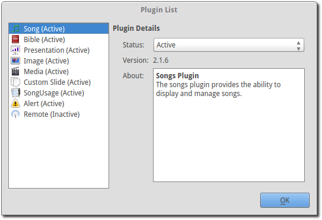

.. _plugin_list:

Plugin List
===========

OpenLP has many plugins you can activate. By default, all plugins are enabled, 
except the Remote Access plugin. A plugin adds features and functionality to 
OpenLP.

To see which plugins are enabled select :menuselection:`Settings --> Plugin List`
or :kbd:`Alt+F7`

Plugin Details
^^^^^^^^^^^^^^

The left side shows you the list of plugins. Click on a plugin to check its 
status.

**Status:** 
    Shows if your plugin is Active or Inactive. Click the box to change the 
    status and click :kbd:`OK` to save your selection.

**Version:** 
    Is the version of the plugin. 

**About:** 
    Describes the use of the plugin.

For a brief description of what each plugin does, please see below.

|songs| **Songs Plugin:** 
    The songs plugin provides the ability to display and manage songs.

|bibles| **Bible Plugin:**
    The Bible plugin provides the ability to display Bible verses from different
    sources during the service.

|presentations| **Presentation Plugin:**
    The presentation plugin provides the ability to show presentations using a 
    number of different programs. The choice of available presentation programs
    is available to the user in a drop down box.
    **Note:** Presentation plugin is disabled on MAC.

|images| **Image Plugin:**
    The image plugin provides displaying of images. One of the distinguishing
    features of this plugin is the ability to group a number of images together
    in the service manager, making the displaying of multiple images easier. 
    This plugin can also make use of OpenLP's "timed looping" feature to create 
    a slide show that runs automatically. In addition to this, images from the 
    plugin can be used to override the current theme's background, which renders 
    text-based items like songs with the selected image as a background instead 
    of the background provided by the theme. See the section on :ref:`adding_images`.

|media| **Media Plugin:**
    The media plugin provides playback of audio and video.

|custom| **Custom Slide Plugin:**
    The custom slide plugin provides the ability to set up custom text slides
    that can be displayed on the screen the same way songs are. This plugin 
    provides greater freedom over the songs plugin.

|songusage| **SongUsage Plugin:**
    This plugin tracks the usage of songs in services.

|alerts| **Alerts Plugin:**
    The alert plugin controls the displaying of nursery alerts on the display
    screen. See :ref:`alerts` for more information

|remote| **Remote Plugin:**
    The remote plugin provides the ability to send messages to a running version
    of OpenLP on a different computer via a web browser or through the remote API.
    See the section on :ref:`remote_tab`.

.. These are all the image templates that are used in this page.

.. |ALERTS| image:: pics/plugin_alerts.png

.. |IMAGES| image:: pics/plugin_images.png

.. |PRESENTATIONS| image:: pics/plugin_presentations.png
.. |REMOTE| image:: pics/plugin_remote.png
.. |SONGS| image:: pics/plugin_songs.png
