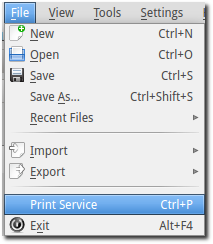
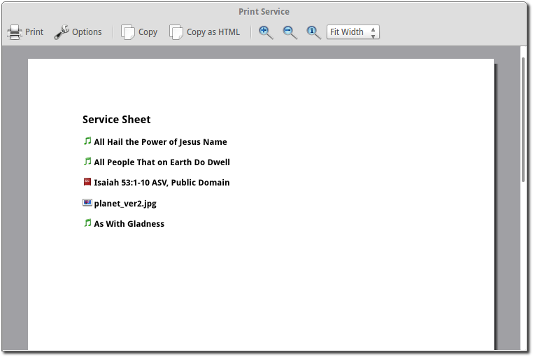
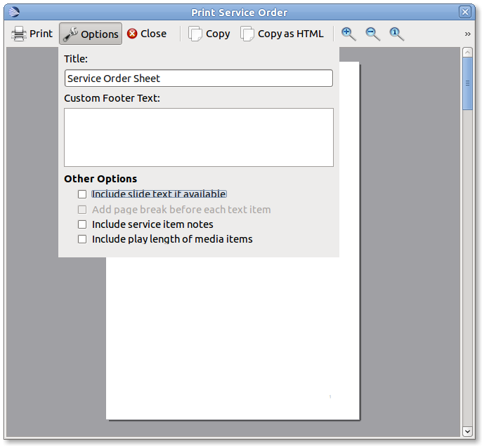

=============
Print Service 
=============

OpenLP gives you the option to print your service order. This can be useful for
a variety of reasons, such as giving the printed service to your music team so
they have the song order, or so pastors or speakers can have the flow of the
service.

To print your service go to :menuselection:`File --> Print Service` or press 
:kbd:`Control + P`.

This will bring up a window with your service order for review and printing.

|printbutton| *Print*
  This will print your service bringing up your system's print options. Use
  this when you are ready to print.

|optionbutton| *Options* 
  This gives you a series of ways to customize the service order before
  printing.

*Title:*
  Gives you the ability to change the title of your printed document.

*Custom Footer Text:*
  Add text to the footer of your printed document.

**Other Options**

*Include slide text if available*
  Check this to include all the text from songs or scripture.

*Add page break before each text item*
  If you have checked *include slide text if available* you can select this
  option to put each text item (songs, custom slides, scripture) on a
  separate page.

*Include service item notes*
  This option will include any notes you have added to the service items.

*Include play length of media items*
  This option will print the length of media items in your service.

|closebutton| *Close*
  Closes the print service window.

|copybutton| *Copy* 
  Copy the text of the preview window to your clipboard. You can then paste the
  text into other documents or applications.

|copybutton| *Copy HTML* 
  Copy html code to your clipboard. You can then paste this in a text editor
  and save as .html. This can then be used to post your service details on a 
  website or anywhere an html document can be used.

|zoomin| *Zoom in*
  Zooms in on your preview.

|zoomout| *Zoom out*
  Zooms out to make more of your preview visible.

|zoomoriginal| *Zoom to original*
  Restores the preview to its original size.

Customizing with CSS
--------------------

It is possible to customize the printed service using CSS. To do this go to
:menuselection:`Tools --> Open Data Folder` If you have a file named 
servicePrint.css delete it. In the open folder create a file named 
service_print.css containing your customizations.

For more information please check out this `example <http://wiki.openlp.org/Documentation:Service_Print>`_.

.. The following section defines the inline pics

.. |printbutton| image:: pics/general_print.png

.. |optionbutton| image:: pics/system_configure.png

.. |copybutton| image:: pics/system_edit_copy.png

.. |zoomout|  image:: pics/general_zoom_out.png

.. |zoomin|  image:: pics/general_zoom_in.png

.. |zoomoriginal|  image:: pics/general_zoom_original.png
