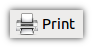
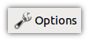
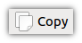
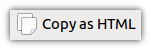

===================
Print Service Order
===================

OpenLP gives you the option to print your service order. This can be useful for
a variety of reasons, such as giving to your music team so they know the song
order, or so pastors or speakers can know what is happening, etc.

To print your service go to :menuselection:`File --> Print Service Order` or 
press :kbd:`Control + P`

.. image:: pics/printservice1.png

You should now see a preview of your service

.. image:: pics/printservice2.png

The :guilabel:`Print Button` |printbutton| will print your service bringing 
up your system's print options.

When you are ready to print simply click the :guilabel:`Print Button`

The :guilabel:`Options Button` |optionsbutton| gives you a series of ways to 
customize the service order before printing.

.. image:: pics/printservice3.png

*Title*
  Gives you the ability to change the title of your printed document

*Customer Footer Text*
  Add text to the footer of your printed document

*Other Options*

*Include slide text if available*
  Check this to include all the text from songs or scripture

*Add page break before each text item*
  If you have checked include slide text if available you can check this to put
  each slide on a separate page.

*Include service item notes*
  This option will include any notes you have added to the service items.

*Include play length of media items*
  This option will print the length of any media items.

The :guilabel:`Close Button` |closebutton| will close the print service window.

Use the :guilabel:`Copy Button` |copybutton| to copy the text of the preview
window to your clipboard. You can then paste the text into other documents or
applications.

The :guilabel:`Copy to HTML Button` |copyhtml| will copy html code to your 
clipboard. You can then paste this in a text editor and save as .html. This can
then be used to post your service details on a website or anywhere else that an
html document can be used.

Use the :guilabel:`Zoom Buttons` |zoombuttons| to zoom in, zoom out, or restore
the document to its original side.

