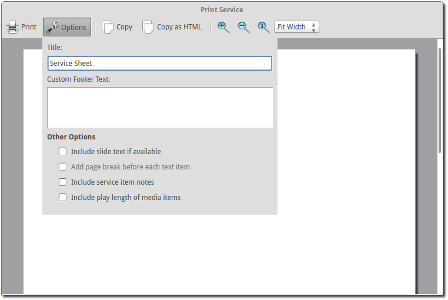

=============
Print Service 
=============

OpenLP gives you the option to print your service order. This can be useful for
a variety of reasons, such as giving to your music team so they know the song
order, or so pastors or speakers can know what is happening, etc.

To print your service go to :menuselection:`File --> Print Service` or press 
:kbd:`Control + P`

.. image:: pics/printservice1.png

You should now see a preview of your service

.. image:: pics/printservice2.png

|printbutton| will print your service bringing up your system's print options.
Use this when you are ready to print.

|optionbutton| gives you a series of ways to customize the service order
before printing.

*Title*
  Gives you the ability to change the title of your printed document

*Customer Footer Text*
  Add text to the footer of your printed document

*Other Options*

*Include slide text if available*
  Check this to include all the text from songs or scripture

*Add page break before each text item*
  If you have checked *include slide text* if available you can check this to
  put each text item (songs, custom slides, scripture) on a separate page.

*Include service item notes*
  This option will include any notes you have added to the service items.

*Include play length of media items*
  This option will print the length of any media items.

|closebutton| will close the print service window.

|copybutton|-Copy- to copy the text of the preview window to your clipboard.
You can then paste the text into other documents or applications.

|copybutton|-Copy HTML- will copy html code to your clipboard. You can then
paste this in a text editor and save as .html. This can then be used to post
your service details on a website or anywhere else that an html document can
be used.

|zoomin| zooms in on your preview

|zoomout| zooms out to make more of your preview visible

|zoomoriginal| restores the preview to its original size

Customizing with CSS
--------------------

It is possible to customize the printed service using CSS. To do this go to
:menuselection:`Tools --> Open Data Folder` If you have a file named 
servicePrint.css delete it. In the open folder create a file named 
service_print.css containing your customizations.

.. The following section defines the inline pics

.. |optionbutton| image:: pics/system_configure.png

.. |closebutton| image:: pics/system_close.png

.. |copybutton| image:: pics/system_edit_copy.png

.. |zoomout|  image:: pics/general_zoom_out.png

.. |zoomin|  image:: pics/general_zoom_in.png

.. |zoomoriginal|  image:: pics/general_zoom_original.png
