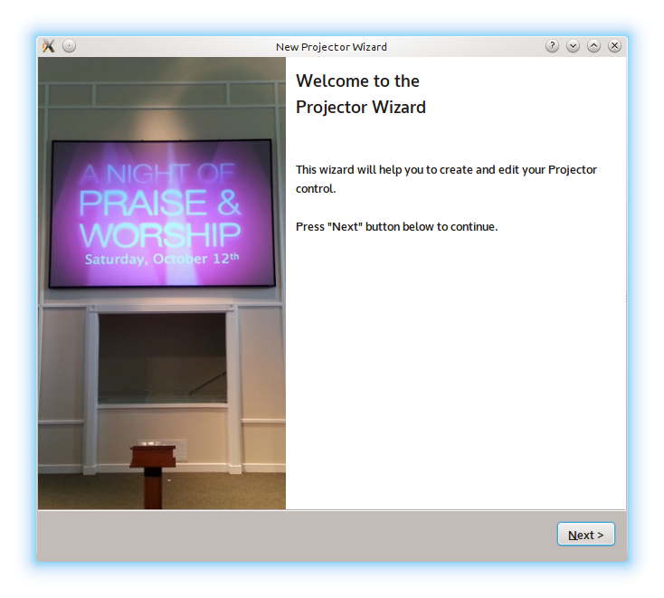
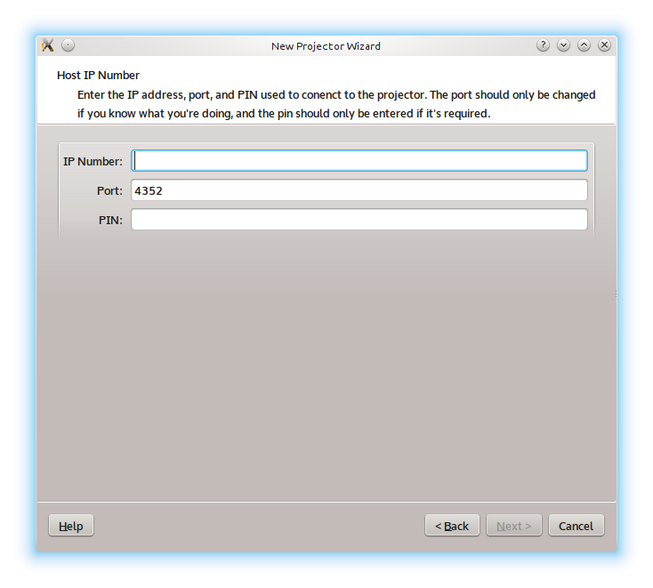
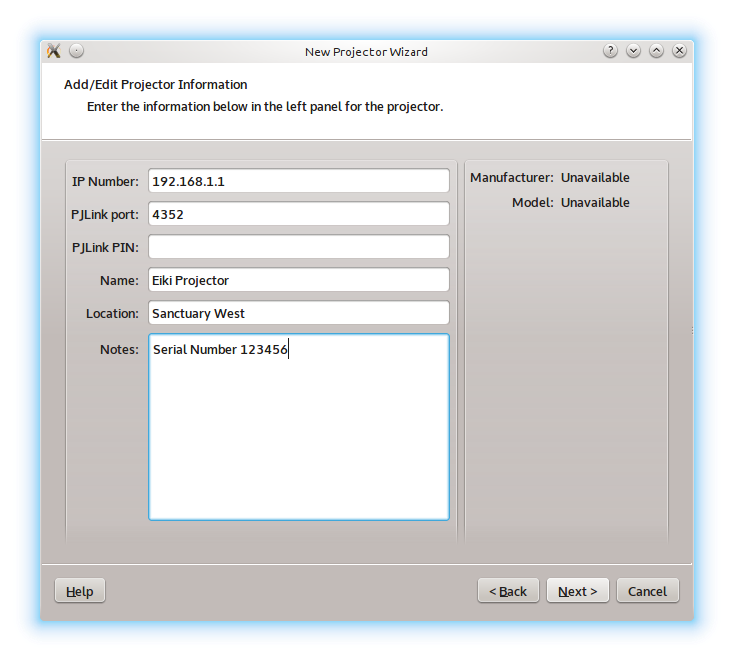
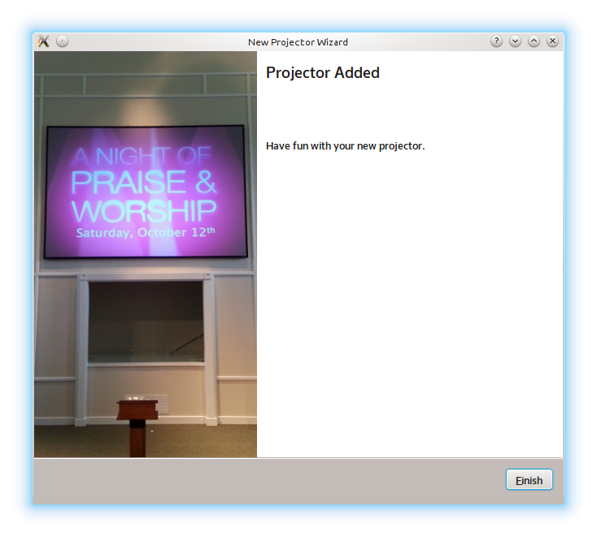

.. _projector:

========================
Projector Remote Control
========================

The Projector Manager allows you to remotely control a network-connected
projector that conforms to the Japan Business Machine and Information System
Associaion (JBMIA) PJLink specification.

Projector Manager
-----------------

The Projector Manager is the interface to controlling your projector(s). It is
located on the bottom-right corner of OpenLP just below the Theme Manager.

.. image:: pics/projector_manager.png

The icons shown are for (in order from left to right):

.. image:: pics/projector_new.png  Add a new projector
.. image:: pics/projector_connect.png  Connect to all projectors
.. image:: pics/projector_disconnect.png  Disconnect from all projectors
.. image:: pics/projector_power_on.png  Power on all projectors
.. image:: pics/projector_power_off.png  Power Off (standby) all projectors
.. image:: pics/projector_blank.png  Close the shutter on all projectors
.. image:: pics/projector_show.png  Open the shutter on all projectors

Adding a Projector
------------------

When you click on the 'Add Projector' icon, you will launch the wizard to help
guide you through adding a new projector. click on the :guilabel:`Next`.

On this page, you will enter the basic information needed to connect to the
projector.

Enter the following information:

  IP Number: IPv4 or IPv6 addresses are acceptable. Required.
  Port: The network port. Default PJLink port is already filled in.
  PIN: If you have authenticated access enabled, enter the PIN here.

Once you enter the information, click on the :guilabel:`Next` button.

On the edit page, you can add the rest of the information for your projector.

  Name: A name for you to identify the projector in the manager list. Required.
  Location: The location where this projector is located.
  Notes: Any other notes you want for this projector.

Once you have finished entering information for this projector, click on
the :guilabel:`Next` button.

Once you get to this page, your entry has been saved and is ready for use.
Click on the :guilabel:`Finish` button to close the wizard.

Congratulations - you have finished entering your new projector in the list.

.. image:: pics/projector_manager_list.png

