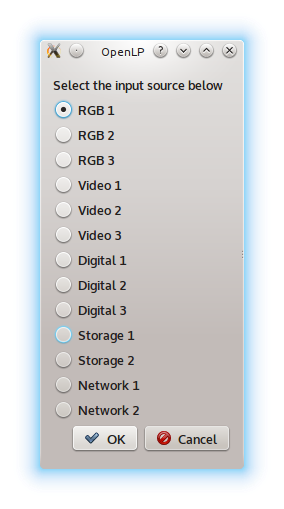

.. _projector:

========================
Projector Remote Control
========================

The Projector Manager allows you to remotely control a network-connected
projector that conforms to the Japan Business Machine and Information System
Associaion (JBMIA) PJLink specification. Available in OpenLP v2.2.

Projector Manager
-----------------

The Projector Manager is the interface to controlling your projector(s). It is
located on the bottom-right corner of OpenLP just below the Theme Manager.

.. image:: pics/projector_manager.png
   :alt: Projector Manager

The icons on the Projector Manager tab are:

.. image:: pics/projector_new.png
   :height: 100
   :width: 100
   :scale: 50
   :alt: New Projector icon

Add a new projector

.. image:: pics/projector_connect.png
   :height: 100
   :width: 100
   :scale: 50
   :alt: Connect Projector icon

Connect to all projectors

.. image:: pics/projector_disconnect.png
   :height: 100
   :width: 100
   :scale: 50
   :alt: Disconnect Projector icon

Disconnect from all projectors

.. image:: pics/projector_power_on.png
   :height: 100
   :width: 100
   :scale: 50
   :alt: Power On Projector icon

Power on all projectors

.. image:: pics/projector_power_off.png
   :height: 100
   :width: 100
   :scale: 50
   :alt: Power Off Projector icon

Power Off (standby) all projectors

.. image:: pics/projector_blank.png
   :height: 100
   :width: 100
   :scale: 50
   :alt: Blank Screen icon

Blank screen - Close the shutter on all projectors

.. image:: pics/projector_show.png
   :height: 100
   :width: 100
   :scale: 50
   :alt: Show Screen icon

Show screen - Open the shutter on all projectors

Adding a Projector
------------------

.. image:: pics/projector_add_wizard_welcome.png
   :alt: Add Projector Wizard welcome page

When you click on the 'Add Projector' icon, you will launch the wizard to help
guide you through adding a new projector. click on :guilabel:`Next`. to start.
On each of the following pages, there's a :guilabel:`Help` button to give you
some hints as to what goes in what field.

On this page, you will enter the basic information needed to connect to the
projector.

.. image:: pics/projector_add_wizard_host.png
   :alt: Add Projector Wizard enter host page

Enter the following information:

  IP Number: IPv4 or IPv6 addresses are acceptable. Required.

  Port: The network port. Default PJLink port is already filled in.

  PIN: If you have authenticated access enabled, enter the PIN here.

Once you enter the information, click on the :guilabel:`Next` button.

.. image:: pics/projector_add_wizard_edit.png
   :alt: Add Projector Wizard enter host page

On the edit page, you can add the rest of the information for your projector.

  Name: A name for you to identify the projector in the manager list. Required.

  Location: The location where this projector is located. Optional.

  Notes: Any other notes you want for this projector. Optional.

Once you have finished entering information for this projector, click on
the :guilabel:`Next` button.

.. image:: pics/projector_add_wizard_finish.png
   :alt: Add Projector Wizard finish page

Once you get to this page, your entry has been saved and is ready for use.
Click on the :guilabel:`Finish` button to close the wizard.

Congratulations - you have finished entering your new projector in the list.

.. image:: pics/projector_manager_list.png
   :alt: Projector Manager with one entry

Projector Menus
---------------

Once you have a projector entered, you can right-click on the entry and a pop-up
menu will show.

These are the descriptions of the menu items you may see. Note that the menu
entries you see will vary depending on the status of the projector:

    Blank Screen : Close shutter so screen is blank.

    Connect Projector : Connect to this projector.

    Delete Projector : Delete this entry from the database.

    Disconnect Projector : Disconnect from this projector.

    Edit Projector : This will allow you to edit the information on this entry and
    save changes to the database..

    Power Off Projector : Tell the projector to enter standby.

    Power On Projector : Tell the projector to power on.

    Select Input : Select the projector video source to use.

    Show Screen : Open shutter so you can see the picture.

    View Porjector Information : This will show you the saved information on this
    entry in the database.

    View Projector Status : Will show you the information gathered from the
    projector.

Initial Menu
~~~~~~~~~~~~

When you first enter a projector or when you first start OpenLP, you will select
from the following menu items:

.. image:: pics/projector_item_not_connected.png
   :alt: Projector not connected menu

Projector Connected Menu 1
~~~~~~~~~~~~~~~~~~~~~~~~~~

Once the projector has been connected, and if the projector is not powered on,
you get the below menu list:

.. image:: pics/projector_item_connected_off.png
   :alt: Projector Connected Power Off menu

Projector Connected Menu 2
~~~~~~~~~~~~~~~~~~~~~~~~~~

Once you have connected to the projector, and the projector is powered on (either
by being previously on or you sent the power on command), you will see the
following menu:

.. image:: pics/projector_item_power_on.png
   :alt: Projector Connected and Power On menu

Source Input Options
~~~~~~~~~~~~~~~~~~~~

If you want to change the video source the projetor uses, click on the
"Select Source" option, then select from the pop-up window which video source
you want to use.

NOTE: The picture is an example only - what options you
will have will vary depending on the projector you have.

