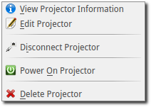
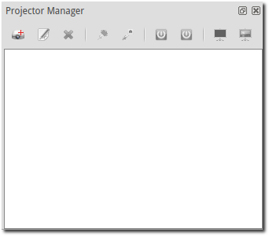

.. _projector:

========================
Projector Remote Control
========================

The Projector Manager allows you to remotely control a network-connected
projector that conforms to the Japan Business Machine and Information System
Association (JBMIA) PJLink specification. Available in OpenLP v2.2.

.. _projector_settings:

Projector Configuration
-----------------------

The available projector options can be changed using the main settings menu by
going to :guilabel:`Settings` -> :guilabel:`Configure OpenLP` -> :guilabel:`Projectors` tab.
See :ref:`configure_projectors`.

.. _projector_manager:

Projector Manager
-----------------

The Projector Manager is the interface to controlling your projector(s). It is
located on the bottom-right corner of OpenLP just below the Theme Manager.

|projector_manager|

The icons on the Projector Manager tab will depend on projector entries as well
as how many projectors are selected at once.

A list of possible projector icons are:

|projector_new| **New Projector:**
    Choosing this option will open the "Create New Projector" dialog so you can enter
    a new projector item.

|projector_edit| **Edit Projector:**
    When you have selected a projector item, this option will open the "Edit Projector"
    dialog so you can make changes to that projector item.

|projector_source| **Select Projector Input:**
    When you have selected a projector item and it is connected and power is ON, this
    option will give you a dialog that allows you to select the video source the
    projector will use.

|projector_delete| **Delete Projector:**
    When you have selected a projector item, this option will allow you to delete
    the projector item from the Projector manager list.

|projector_info| **Projector Information:**
    When you have selected a projector item and it is connected to the projector, this
    option will give you an information box with extra information about the projector.

|projector_connect| **Connect to Projector:**
    When you have selected a projector item, this option will allow you to connect to
    the projector.

|projector_connect_tiled| **Connect to Multiple Projectors:**
    When you have multiple projector items selected, this option will allow to to
    connect to multiple projectors at once.

|projector_disconnect| **Disconnect from Projector:**
    When you have a projector item selected, this option will allow you to disconnect
    from the projector.

|projector_disconnect_tiled| **Disconnect from Multiple Projectors:**
    When you have multiple projector items selected, this option will allow to
    disconnect from multiple projectors at once.

|projector_power_on| **Power On Projector:**
    When you have selected a projector item and it is connected, this option will allow
    you to turn the projector to  "Power ON".

|projector_power_on_tiled| **Power On Multiple Projectors:**
    When you have selected multiple projector items and they are connected, this option will allow
    you to turn the projectors to  "Power ON".

|projector_power_off| **Power Off Projector:**
    When you have selected a projector item and it is connected, this option will allow
    you to turn the projector to  "Power STANDBY".

|projector_power_off_tiled| **Power Off Multiple Projectors:**
    When you have selected multiple projector items and they are connected, this option will allow
    you to turn the projectors to  "Power STANDBY".

|projector_blank| **Blank Projector Screen:**
    When you have a projector item selected and it is powered ON, this option will allow
    you to blank the projector screen so no video is shown.

|projector_blank_tiled| **Blank All Projector Screens:**
    When you have multiple projector items selected and they are powered ON, this option will allow
    you to blank the projector screens so no video is shown.

|projector_show| **Show Projector Screen:**
    When you have a projector item selected and it is powered ON, this option will allow
    you to unblank the projector screen so video is shown.

|projector_show_tiled| **Show All Projector Screens:**
    When you have multiple projector items selected and they are powered ON, this option will allow
    you to unblank the projector screens so video is shown.

.. _projector_add:

Adding a Projector
------------------

To add a new projector, click on the :guilabel:`Add New Projector` icon on the Projector
Manager tab bar. You will be given an input dialog box like the below image.

|projector_add_new|

The required information are "IP Address", "Port Number", and "Name" entries.
The port number is already set with the default PJLink port.

The "PIN" entry is only needed if the projector you are connecting to has the
PJLink PIN set. Be careful, since most projectors have a separate entry for
the PJLink PIN, any other network PIN or password, as well as a separate entry
for any HTML access name/password settings (if the projector has HTML webpage
access). The PIN setting here is ONLY used if the projector has a "PJLink access
code" or "PJLink PIN" setting.

For information on what the fields are, you can click on :guilabel:`Help` button for some information
about what is expected for each field.

Once you are done entering the new information, click on :guilabel:`Save` to save the entry
and add it to the projector manager list. If you decide to not add a new entry, click the
:guilabel:`Cancel` button to close the dialog without saving.

Congratulations, you now have your first projector entry in the list and ready for control.

|projector_manager_list|

When you have multiple projector entries selected, the projector manager toolbar
will change to the following:

|projector_item_multiple_selection|

Once you select a projector, the icons will also change based on the status of
the projector.

.. _projector_view:

View Projector Information
--------------------------

After you have a projector item added and it's connected, you can view the current status of the projector
by clicking on the :guilabel:`View Projector Information` icon. You will see a pop-up box that looks
similar to the following: (NOTE: Example information only - the information you see will depend on the
projector that you are connected to)

|projector_item_view|

.. _projector_status:

Projector Status Icons
----------------------

The icons next to the projector entry in the projector manager list give you a
quick visual status of the projector.

The icons you will see for the projector are:

|projector_item_disconnect| Projector is disconnected

|projector_item_connect| Attempting to connect to projector

|projector_not_connected_error| There was an error connecting to projector

|projector_item_off| The projector power is OFF (Standby)

|projector_item_warmup| The projector is warming up

|projector_item_on| The projector is on

|projector_item_cooldown| The projector is cooling down before power off (standby)

|projector_item_error| The projector is reporting an error

.. _projector_menu:

Projector Menus
---------------

The projector menu items will vary depending on what the status is of the selected projector.
The icons/options available are the same as described above in the icon description section.

.. _projector_menu_initial:

Initial Menu
~~~~~~~~~~~~

When you first enter a projector or when you first start OpenLP, you will select
from the following menu items:

|projector_item_not_connected_menu|

.. _projector_menu_connected_standby:

Projector Connected in Standby Mode
~~~~~~~~~~~~~~~~~~~~~~~~~~~~~~~~~~~

Once the projector has been connected, and if the projector is not powered on,
you get the below menu list:

|projector_item_connected_off|

.. _projector_menu_connected_warmup:

Projector Connected in Warmup Mode
~~~~~~~~~~~~~~~~~~~~~~~~~~~~~~~~~~

Once the projector is in warming up, you will see the following menu:

|projector_item_connected_warmup_menu|

.. _projector_menu_connected_on:

Projector Connected and Power On
~~~~~~~~~~~~~~~~~~~~~~~~~~~~~~~~

Once the projector is on, you will see the following menu:

|projector_item_power_on_menu|

.. _projector_menu_connected_cooldown:

Projector Connected and in Cooldown Mode
~~~~~~~~~~~~~~~~~~~~~~~~~~~~~~~~~~~~~~~~

When the projector is cooling down, you will see the following menu:

|projector_item_cooldown_menu|

.. _projector_video_source:

Video Source Options
--------------------

The video source options allow you to tell the projector to change it's video
source input, as well as allowing you to personalize what the video settings
options.

.. _projector_video_source_select:

Video Source Input Select Options
~~~~~~~~~~~~~~~~~~~~~~~~~~~~~~~~~

If you want to change the video source the projector uses, click on the
:guilabel:`Select Source` option, then select from the pop-up window which video source
you want to use. You can access the :guilabel:`Select Source` option from either the
projector manager toolbar or from the right-click pop-up menu.

You have an option of setting two different styles for the video source window.
The default option is all entries on one radio button dialog. The other option
is to have the selections grouped by type. This option is available in the
:guilabel:`Settings` -> :guilabel:`Configure OpenLP` -> :guilabel:`Projectors` tab under
the "Source Select dialog interface" option.

NOTE: These images are examples only - what options you will have will vary
depending on the projector you have. These images show the default PJLink text.

|projector_source_select_tabbed|

.. _projector_video_source_edit:

Video Source Input Edit Options
~~~~~~~~~~~~~~~~~~~~~~~~~~~~~~~

When you want to customize how the video source select text looks, click on the
:guilabel:`Edit Input Source` icon in the right-click menu. This will
bring up the source edit dialog box.

NOTE: These images are examples only - what options you will have will vary
depending on the projector you have. These images show the default PJLink text.

|projector_source_edit_tabbed|

Once you are satisfied, you can click on the :guilabel:`OK` button to save the changes,
or click on the :guilabel:`Cancel` button to discard these changes and continue to use
the previously saved user-defined text (or the PJLink defaults if you have no
previously saved user-defined text).

If you don't like the changes, the :guilabel:`Reset` button will reset the text back to
the previously saved text (or PJLink defaults if you have no previously saved
user-defined text) and allow you to continue editing.

If you _really_ don't like the text, you can select the :guilabel:`Discard` button and
remove all entries from the database. WARNING: This will delete _all_ of the
user-defined entries for this projector in the database and return them to the
PJLink defaults.

.. These are all the image templates that are used in this page.

.. |PROJECTOR_BLANK| image:: pics/projector_blank.png
.. |PROJECTOR_BLANK_TILED| image:: pics/projector_blank_tiled.png
.. |PROJECTOR_CONNECT| image:: pics/projector_connect.png
.. |PROJECTOR_CONNECT_TILED| image:: pics/projector_connect_tiled.png
.. |PROJECTOR_DELETE| image:: pics/custom_delete.png
.. |PROJECTOR_DISCONNECT| image:: pics/projector_disconnect.png
.. |PROJECTOR_DISCONNECT_TILED| image:: pics/projector_disconnect_tiled.png
.. |PROJECTOR_EDIT| image:: pics/general_edit.png

.. |PROJECTOR_ITEM_CONNECT| image:: pics/projector_item_connect.png
.. |PROJECTOR_ITEM_COOLDOWN| image:: pics/projector_cooldown.png
.. |PROJECTOR_ITEM_COOLDOWN_MENU| image:: pics/projector_item_connected_cooldown.png
.. |PROJECTOR_ITEM_DISCONNECT| image:: pics/projector_item_disconnect.png

.. |PROJECTOR_ITEM_MULTIPLE_SELECTION| image:: pics/projector_multiple_selection.png
.. |PROJECTOR_ITEM_NOT_CONNECTED_MENU| image:: pics/projector_item_not_connected.png
.. |PROJECTOR_ITEM_OFF| image:: pics/projector_off.png
.. |PROJECTOR_ITEM_ON| image:: pics/projector_on.png
.. |PROJECTOR_ITEM_POWER_ON_MENU| image:: pics/projector_item_power_on.png
.. |PROJECTOR_ITEM_VIEW| image:: pics/projector_item_view.png
.. |PROJECTOR_ITEM_WARMUP| image:: pics/projector_warmup.png

.. |PROJECTOR_MANAGER_LIST| image:: pics/projector_manager_list.png
.. |PROJECTOR_NEW| image:: pics/projector_new.png
.. |PROJECTOR_NOT_CONNECTED_ERROR| image:: pics/projector_not_connected_error.png

.. |PROJECTOR_POWER_ON| image:: pics/projector_power_on.png
.. |PROJECTOR_POWER_ON_TILED| image:: pics/projector_power_on_tiled.png

.. |PROJECTOR_SHOW_TILED| image:: pics/projector_show_tiled.png

.. |PROJECTOR_SOURCE_SELECT_TABBED| image:: pics/projector_source_select_tabbed.png
