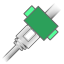
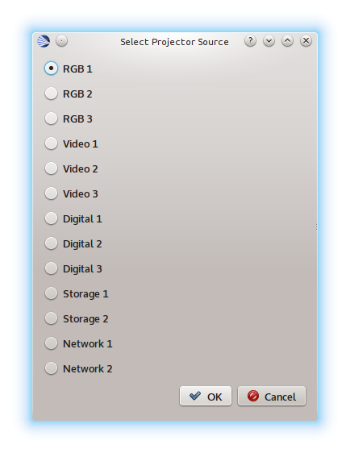
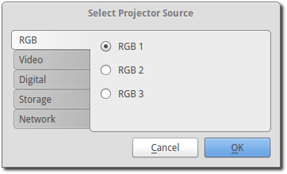

.. _projector:

========================
Projector Remote Control
========================

The Projector Manager allows you to remotely control a network-connected
projector that conforms to the Japan Business Machine and Information System
Association (JBMIA) PJLink specification. Available in OpenLP v2.2.

Projector Settings
------------------

The available projector options can be changed using the main settings menu by
going to Settings -> Configure OpenLP -> Projectors tab.

The options available are:

    Connect to projectors on startup : Check if you want to attempt to connect
    to all projectors when OpenLP starts

    Socket timeout (seconds):  Time in seconds to wait for the projector connection.
    Available options are 2 to 10 seconds.

    Poll timeout (seconds): How often to poll the projector for status information.
    Available options are 2 to 60 seconds. NOTE: PJLink specifications call for
    automatic disconnect after 30 seconds of inactivity.

    Source select dialog interface: Select whether you want all video source options
    on one dialog page or to use tabs to consolidate the inputs based on video group.

Once you are satisfied with the settings, click on the "OK" button, otherwise click
on the "Cancel" button to ignore changes and close the dialog.

Projector Manager
-----------------

The Projector Manager is the interface to controlling your projector(s). It is
located on the bottom-right corner of OpenLP just below the Theme Manager.

.. image:: pics/projector_manager.png
   :alt: Projector Manager

The icons on the Projector Manager tab will depend on projector entries as well
as how many projectors are selected at once.

A list of possible projector icons are:

.. image:: pics/projector_new.png
   :height: 100
   :width: 100
   :scale: 50
   :alt: New projector icon

Add a new projector

.. image:: pics/general_edit.png
   :height: 100
   :width: 100
   :scale: 50
   :alt: Edit projector icon

Edit selected projector

.. image:: pics/projector_hdmi.png
   :height: 100
   :width: 100
   :scale: 50
   :alt: Select video source of selected projector icon

Select the video source of the selected projector

.. image:: pics/custom_delete.png
   :height: 100
   :width: 100
   :scale: 50
   :alt: Delete the selected projector icon

Delete the selected projector

.. image:: pics/system_about.png
   :height: 100
   :width: 100
   :scale: 50
   :alt: Show information about selected projector icon

Show information about the selected projector

.. image:: pics/projector_connect.png
   :height: 100
   :width: 100
   :scale: 50
   :alt: Connect to selected projector icon

Connect to selected projector

Connect to multiple selected projectors

.. image:: pics/projector_disconnect.png
   :height: 100
   :width: 100
   :scale: 50
   :alt: Disconnect selected projector icon

Disconnect from selected projector

.. image:: pics/projector_disconnect_tiled.png
   :height: 100
   :width: 100
   :scale: 50
   :alt: Disconnect from multiple selected projectors icon

Disconnect from multiple selected projectors

.. image:: pics/projector_power_on.png
   :height: 100
   :width: 100
   :scale: 50
   :alt: Power on selected projector icon

Power on selected projector

Power on multiple selected projectors

.. image:: pics/projector_power_off.png
   :height: 100
   :width: 100
   :scale: 50
   :alt: Power off selected projector icon

Power Off (standby) selected projector

.. image:: pics/projector_power_off_tiled.png
   :height: 100
   :width: 100
   :scale: 50
   :alt: Power off multiple selected projectors icon

Power Off (standby) multiple selected projectors

Blank screen - Close the shutter on selected projector

.. image:: pics/projector_blank_tiled.png
   :height: 100
   :width: 100
   :scale: 50
   :alt: Blank screen multiple selected projectors icon

Blank screen - Close the shutter on multiple selected projector

.. image:: pics/projector_show.png
   :height: 100
   :width: 100
   :scale: 50
   :alt: Show Screen selected projector icon

Show screen - Open the shutter on selected projector

.. image:: pics/projector_show_tiled.png
   :height: 100
   :width: 100
   :scale: 50
   :alt: Show screen multiple selected icon

Show screen - Open the shutter on multiple selected projectors

Adding a Projector
------------------

To add a new projector, click on the "Add new projector" icon on the Projector
Manager tab bar. You will be given an input dialog box like the below image.

.. image:: pics/projector_add_new.png
   :alt: Add new projector image

The required information are "IP Address", "Port Number", and "Name" entries.
The port number is already set with the default PJLink port.

The "PIN" entry is only needed if the projector you are connecting to has the
PJLink PIN set. Be careful, since most projectors have a separate entry for
the PJLink PIN, any other network PIN or password, as well as a separate entry
for any HTML access name/password settings (if the projector has HTML webpage
access). The PIN setting here is ONLY used if the projector has a "PJLink access
code" or "PJLink PIN" setting.

Once you are done entering the new information, click on "Save" to save the entry
and add it to the projector manager list. Congratulations, you now have your first
projector entry in the list and ready for control.

.. image:: pics/projector_manager_list.png
   :alt:  Projector manager with one entry image

When you have multiple projector entries selected, the projector manager toolbar
will change to the following:

.. image:: pics/projector_multiple_selection.png
   :alt:  Projector manager with multiple entries image

Once you select a projector, the icons will also change based on the status of
the projector.

Projector Status Icons
----------------------

The icons next to the projector entry in the projector manager list give you a
quick visual status of the projector.

The icons you will see for the projector are:

.. image:: pics/projector_item_disconnect.png
   :height: 100
   :width: 100
   :scale: 50
   :alt: Projector disconnected icon

Projector is disconnected

Attempting to connect to projector

There was an error connecting to projector

.. image:: pics/projector_off.png
   :height: 100
   :width: 100
   :scale: 50
   :alt: Projector off icon

Projector is off (standby)

.. image:: pics/projector_warmup.png
   :height: 100
   :width: 100
   :scale: 50
   :alt: Projector warmup icon

Projector is in warmup mode

Projector is on

Projector is in cooldown mode in preparation for power off/standby mode

.. image:: pics/projector_error.png
   :height: 100
   :width: 100
   :scale: 50
   :alt: Projector error icon

Projector is reporting some kind of error

Projector Menus
---------------

These are the descriptions of the menu items you may see. Note that the menu
entries you see will vary depending on the status of the projector. The list
of all menu options in alphabetical order are:

    Blank Screen : Close shutter so screen is blank. NOTE: This entry is replaced
    with the "Show Screen" entry when the shutter is open.

    Connect Projector : Connect to this projector. NOTE: This entry is replaced
    with the "Disconnect Projector" entry when the projector is connected.

    Delete Projector : Delete this entry from the database.

    Disconnect Projector : Disconnect from this projector. NOTE: This entry is
    replaced with the "Connect Projector" entry when the projector is connected.

    Edit Projector : This will allow you to edit the information on this entry and
    save changes to the database.

    Edit Input Source : This will allow you to customize the look of the source
    input select screen with text that is meaningful for you. NOTE: This entry is
    only available when the projector is connected and powered on.

    Power Off Projector : Tell the projector to enter standby. NOTE: This entry
    is replaced with the "Power On" entry when the projector is in standby.

    Power On Projector : Tell the projector to power on. NOTE: This entry is
    replaced with the "Power Off" entry when the projector is on.

    Select Input : Select the projector video source the projector will use.
    NOTE: This entry is only available when the projector is connected and
    power is on.

    Show Screen : Open shutter so you can see the picture. NOTE: This entry is
    replaced with the "Blank Screen" entry when the projector shutter is closed.

    View Projector Information : This will show you the saved information on this
    entry in the database as well as the extra information about the projector
    once it's connected and talking. NOTE: This entry is only visible when the
    projector is connected and power is either on or in cooldown mode.

You will see the following menu items when you right-click on a projector item.

Initial Menu
~~~~~~~~~~~~

When you first enter a projector or when you first start OpenLP, you will select
from the following menu items:

Projector Connected in Standby Mode
~~~~~~~~~~~~~~~~~~~~~~~~~~~~~~~~~~~

Once the projector has been connected, and if the projector is not powered on,
you get the below menu list:

.. image:: pics/projector_item_connected_off.png
   :alt: Projector Connected Power Off Menu image

Projector Connected in Warmup Mode
~~~~~~~~~~~~~~~~~~~~~~~~~~~~~~~~~~

Once the projector is in warming up, you will see the following menu:

.. image:: pics/projector_item_connected_warmup.png
   :alt: Projector Connected and Warmup Mode image

Projector Connected and Power On
~~~~~~~~~~~~~~~~~~~~~~~~~~~~~~~~

Once the projector is on, you will see the following menu:

.. image:: pics/projector_item_power_on.png
   :alt: Projector Connected and Power On menu

Projector Connected and in Cooldown Mode
~~~~~~~~~~~~~~~~~~~~~~~~~~~~~~~~~~~~~~~~

When the projector is cooling down, you will see the following menu:

.. image:: pics/projector_item_connected_cooldown.png
   :alt: Projector Connected and Cooldown Mode menu

Video Source Input Select Options
~~~~~~~~~~~~~~~~~~~~~~~~~~~~~~~~~

If you want to change the video source the projector uses, click on the
"Select Source" option, then select from the pop-up window which video source
you want to use.

You have an option of setting two different styles for selecting the video source.
The default option is all entries on one radio button dialog. The Other option
is to have the selections grouped by type. This option is available in the
Settings -> Configure OpenLP -> Projectors tab under the "Source Select dialog
interface" option.

NOTE: These images is an example only - what options you will have will vary
depending on the projector you have. These images show the default PJLink text.

"Single dialog box" will give you the following menu dialog:

"Tabbed dialog box" will give you the following menu dialog:

Video Source Input Edit Options
~~~~~~~~~~~~~~~~~~~~~~~~~~~~~~~

When you want to customize how the video source select text looks, you will see
a dialog box that looks like the following (NOTE: this is the single dialog
box - the tabbed dialog box will have similar options available):

Once you are satisfied, you can click on the "OK" button to save the changes,
or click on the "Cancel" button to discard these changes and continue to use
the previously saved user-defined text (or the PJLink defaults if you have no
previously saved user-defined text).

If you don't like the changes, the "Reset" button will reset the text back to
the previously saved text (or PJLink defaults if you have no previously saved
user-defined text) and allow you to continue editing.

If you _really_ don't like the text, you can select the "Discard" button and
remove all entries from the database. WARNING: This will delete _all_ of the
user-defined entries for this projector in the database and return them to the
PJLink defaults.
