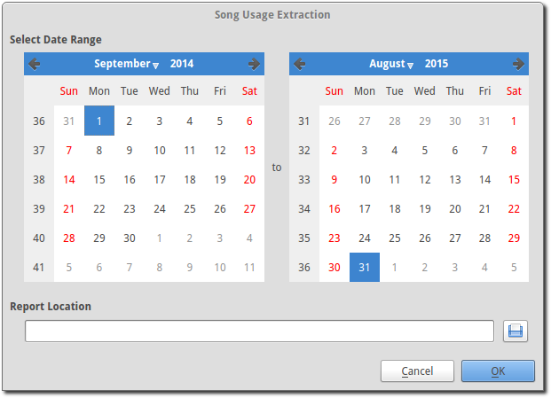

.. _song_usage:

Song Usage Tracking
===================

OpenLP gives you the ability to track all the songs that are displayed live or 
printed. Every time a song is displayed live or printed it will be logged. This 
is useful for CCLI or any other church copyright license that may require 
tracking or for your own personal use to know what songs you previously used. 

Song Usage Tracking is listed under the menu item 
:menuselection:`Tools --> Song Usage Tracking`

You can start and stop tracking by using your keyboard :kbd:`F4` key, going to 
:menuselection:`Tools --> Song Usage Tracking --> Toggle Tracking` or by using
one of these buttons below :ref:`creating_service`.

|song_active| Song usage tracking is active.

|song_inactive| Song usage tracking is inactive.

**Extract Tracking Data** 

Now that you have tracked the songs that were displayed or printed you will want 
to access the information. Go to 
:menuselection:`Tools --> Song Usage Tracking --> Extract Tracking Data` and you 
will be presented with dual calendars.

**Select Date Range**

The calendars on the left side and right side are what you use to select the 
beginning and end dates of your tracking information. Select the date you want 
to begin your tracking information on the left and end your tracking information 
on the right. Use the left and right arrows or click on the month or year and 
then select the day. 

**Report Location**

|file_open| Use this button to choose the folder you want to save your tracking
file in. Click :guilabel:`OK` and click :guilabel:`OK` again or 
:guilabel:`Cancel` at any time. This saves your tracking log as "usage_detail_<start date>_<end date>.txt". 
You can open this file in any text viewer or your spread sheet application.

The usage detailed report will be in the following format: Year, Month, Day,  
Hour, Minute, Seconds, Micro-seconds, Song title, Copyright, CCLI number, Author, 
Song (meaning a song was tracked), and if your song was Displayed or Printed.

**Delete Extracted Data**

When you do not need your previously saved data past a certain point in time, 
you can delete it. Go to
:menuselection:`Tools --> Song Usage Tracking --> Delete Tracking Data`  

.. image:: pics/songusagedelete.png

You will be presented with a single calendar. Select a date by using the left 
and right arrows or click on the month or year and then select the day. All 
tracking information prior to the date you selected will be deleted. Click 
:guilabel:`OK` to delete or :guilabel:`Cancel` if you change your mind.

**Tip**

Every time you display or print a song, whether for practice or during a service, 
it will be logged if tracking is on. This could create a lot of duplicate songs 
being logged. Toggle the tracking on and off, as needed, at the bottom right 
under :ref:`themes` using these buttons.

|song_active| Song usage tracking is active.

|song_inactive| Song usage tracking is inactive.

.. These are all the image templates that are used in this page.

.. |SONG_ACTIVE| image:: pics/song_usage_active.png

.. |SONG_INACTIVE| image:: pics/song_usage_inactive.png

.. |FILE_OPEN| image:: pics/service_open.png