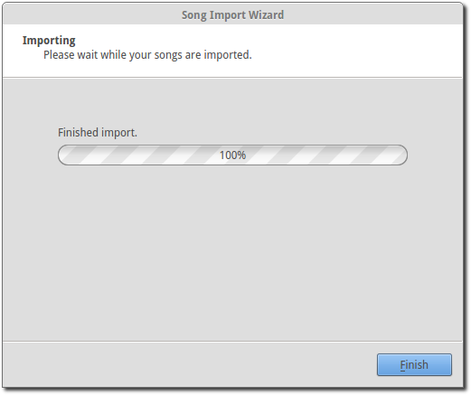
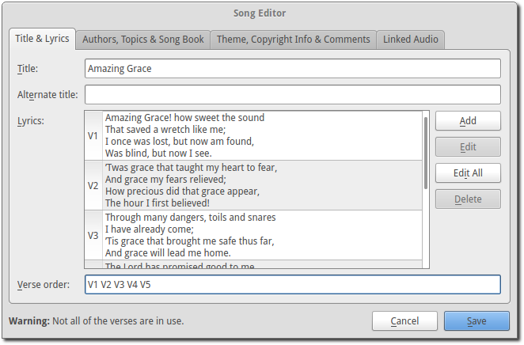
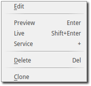
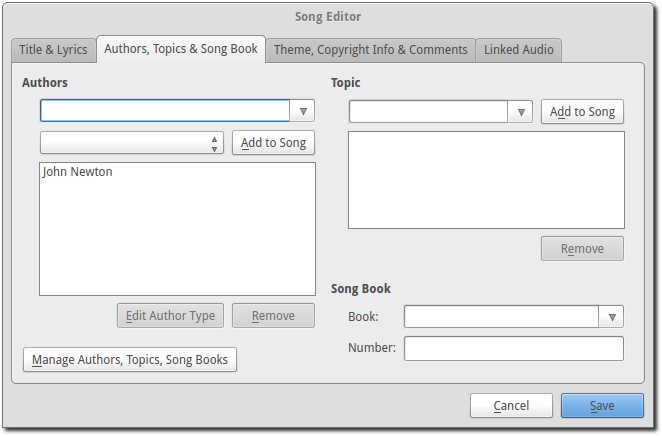

.. _songs:

=====
Songs 
=====

This section describes the use of the various converters built into OpenLP for 
managing and importing song files from other formats.

.. _import_songs:

Song Importer
=============

If you are using an earlier version of OpenLP or, come from another software 
package, you may be able to convert your existing database to work in OpenLP
2.0. To access the Song Importer click :menuselection:`File --> Import --> Song`.
You will see the Song Importer window, then click :guilabel:`Next`.

After choosing :guilabel:`Next` you can select from the various types of 
software that OpenLP will convert songs from.

Click on the file folder icon to choose the file of the song database you
want to import. See the following sections for information on some of the 
different formats that OpenLP will import.

Importing from OpenLP Version 1
^^^^^^^^^^^^^^^^^^^^^^^^^^^^^^^

Converting from OpenLP Version 1 is a simple process. First you will 
need to locate your version 1 database file.

Windows XP::

    C:\Documents and Settings\All Users\Application Data\openlp.org\Data\songs.olp

Windows Vista / Windows 7::

    C:\ProgramData\openlp.org\Data\songs.olp

After clicking :guilabel:`Next` your conversion will be complete. 

Press :guilabel:`Finish` and you will now be ready to use your OpenLP 
version 1 songs.

**Note:** To retain a theme assigned to a song, you must import your themes
first.

Importing from OpenSong
^^^^^^^^^^^^^^^^^^^^^^^

Converting from OpenSong, you will need to locate your songs database. In the 
later versions of OpenSong you are asked to define the location of this. The 
songs will be located in a folder named :guilabel:`Songs`. This folder will
contain files with all your songs in them, without a file extension (file.xxx).
When you have located this folder you will need to select the songs from
the folder.

On most operating systems, to select all the songs, first select the first song
in the list, press the shift key, and select the last song in the list. After
this press :guilabel:`Next` and you will see that your import has been 
successful.

Press :guilabel:`Finish` and OpenLP will be ready to use your songs that you
imported from OpenSong.

Importing from CCLI Song Select
^^^^^^^^^^^^^^^^^^^^^^^^^^^^^^^

To import from CCLI Song Select you must be a CCLI Subscriber and also a 
subscriber of the Song Select service. For more information check out the 
`CCLI website. <http://www.ccli.com>`_ 

The first step for importing from CCLI Song Select is to log into your account.
Then search for your desired song. For this example we will be adding the song
"Amazing Grace". 

.. image:: pics/songselectsongsearch.png

For the song you are searching for, select `lyrics` This will take you to a 
page displaying the lyrics and copyright information for your song.

.. image:: pics/songselectlyrics.png

Next, hover over the :guilabel:`Lyrics` menu from the upper right corner.
Choose either the .txt or .usr file. You will be asked to chose a download
location if your browser does not automatically select that for you. Select 
this file from the OpenLP import window and then click :guilabel:`Next` You can
also select multiple songs for import at once on most operating systems by 
selecting the first item in the list then holding the shift key and select the
last item in the list. When finished, you will see that your import has 
completed.

Press :guilabel:`Finish` and OpenLP will be ready to use your songs imported
from CCLI SongSelect.

.. _songs_create_edit:

Importing from ZionWorx
^^^^^^^^^^^^^^^^^^^^^^^

ZionWorx (version 2.5/2.6) stores your songs in a proprietary database format
which OpenLP is unable to access directly. Thus you will first need to convert 
it to a CSV text file, which OpenLP and other tools (such as spreadsheet 
applications) are able to access. This can be achieved via a free third-party 
utility called "TurboDB Data Exchange".

First, locate your ZionWorx songs database. ZionWorx lets you define the 
location in :guilabel:`File > Preferences`. The database folder will contain a 
collection of files such as Data.tdbd and MainTable.dat

    Default location on Windows XP::

        C:\Documents and Settings\All Users\ZionWorx\2.6\Data

    Default location on Windows Vista / Windows 7:: 

        C:\ProgramData\ZionWorx\2.6\Data

Download `TurboDB Data Exchange 
<http://www.dataweb.de/en/support/downloads.html>`_ from dataWeb. The utility
will be downloaded as an archive file:
   
    **Windows**:

        Open ``tdbdataX.zip`` and copy ``TdbDataX.exe`` into your ZionWorx 
        database folder.
        
        Press the keyboard combination :kbd:`Windows key + R` to open the 
        :guilabel:`Run` window.
        
        Type ``cmd`` and click :guilabel:`OK`.
        
        In the command prompt window that opens, type these commands (replacing 
        ``database-folder`` with your actual location), followed by 
        :kbd:`Enter`::

            cd "database-folder"
            tdbdatax MainTable.dat songstable.csv -fsdf -s, -qd
     
    **Linux**:
     
        Right click on ``tdbdatax.tar.gz`` and select :guilabel:`Unpack` or 
        :guilabel:`Extract`. Then right click on ``tdbdatax``, select 
        :guilabel:`Properties`, and make sure the :guilabel:`executable` option 
        is checked.
        
        Alternatively, in the terminal::
        
            tar xvzf tdbdatax.tar.gz
            chmod u+x tdbdatax
            
        Copy ``tdbdatax`` into your ZionWorx database folder.
        
        Finally, open a terminal and ``cd`` to your ZionWorx database folder.
        Type this command and press :kbd:`Enter`::
        
            ./tdbdatax MainTable.dat songstable.csv -fsdf -s, -qd

You should see some feedback indicating success, such as::
   
    Batch move has moved 408 records.
       
Your ZionWorx songs database has now been converted to a CSV text file. Run the
Song Importer in OpenLP, select :guilabel:`ZionWorx (CSV)`, and locate the
``songstable.csv`` file you have just created. 

.. image:: pics/songimporter_zionworx.png

After clicking :guilabel:`Next` your import will be complete.

Creating or Editing a Song Slide
================================

When you want to create a new song slide or, once you have a song imported, you 
want to edit and rearrange the Title & Lyrics, Author, Topics & Song Book, 
assign a Theme, or edit Copyright Info & Comments, you will do this through the 
`Song Editor`. 

**Edit:** 
    To edit an existing song you can either click on a song in the 
    :ref:`media-manager` and then click the button to :guilabel:`Edit the selected song` 
    or right click a song from either the :ref:`media-manager` or additionally 
    from the :ref:`creating_service` and click :guilabel:`Edit item`. If you are 
    adding a new song click :guilabel:`Add a new Song` in the :ref:`media-manager`.

**Title:** 
    This is where you would name the song or edit a song name.

**Note:** Anything typed in the title name between these brackets <> will not be 
displayed in the screen title. See *Clone* below.

**Alternate title:** 
    Alternate Title was for songs with two names "Lord the Light" - 
    "Shine Jesus Shine". You can also add a name in this box that will bring up 
    the song in Titles search. **Example:** You could use an alternate title of 
    "hymn" on all your hymn song titles for grouping. When you search "hymn" 
    it will show all the hymns that have "hymn" for the Alternate title. 

**Lyrics:** 
    The *Lyrics* window shows all lyrics imported or added. On the left side of 
    the lyrics you will see a capital letter followed by a number. A V1 would 
    represent verse 1, C1 would be Chorus 1. You will use these letters and
    numbers for the order to display the lyrics.

**Verse Order:** 
    After you entered or edited your song, you will want OpenLP to display the 
    verses in the correct order you want them displayed. On the left side of 
    your lyrics you will see C1, V1, V2 etc. the way they were imported or added. 
    To put your lyrics in the correct order is as simple as typing in the 
    :guilabel:`Verse order box` at the bottom, the correct order you want them 
    displayed, with only a blank space in between each entry. The correct format 
    will look like this: V1 C1 V2 C1 V3 C1. If you forget to put a space in 
    between the order, or if you do not have the corresponding verse number, 
    OpenLP will politely tell you with a pop-up error message what is wrong so 
    you can correct your mistake and save it. Verse order is optional and if 
    left blank the verses will display in the order seen in *Lyrics*.

.. image:: pics/song_edit_verse_error.png

If you forgot to add a verse or intentionally left a verse out of your order you 
will see the notification at the bottom left of the window saying "**Warning:** 
Not all of the verses are in use."

**Clone:** 
    OpenLP gives you the ability to clone a song. This could be useful if you 
    use a different version of the song with slightly different lyrics. Instead
    of typing in all the lyrics again, you can clone it which makes an identical 
    copy of the original song.

To *Clone* a song right-click on the song you would like to duplicate and left-
click :guilabel:`Clone`. 

After you click *Clone* you will see the copy of the song with <copy> in the 
title. 

**Note:** Anything typed in the title name between these brackets <> will not be 
displayed in the screen title.

Adding or Editing the Lyrics
^^^^^^^^^^^^^^^^^^^^^^^^^^^^

**Add:** 
    To Add a new verse, click on :guilabel:`Add`. The main window is where
    you will type your lyrics. OpenLP is packaged with a spell checker for most 
    languages. If you misspell a word it will be underlined. Right click the 
    underlined word and left click *Spelling Suggestions* or you can ignore it 
    and continue typing. You also have the ability to format the font using 
    *Formatting Tags*. Highlight the word/words you want to format and right 
    click the highlight. Left click *Formatting Tags* and choose the format you 
    want to apply to the font and the format tags will be entered with your 
    lyrics. These tags are not visible when displayed. To remove the format, 
    delete the tag on each end of the word or sentence. 

**Edit:** 
    To edit an existing verse, click on the verse you wish to *Edit* then 
    click on :guilabel:`Edit`, make your changes and click :guilabel:`Save`. 

**Edit All:** 
    To edit the whole song at once, click on :guilabel:`Edit All`.
 
**Delete:** 
    To delete a verse, click on the verse you want to delete and it will
    highlight, click on the :guilabel:`Delete` button and it will be deleted.

**Warning:** Once you click the :guilabel:`Delete` button, you will not be
asked again, it will be deleted immediately.

.. image:: pics/song_edit_verse_type.png

**Verse type:** 
    Select one of seven ways to classify your lyrics. Verse, Chorus, Bridge, 
    Pre-Chorus, Intro, Ending, Other. 

If you have more than one verse, you would number them Verse 1, 2, 3 as needed. 
If you find the verse has too many lines for your screen, you can edit and 
shorten the verse and :guilabel:`Add` another slide. 

Authors, Topics & Song Book
^^^^^^^^^^^^^^^^^^^^^^^^^^^

Once your *Title & Lyrics* are added or edited the way you want them you must 
add or enter the author or authors of the song. OpenLP requires all songs to 
have an author entered. You can add a blank space for the author name.

**Authors:** 
    Click the drop down arrow to view all authors or start typing a name in the 
    box and a list will appear. If the authors name has not been added, type
    the authors name in the box and click :guilabel:`Add to Song`. The authors 
    name will appear below and will also be added to your database. If you 
    accidentally add the wrong author you can click on the authors name and click :guilabel:`Remove`.

:guilabel:`Manage Authors, Topics, Song Books`: Clicking this button will bring 
up your complete list of authors.

**Add:** 
    Clicking the :guilabel:`Add` button will bring up a box where you will
    add the Authors First name, Last name and Display name. Click :guilabel:`Save`
    when you are finished.

.. image:: pics/song_edit_author_maintenance.png

**Edit:** 
    The :guilabel:`Edit` button will bring up window where you can edit the info 
    that is already there.

**Delete:** 
    The :guilabel:`Delete` button will remove the author you have highlighted. 

**Note:** You cannot delete an author that is assigned to a song. 
Authors names are displayed in the footer.

Theme, Copyright Info & Comments
^^^^^^^^^^^^^^^^^^^^^^^^^^^^^^^^

You can assign a :ref:`themes` to a song, enter the *Copyright information*
and add the *CCLI number* to the song. If you imported a song from SongSelect 
this information will usually be entered.

.. image:: pics/song_edit_theme_copyright.png

**Theme:** 
    Click the drop down arrow to display your list of themes or start typing a 
    theme name in the box and the list will appear. You can also create a new 
    theme by clicking the :guilabel:`New Theme` button. 

**Copyright information:** 
    Add or edit the copyright information in this box. If you would like to use 
    the © symbol click :guilabel:`©` button. This information is displayed in 
    the footer.

**CCLI number:** 
    Enter the CCLI number in this box. 

**Note:** This is the CCLI number of the song, not your contract number. This 
number is not displayed in the footer.

**Comments:** 
    You can add comments in this box. This information is not displayed in the footer.

.. _songs_linked:

Linked Audio
^^^^^^^^^^^^

OpenLP gives you the ability to play an audio file or multiple audio files when 
the song is displayed live.

**Add File(s):** 
    Add an audio file from a folder on your computer by clicking :guilabel:`Add File(s)`.

**Add Media:** 
    Add an audio file that is already in the :ref:`media-manager` by   clicking 
    :guilabel:`Add Media`.

**Remove:** 
    Click on a file you want to remove and click :guilabel:`Remove`.

**Remove All:** 
    Click on :guilabel:`Remove All` to remove all audio files linked to the song.

If you added multiple audio files, they will play in the order listed. You can 
change their position in the order by clicking on an audio file and using the 
arrows. 

|move_up| Move selection up one position.

|move_down| Move selection down one position.

When you are done, click :guilabel:`Save` to save your choices. You can click 
:guilabel:`Cancel` at anytime if you change your mind.

|audio_pause| This button will appear in the :ref:`linked-audio` when an 
audio file is being played with a song. You can stop or start the audio playing 
by using this button. 

.. These are all the image templates that are used in this page.

.. |MOVE_DOWN| image:: pics/service_down.png
.. |AUDIO_PAUSE| image:: pics/media_playback_pause.png
