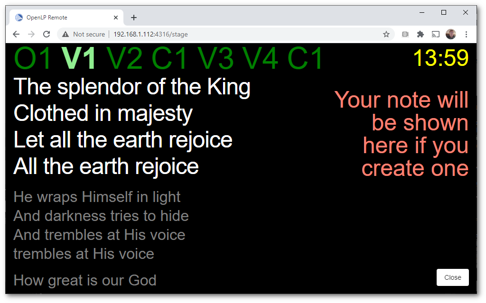
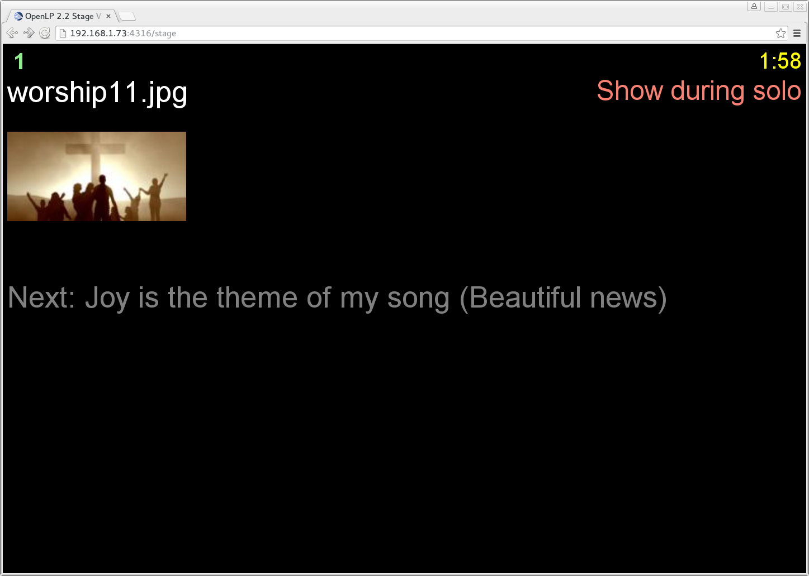
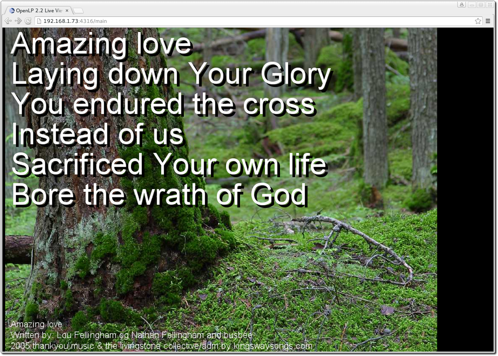

.. _stage_view:

The Stage View
==============

Stage view gives you the ability to set up a remote computer, netbook or 
smartphone to view the live service being displayed on the projection screen in 
an easy to read font on a black background. This is a text only viewer, tough it
will show thumbnails of images and presentations.

The first step is to make sure the Remote plugin is activated. You can accomplish
this by following the instructions in the :ref:`plugin_list`. The second step is to 
configure the settings you will use with the web browser. You can find these 
instructions and settings in :ref:`remote_tab`.

Open a web browser, type in the Stage View URL you found in :ref:`remote_tab` 
and press the :kbd:`Enter` key. For this example we will use 
\http://192.168.1.73:4316/stage. You will then be presented with the home page 
of the OpenLP Stage View. On most browsers you can press F11 to go into
fullscreen mode.

At the top right hand side you will see the time of day. This can be changed 
from 12 hour to 24 hour format in :ref:`remote_tab`. If you added a note to the 
the song it will be the next line below the time. See :ref:`adding_note` 
for adding notes. Below the note will be the Bible or song verse numbers and one 
of those will be highlighted. The lyrics or verses highlighted below the verse 
numbers correspond to the highlighted verse number. In this example V1 is 
highlighted and the corresponding first verse below it is highlighted.

If there is an image, presentation or media being displayed you will see the 
title of the displayed item. Below the title will show the next item to be 
displayed in the :ref:`creating_service`.

.. _main_view:

The Live View
=============

Live view gives you the ability to set up remote computers that will mirror
what your projector is showing. The Live view basically woks by taking
screenshots of what the projector is showing and then presenting it in a
browser. This means that audio and video playback will not be presented in the
Live View.

The first step is to make sure the Remote plugin is activated. You can accomplish
this by following the instructions in the :ref:`plugin_list`. The second step is to 
configure the settings you will use with the web browser. You can find these 
instructions and settings in :ref:`remote_tab`.

Open a web browser, type in the Main View URL you found in :ref:`remote_tab` 
and press the :kbd:`Enter` key. For this example we will use 
\http://192.168.1.73:4316/main. You will then be presented with the home page 
of the OpenLP Live View. On most web browsers you can press F11 to go into
fullscreen mode.
