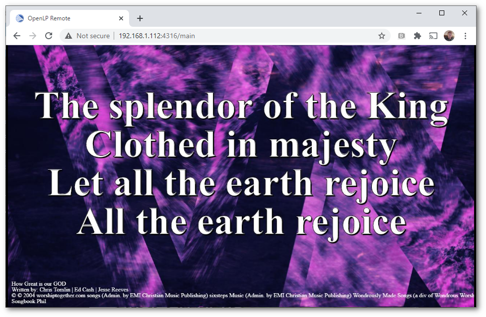

.. _stage_view:

The Stage View
==============

Stage view gives you the ability to set up a remote computer, netbook or 
smartphone to view the live service being displayed on the projection screen in 
an easy to read font on a black background. This is a text only viewer, though it
will show thumbnails of images and presentations.

You can configure the settings you use with the web browser. You can find these 
instructions and settings in :ref:`remote_tab`.

Open a web browser, type in the Stage View URL you found in :ref:`remote_tab` 
and press the :kbd:`Enter` key. For this example we will use 
\http://192.168.1.112:4316/stage. You will then be presented with the home page 
of the OpenLP Stage View. On most browsers you can press F11 to go into
fullscreen mode.

At the top right hand side you will see the time of day. This can be changed 
from 12 hour to 24 hour format in :ref:`remote_tab`. If you added a note to the 
the song it will be the next line below the time. See :ref:`adding_note` 
for adding notes. On the same line as the clock will be the Bible or song
verse numbers and one of those will be highlighted. The lyrics or verses 
highlighted below the verse numbers correspond to the highlighted verse number. 
In this example V1 is highlighted and the corresponding first verse below 
it is highlighted.

At the bottom right had side you will see a :guilabel:`Close` button.  Clicking on the 
button will close the stage page and open the Web-Remote main page.

If there is an image, presentation or media being displayed you will see the 
title of the displayed item. Below the title will show the next item to be 
displayed in the :ref:`creating_service`.

.. image:: pics/stage_view_image_w_note.png 

Custom Stage Views
^^^^^^^^^^^^^^^^^^

It is possible to create custom stage view with custom styles, javescript and
html. To create a custom stage view, go to the OpenLP Data Folder by going to
:menuselection:`Tools --> Open Data Folder`. Inside the data folder create a
folder names :file:`stages`. Inside the :file:`stages` folder you can now create
a folder which will be the name of your custom view, an example could be
:file:`myview`. Now copy :file:`stage.html`, :file:`stage.css` and
:file:`stages.js` from `Custom Stage View Zip <https://gitlab.com/openlp/wiki/-/wikis/Development/custom_stage.zip>`_
and customize them to your needs.

To access the custom stage view in a browser go to http://myopenlpip:4316/stage/myview.

.. _main_view:

The Main View
=============

Main view gives you the ability to set up remote computers that will mirror
what your projector is showing. The Main view basically works by taking
screenshots of what the projector is showing and then presenting it in a
browser. This means that audio and video playback will not be presented in the
Main View.

You can configure the settings you use with the web browser. You can find these 
instructions and settings in :ref:`remote_tab`.

Open a web browser, type in the Main View URL you found in :ref:`remote_tab` 
and press the :kbd:`Enter` key. For this example we will use 
\http://192.168.1.112:4316/main. You will then be presented with the home page 
of the OpenLP Live View. On most web browsers you can press F11 to go into
fullscreen mode.

.. _cord_view:

The Chord View
==============

The Chord view is stage view that displays chords if they are in the songs.
You can configure the settings you use with the web browser. You can find these 
instructions and settings in :ref:`remote_tab`.

The chords view adds another control for translation of the cords. clicking on
this control will translate the chords up or down an octive.

Open a web browser, type in the Stage View URL you found in :ref:`remote_tab` 
and press the :kbd:`Enter` key. For this example we will use 
\http://192.168.1.112:4316/chords. You will then be presented with the home page 
of the OpenLP Stage View. On most browsers you can press F11 to go into
fullscreen mode.

