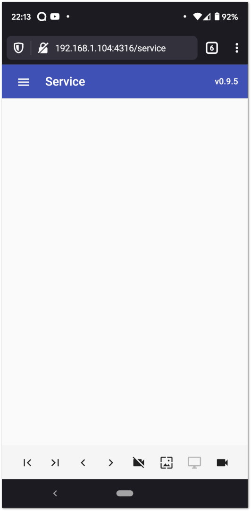
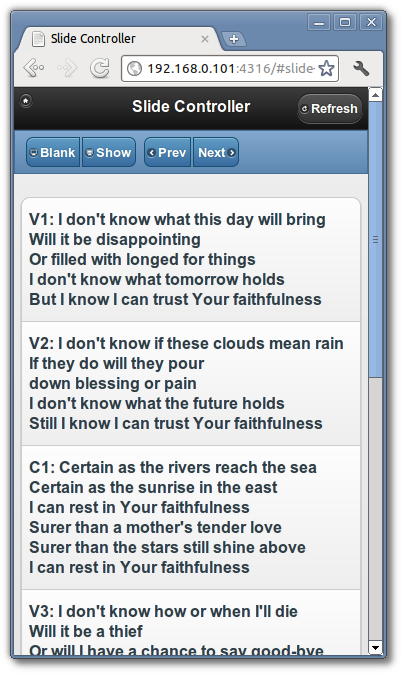
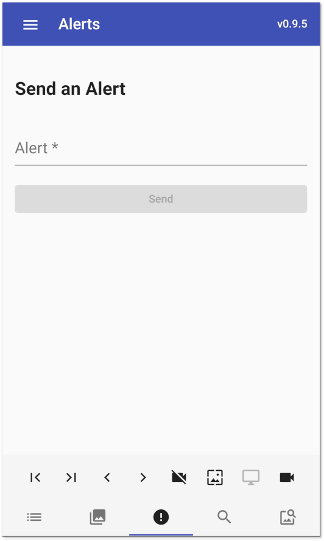
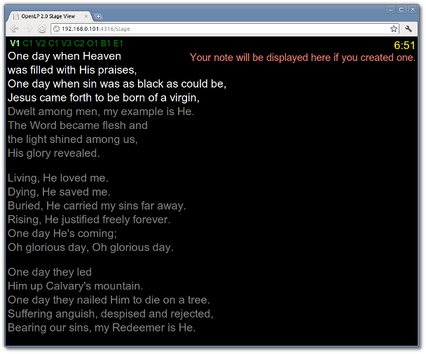
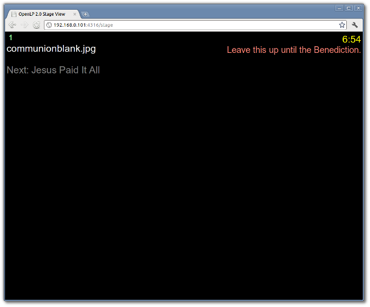

.. _web_remote:

The Web Remote
==============

OpenLP gives you the ability to control the :ref:`creating_service` or send an 
:ref:`alerts` from a remote computer through a web browser. This could be useful 
for a nursery or daycare to display an :ref:`alerts` message or, use it as an 
interface to control the whole service remotely by a visiting missionary or 
worship team leader. 

The first step is to make sure the Remote plugin is activated. You can accomplish
this here: :ref:`plugin_list`. The second step is to configure the settings you 
will use with your web browser. You can find these instructions and settings 
here: :ref:`remote_tab`.

Open your favorite web browser and type in the Remote URL you found in 
:ref:`remote_tab`. For this example we will use \http://192.168.0.101:4316 and 
then press the :kbd:`Enter` key. You will be presented with the home page of the
OpenLP Remote.

Service Manager
---------------

Clicking on Service Manager will display your service item list in the 
:ref:`creating_service`.

.. image:: pics/web_remote_service.png

You will find the following buttons throughout the web remote interface. 
Clicking on any item in the Service Manager will immediately take you to the 
slide controller.

    |web_remote_home| The home button is found on most of the pages in the top 
    left hand corner of the remote interface and clicking it will take you back 
    to the home page of the OpenLP remote.

    |web_remote_refresh| When changes are made on the main computer clicking on 
    refresh will show the changes in the remote viewer.

    |web_remote_blank| Clicking this button will blank the display on the 
    projector screen. Clicking on an item in the Service Manager will 
    automatically show the item on the screen.

    |web_remote_show| If your screen is blanked, clicking on this button will
    unblank your display.

    |web_remote_previous| This button will move you upward in the Service 
    Manager and Slide Controller.

    |web_remote_next| This button will move you downward in the Service Manager 
    and Slide Controller.

**Note:** The buttons Blank, Show, Prev and Next are conveniently located on 
the top and the bottom of the remote interace to help eliminate scrolling.

Slide Controller
----------------

After you click on an item in the Service Manager you will be taken to the Slide 
Controller interface. 

You will find your verses displayed as they appear in the live view and the 
first verse will be displayed on the projection screen. You can use the 
:guilabel:`Prev`, :guilabel:`Next` or click on each verse using your mouse to 
display them. 

**Note:** The remote interface replicates the OpenLP software. Clicking on a 
single image in the service manager will display immediately. The first image 
in a group of images and the first slide in a presentation will also be 
displayed immediately when clicked on in the service manager.

Alerts
------

You can send an alert to the screen by entering your text in the box and clicking
on :guilabel:`Show Alert`. Your alert will be displayed as you have it configured 
in :ref:`configure_alerts`.

Search
------

       

Stage view gives you the opportunity to set up a remote computer, netbook or 
smartphone to view the service being displayed in an easy to read font on a  
black background. This is a text only viewer. 

At the top right hand side you will see the time of day. This can be changed 
from 12 hour to 24 hour format in :ref:`remote_tab`. If you added a note to the 
the song it will be the next line under the time. See :ref:`adding_note` 
for adding notes. Under the note will be the Bible or song verse numbers and one 
of those will be highlighted. The lyrics or verses showing below the verse 
numbers correspond to the highlighted verse number. 

If there is an image, presentation or media being displayed you will see the 
title of the displayed item. Under the title will show the next item to be 
displayed in the :ref:`creating_service`.

.. These are all the image templates that are used in this page.

