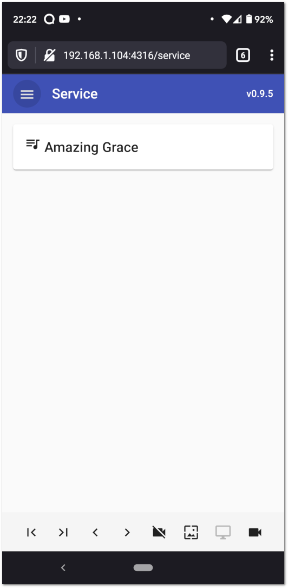
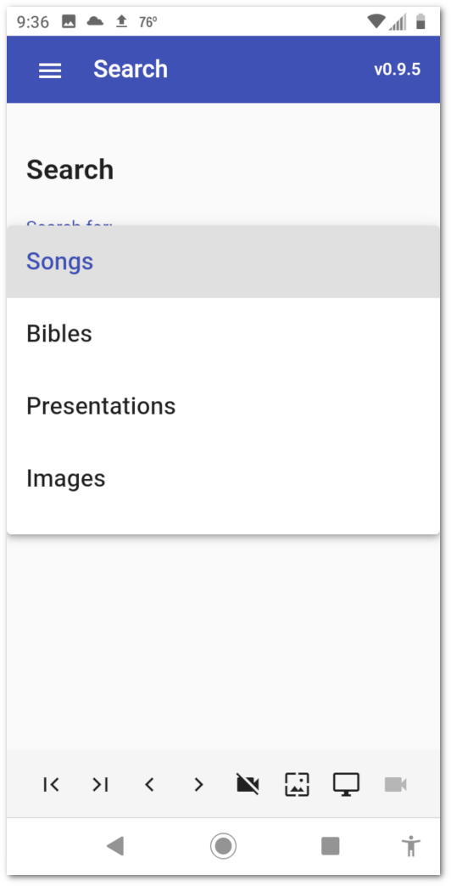
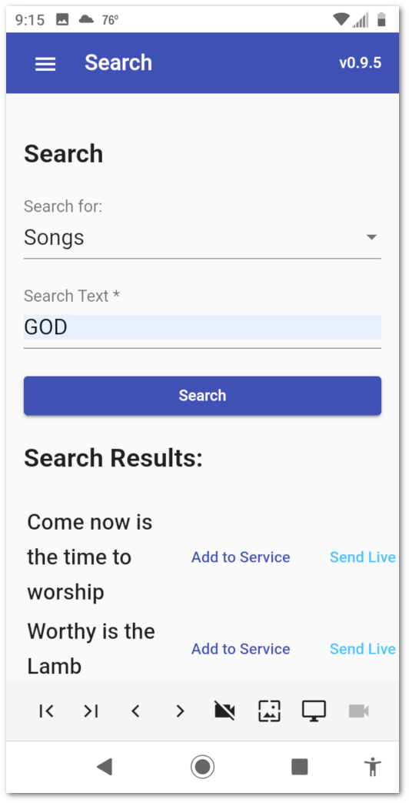
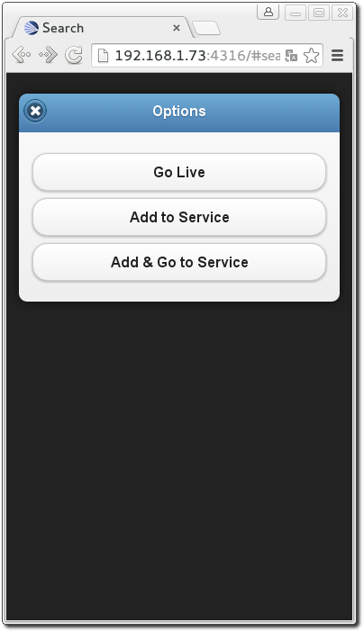

.. _web_remote:

The Web Remote
==============

OpenLP gives you the ability to control the :ref:`creating_service`, send an 
:ref:`alerts`, search, add and display media from the :ref:`media-manager` 
using a remote computer, netbook or smartphone and a web browser. This could be 
useful for a nursery or daycare to display an :ref:`alerts` message or, use it 
as an interface to control the whole service away from the main computer. This 
could be useful for a guest speaker to control their own slides if needed.

The first step is to make sure the Remote plugin is activated. You can accomplish
this here: :ref:`plugin_list`. The second step is to configure the settings you 
will use with the web browser. You can find these instructions and settings 
here: :ref:`remote_tab`.

Open your favorite web browser and type in the Remote URL you found in 
:ref:`remote_tab`. For this example we will use \http://192.168.0.101:4316 and 
then press the :kbd:`Enter` key. You will be presented with the home page of the
OpenLP Remote.

.. image:: pics/web_remote_start.png

Service Manager
---------------

Clicking on :guilabel:`Service Manager` will display the service item list from 
the :ref:`creating_service`.

Clicking on any item in the Service Manager will immediately take you to the 
Slide Controller. 

You will find the following buttons throughout the web remote interface. 

    |web_remote_home| The home button is found on most of the pages in the top 
    left hand corner of the remote interface and clicking it will take you back 
    to the home page of the OpenLP remote.

    |web_remote_refresh| When changes are made on the main computer clicking on 
    refresh will show the changes in the remote viewer.

    |web_remote_blank| Clicking this button will blank the display on the 
    projector screen. Clicking on an item in the Service Manager will 
    automatically show the item on the screen.

    |web_remote_show| If the screen is blanked, clicking on this button will
    unblank the display.

    |web_remote_previous| This button will move you upward through the Service 
    Manager and Slide Controller.

    |web_remote_next| This button will move you downward through the Service 
    Manager and Slide Controller.

**Note:** The buttons Blank, Show, Prev and Next are conveniently located on 
the top and the bottom of the remote interace to help eliminate scrolling.

Slide Controller
----------------

After you click on an item in the Service Manager you will be taken to the Slide 
Controller interface. 

.. image:: pics/web_remote_slide.png

You will find the verses displayed as they appear in the live view on the main 
computer and the first verse will be displayed on the projection screen. You can 
use the :guilabel:`Prev`, :guilabel:`Next` or click on each verse using the 
mouse to display them. 

**Note:** The remote interface replicates the OpenLP software. When displaying 
images, clicking on a single image in the service manager will display it 
immediately. The first image in a group of images and the first slide in a 
presentation will also be displayed immediately when clicked on in the 
web remote service manager.

Alerts
------

You can send an alert to the projection screen by entering the text in the box 
and clicking on :guilabel:`Show Alert`. The alert will be displayed as you have 
it configured in :ref:`configure_alerts`.

Search
------

Using the search function gives you the ability to search for a particular media, 
add it to the service or display it immediately.

Clicking on :guilabel:`Songs` will display your media options to search through. 
Click on the media you want to search. 

Enter the text you want to search for. You can click :guilabel:`Search` or press 
:kbd:`Enter` on your keyboard. If you do not enter any text to search for, you 
will be presented with your entire list of media for the selected media. 

**Note:** When searching :guilabel:`Bibles` media you must enter the exact name, 
chapter, verse or verses. Searching :guilabel:`Songs` will search titles and 
lyrics with the text used.

For this example we are searching "Songs" and the word "Jesus". The results will 
be displayed under the search button.

After finding the song you searched for, clicking on the song will bring up the 
next screen.

Click on :guilabel:`Go Live` to immediately display your media on the projection 
screen. Click on :guilabel:`Add to Service` to add your media to the bottom of 
the :ref:`creating_service`.

Stage View
----------

Stage view gives you the opportunity to set up a remote computer, netbook or 
smartphone to view the :ref:`creating_service` being displayed in an easy to 
read font on a black background. This is a text only viewer. 

.. image:: pics/web_remote_stage.png

At the top right hand side you will see the time of day. This can be changed 
from 12 hour to 24 hour format in :ref:`remote_tab`. If you added a note to the 
the song it will be the next line under the time. See :ref:`adding_note` 
for adding notes. Under the note will be the Bible or song verse numbers and one 
of those will be highlighted. The lyrics or verses highlighted below the verse 
numbers correspond to the highlighted verse number. 

If there is an image, presentation or media being displayed you will see the 
title of the displayed item. Under the title will show the next item to be 
displayed in the :ref:`creating_service`.

.. image:: pics/web_remote_stage_other.png

.. These are all the image templates that are used in this page.

.. |WEB_REMOTE_HOME| image:: pics/web_remote_home.png

.. |WEB_REMOTE_REFRESH| image:: pics/web_remote_refresh.png

.. |WEB_REMOTE_BLANK| image:: pics/web_remote_blank.png

.. |WEB_REMOTE_SHOW| image:: pics/web_remote_show.png

.. |WEB_REMOTE_PREVIOUS| image:: pics/web_remote_previous.png

.. |WEB_REMOTE_NEXT| image:: pics/web_remote_next.png