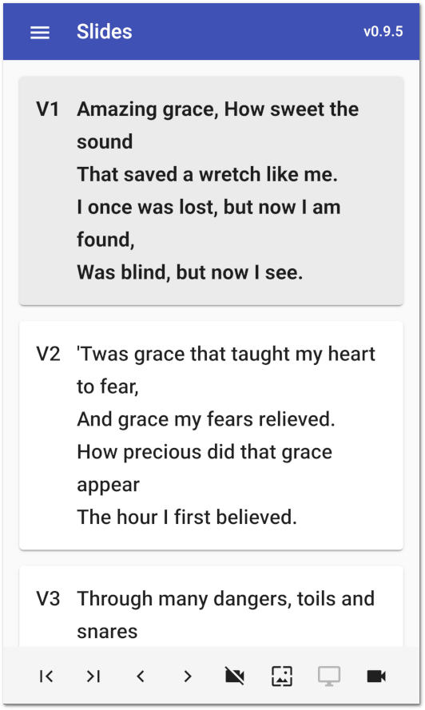
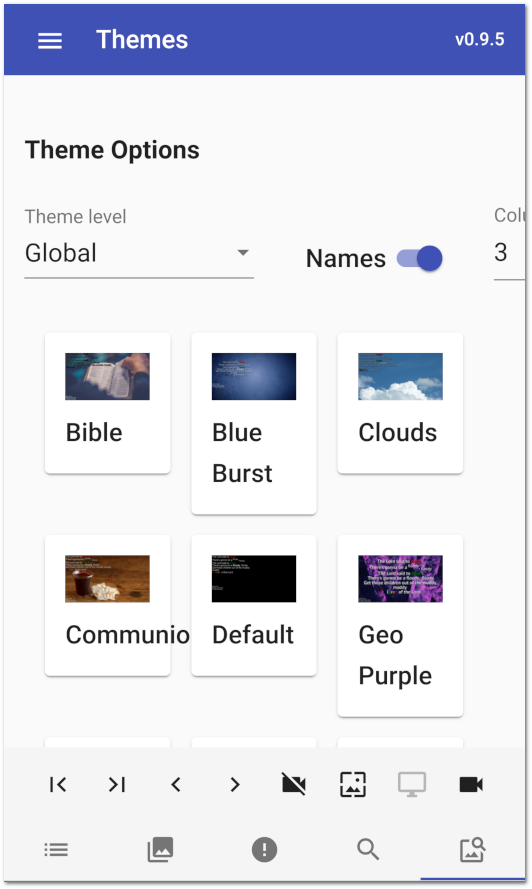

.. _web_remote:

The Web Remote
==============

OpenLP gives you the ability to control the :ref:`creating_service`. You also 
have the ability to search for and add or display media from the 
:ref:`library` or send an :ref:`alerts`, using a remote computer, netbook 
or smartphone and a web browser. You can use the web remote to control the 
entire service away from the main computer or, have the nursery or daycare send 
an :ref:`alerts` message to the projection screen. This could also be used for a 
guest speaker or worship team leader to control their own slides if needed.

The Web Remote was moved to being part of the core program in version 2.9.2.
The only thing you need to do is go into :ref:`configure`, select the Remote Interface
item in the menu on the left side of the Settings window then press the
Check for Updates button.  If the Current version number is not the same as
Latest Version then press the Upgrade button.  When the numbers match, press the
OK button at the bottom of the settings window.

Versions before 2.9.2
The first step is to make sure the Remote plugin is activated. You can accomplish
this by following the instructions in the :ref:`plugin_list`. The second step is 
to configure the settings you will use with the web browser. You can find these 
instructions and settings in :ref:`remote_tab`.

Open a web browser, type in the Remote URL you found in :ref:`remote_tab` and 
press the :kbd:`Enter` key. For this example we will use
\http://192.168.1.112:4316. You will then be presented with the home page of the
OpenLP Remote.  The picture shows a service with nothing in it.

.. image:: pics/web_remote_start.png

Service Manager
---------------

The web remote opens to the :guilabel:`Service` page and if a service is
loaded, it will display the service item list from the :ref:`creating_service`.

.. image:: pics/web_remote_service.png

Clicking on any item in the Service Manager will immediately take you to the 
Slide Controller. 

You will find the following buttons throughout the web remote interface. 

    |web_remote_menu_button| The Menu button is found on most of the pages in the top 
    left hand corner of the remote interface and clicking it will display a menu
    of the web remote pages and a helpful setting.

    |web_remote_menu| 

    Selecting any of the top five menu items will change the web remote page to
    the page responsible for that area of the web remote.
    
    Selecting any of the three views will change the web remote page to the default
    view selected.

    Enabling the :guilabel:`Fast Switch` setting will display
    a set of Icons at the bottom of the page to switch between
    pages without using the menu.
    
    |WEB_REMOTE_ICON|

    |web_remote_previous_item| This button will move upward through the Service 
    items to the previous items.

    |web_remote_next_item| This button will move downward through the Service 
    items to the next item.

    |web_remote_previous| This button will move upward through the Slide Controller.
    If the settings :ref:`slide_controller_config` have been enabled this button will move from the first slide of a
    service item to the last slide of the prevoius service item.

    |web_remote_next| This button will move you downward through the Slide Controller.
    If the settings :ref:`slide_controller_config` have been endables this button will move freom the last slide of a
    service item to the next first slide of the next service item.

    |web_remote_black| This button will blank the display on the projector screen.
    If the settings :ref:`slide_controller_config` have been enabled clicking on an item in 
    the Service Manager will automatically show the item on the screen.

    |web_remote_theme| This button will blank the display on the 
    projector screen to the current theme. Note that this is not available for
    item which does not use themes, such as images, presentations and media. 
    If the settings :ref:`slide_controller_config` have been enabled clicking on an item in 
    the Service Manager will automatically show the item on the screen.

    |web_remote_desktop| This button will hide the display on the projector screen 
    and therefore show the desktop. If the settings :ref:`slide_controller_config` have been
    enabled clicking on an item in the Service Manager will automatically show the item
    on the screen.

    |web_remote_show_presentation| If the screen is blanked, clicking on this button will
    unblank the display.
    
    |web_remote_show_service| This button will display the Service page of the web remote.
    
    |web_remote_show_slides| This button will display the Slides page of the web remote.
    
    |web_remote_show_alerts| This button will display the Alerts page of the web remote.
    
    |web_remote_show_search| This button will display the Search page of the web remote.
    
    |web_remote_show_themes| This button will display the Themes page of the web remote.

Slide Controller
----------------

After you click on an item in the Service Manager you will be taken to the Slide 
Controller interface. 

You will find the verses displayed as they appear in the live view on the main 
computer and the first verse will be displayed on the projection screen. You can 
use the |web_remote_previous|, |web_remote_next| or click on each verse using the 
mouse to display them. 

**Note:** The remote interface replicates the OpenLP software. When displaying 
images, clicking on a single image in the service manager will display it 
immediately. The first image in a group of images and the first slide in a 
presentation will also be displayed immediately when clicked on in the 
web remote service manager.

Alerts
------

You can send an alert to the projection screen by entering the text on the line 
and clicking on :guilabel:`Send`. The alert will be displayed as you have 
it configured in :ref:`configure_alerts`.

.. image:: pics/web_remote_alert.png

Search
------

Using the search function gives you the ability to search for a particular media, 
add it to the service or display it immediately.

.. image:: pics/web_remote_search.png

Clicking on :guilabel:`Songs` will display your media options to search through. 
Click on the media type that you want to search. 

.. image:: pics/web_remote_search_choice.png

Enter the text you want to search for. You can click :guilabel:`Search` or press 
:kbd:`Enter` on the keyboard. If you do not enter any text to search for, you 
will be presented with your entire list of media for the selected media. 

**Note:** When searching :guilabel:`Bibles` media you must enter the exact name, 
chapter, verse or verses. Searching :guilabel:`Songs` will search titles and 
lyrics with the text used.

For this example we are searching "Songs" and the word "God". The results will 
be displayed below the search button.

.. image:: pics/web_remote_search_complete.png

After finding the song you searched for, click on :guilabel:`Send Live` to 
immediately display your media on the Live screen. Click on :guilabel:`Add to Service`
to add your media to the bottom of the :ref:`creating_service`.

Theme Manager
---------------

The :guilabel:`Theme` page lets you select a Global or Service level theme.  When the theme
changes is dependent on the theme settings under :ref:`theme_configure`.  To make
the change take effect on the current Service Item you will need to resend the Service Item 
to the Live screen.

Clicking on any item in the Theme Manager will select the theme. 

You can select the Theme Level, if you want to see the theme names and how many columns you
want to view on the page.

.. These are all the image templates that are used in this page.

.. |WEB_REMOTE_MENU| image:: pics/web_remote_menu.png

.. |WEB_REMOTE_BLANK| image:: pics/web_remote_blank.png

.. |WEB_REMOTE_SHOW| image:: pics/web_remote_show.png

