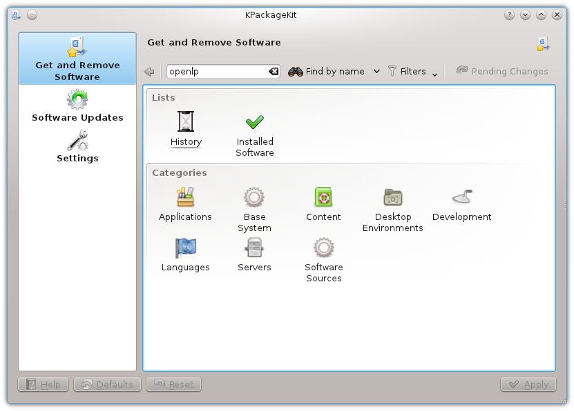
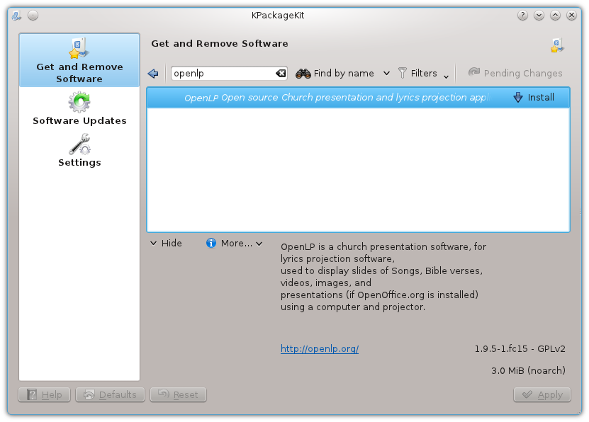
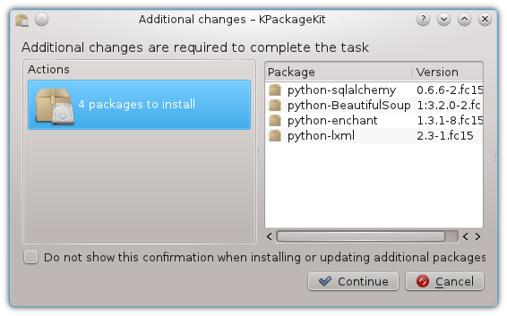
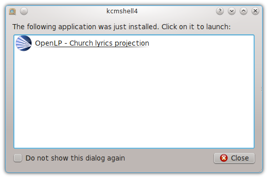

.. _fedora:

Fedora(KDE)
===========

**Note** when installing OpenLP you will need to have administrator privileges.
You will be asked for the administrator password to install.

From the KickOff open *Software Management*. Type OpenLP into the search
box. Then click :guilabel:`Find by name` or press :kbd:`Enter`.

Select OpenLP from the search results. Next, click :guilabel:`Apply`

Now give permission to install other software dependencies that are needed by
clicking :guilabel:`Continue`

Once completed you can run OpenLP by clicking on its logo in the completed
install notification, or from the KickOff menu.

