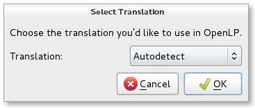

.. _first-time-wzard:

First Time Wizard
=================

When OpenLP starts up for the first time, you can select the language you want
to use it in, or allow OpenLP to automatically detect your language from your
operating system. This may take a long time as OpenLP needs to contact the
download servers to initialise First Time Wizard.

Follow the prompts once the First Time Wizard has started.

.. image:: ../screenshots/firsttimewizard/firsttimewizard.png

The First Time Wizard contains a selection of songs, Bibles and themes to
choose and download into OpenLP. The wizard also helps you set up your
monitors, your default theme and which features you want enabled. If at any
later stage you want to re-run the wizard, you can select it from within
OpenLP.
