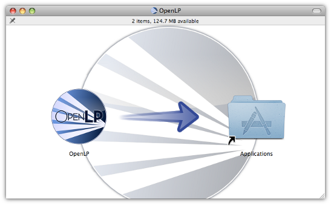

.. _install-mac-os-x:

Mac OS X
========
Installation of OpenLP on Mac OS X is just like most other software packages
on OS X, where you simply have to drag and drop OpenLP into your Applications
directory to install it..

Visit the `download page <http://openlp.org/en/download>`_ on the
`OpenLP website <http://openlp.org/>`_ to download the OpenLP disk image.

Before the setup wizard starts, you are asked to select a langage. This is not
the language you will be using OpenLP in, it is simply the language you will
be using to install OpenLP.

