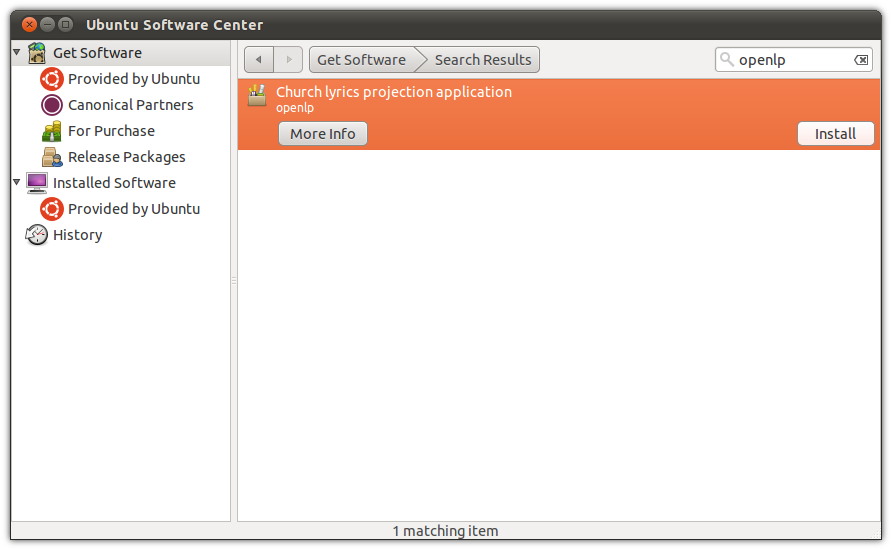
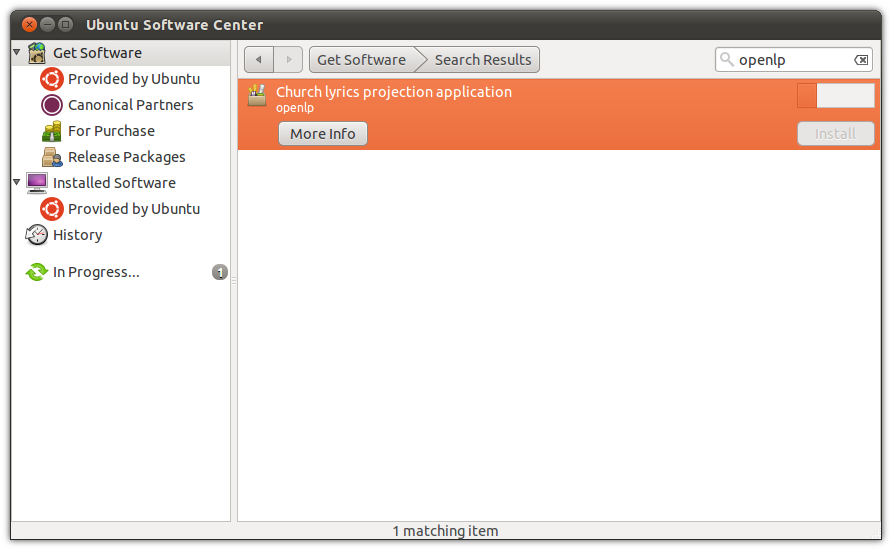

.. _ubuntu:

Ubuntu
======
The latest versions of Ubuntu already have OpenLP, you simply need to open
the Software Center, search for OpenLP and click to install it.

Open up *Software Center* by clicking on the :guilabel:`Software Center` icon
in the Launcher if you are using the *Unity* desktop, or if you are using an
older version of Ubuntu or the *Classic* desktop go to
:menuselection:`Applications` and select the *Software Center* from the bottom
of the menu. You will need to be the administrator of the system to install
OpenLP and may be asked for the administrator password several times through
this process.

When you have the Software Center running simply search for OpenLP and click
:guilabel:`Install`.

You will see the install progress as OpenLP and the dependencies required for
it to run are downloaded.

After installation you should see that OpenLP is installed.

.. image:: ../screenshots/install/ubuntu/3-install-complete.png

You can now run OpenLP by either searching for it in the *Dash*, or clicking on
the category *Media Apps* in Unity. If you are running the Classic Desktop you
will have OpenLP available by clicking
:menuselection:`Applications --> Sound and Video --> OpenLP`

Ubuntu 12.04
------------
If you're using Ubuntu 12.04, you may need to enable the *Backports*
repository in order to find OpenLP. The *Backports* repository is a collection
of newer versions of software already available in Ubuntu.

With *Software Center* openlp, go to :menuselection:`Edit --> Software Sources`

.. image:: ../screenshots/install/ubuntu/4-software-sources.png

Then click on the :guilabel:`Updates` tab and make sure the checkbox next to
:guilabel:`Backports` is checked. Click OK and then close and open *Software
Center* to refresh the software list.

Other Ubuntu Releases
---------------------
For information on how to install OpenLP in older Ubuntu releases, and in
Ubuntu derivatives like Kubuntu and Xubuntu, please see the Reference Manual.
