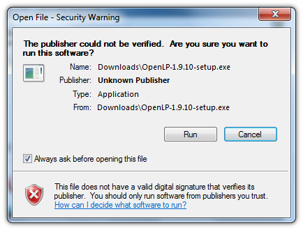
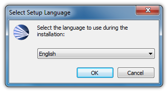
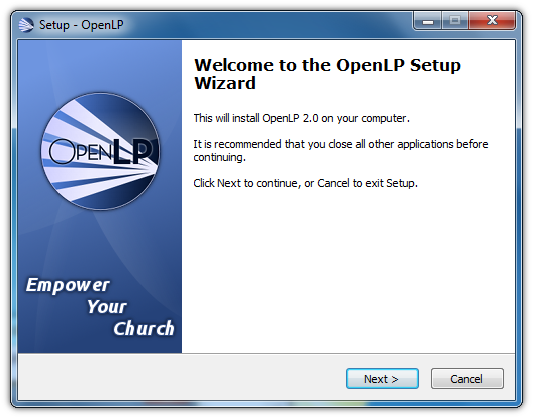
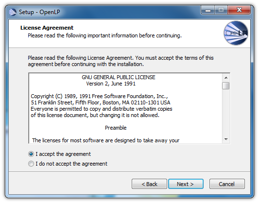
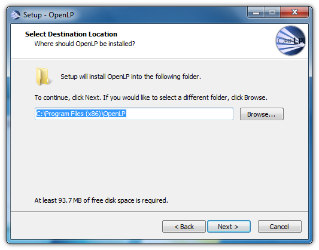
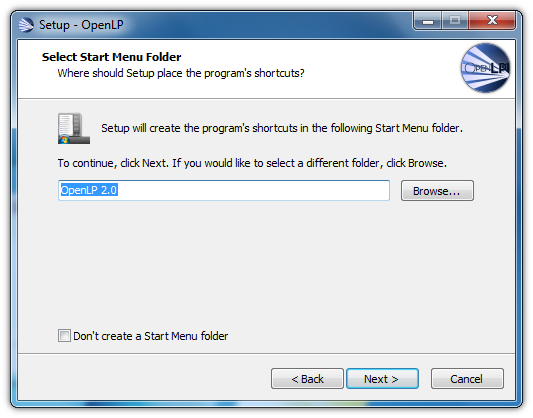
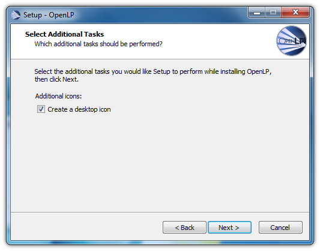
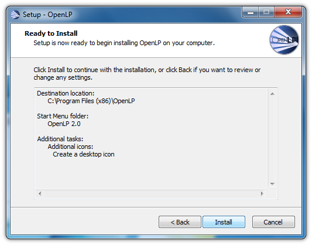
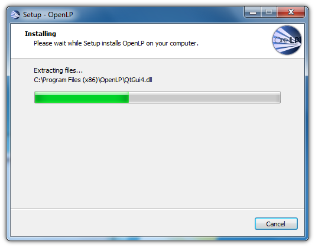
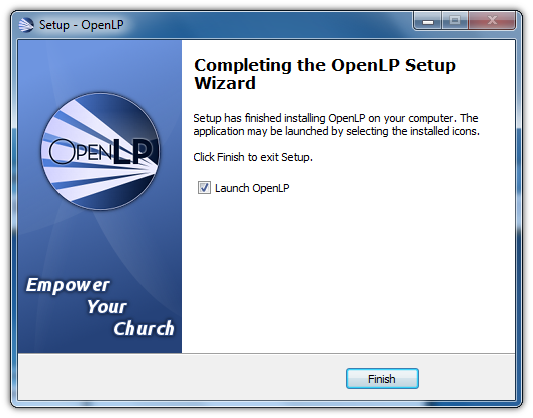

.. _install-windows:

Windows
=======
Installation of OpenLP on Windows is much like most other software packages on
Windows, where a setup wizard guides you through the process.

Visit the `download page <http://openlp.org/en/download>`_ on the
`OpenLP website <http://openlp.org/>`_ to download OpenLP. When you download
OpenLP on Windows, Windows will ask you if you are sure you want to download
it. Be assured that our installer is safe, and has been tested by multiple
independent vendors who have certified our installer to be free of viruses and
malware.

Before the setup wizard starts, you are asked to select a langage. This is not
the language you will be using OpenLP in, it is simply the language you will
be using to install OpenLP.

After selecting your language, the welcome screen appears.

Next you be asked to accept the license. This license is the reason why OpenLP
is free. To find out more about the license, please see the
`quick guide to the GPL <http://www.gnu.org/licenses/quick-guide-gplv3.html>`_
on the `Free Software Foundation <http://www.fsf.org/>`_'s site.

Once you've agreed to the license, you can choose where to install OpenLP to.
This usually defaults to the best place, and it is recommended you leave it
as it is.

In the next step you can select the name of the folder in your start menu
where OpenLP will put its links.

If you want the installer to put an icon on your desktop, you can do that by
checking the checkbox on the "Additional tasks" screen of the installer.

When the installer is ready to install OpenLP, it will show you a summary of
all the options you have selected. Click the Next button to install OpenLP.

The installer usually takes about a minute to install OpenLP. While it does so
it will show you the progress.

Lastly, once the installation is complete, you can check the "Launch OpenLP"
checkbox to run OpenLP once the installer has exited.

